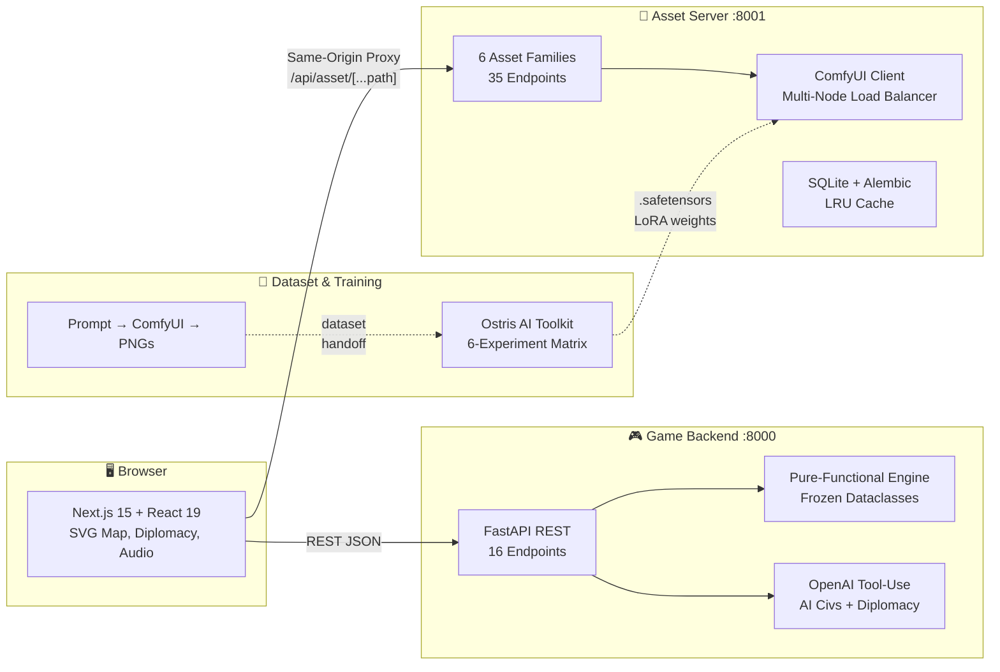

[▶ Watch the StrategAI showcase](https://youtu.be/nvO3DZogazM)

# StrategAI

<div align="center">

**LLM-Driven Strategy Game · Generative Pixel Art · LoRA Style Adaptation**

[](backend/)
[](frontend/)
[](frontend/)
[](assetserver/)
[](LICENSE)

</div>

---

## What is StrategAI?

StrategAI is a **Civilization-style turn-based strategy game** where AI opponents are controlled by Large Language Models (LLMs) making strategic decisions through natural language reasoning, and every game asset — terrain, buildings, units, leader portraits — is generated on-demand by a Diffusion Transformer (DiT) model. Built for the **INF-3600 Generative AI** course at UiT The Arctic University of Norway.

### AI Technologies at a Glance

| Component | AI Technology | What it Does |
|-----------|--------------|--------------|
| 🧠 **AI Civilizations** | LLM (OpenAI tool-use API) | 9 intent tools, per-leader personas, rolling memory — autonomous strategic play |
| 💬 **Diplomacy Chat** | LLM with persistent conversation | Free-form chat with AI leaders, relationship scoring, truce negotiation |
| 🎨 **Generative Pixel Art** | ComfyUI + FLUX2 Klein 4B Distilled (DiT) | On-demand generation of 6 asset families across 35 endpoints |
| 🖌️ **Style Adaptation** | LoRA fine-tuning via knowledge distillation | 100-image dataset generated by FLUX.2 [dev] (12B) teacher → FLUX.2 Klein 4B student LoRA, 6-experiment matrix |

---

## Architecture



### Subprojects

| Subproject | Path | Stack | Purpose |
|-----------|------|-------|---------|
| **Backend** | `backend/` | Python 3.11+, FastAPI, OpenAI API | Game engine, LLM-driven AI civs, REST API |
| **Frontend** | `frontend/` | Next.js 15, React 19, TypeScript, SVG | Game UI, map rendering, asset integration, diplomacy chat |
| **Asset Server** | `assetserver/` | Python 3.10+, FastAPI, ComfyUI, FLUX2 | Generative pixel-art service (6 families, 35 endpoints) |
| **Dataset & Training** | `dataset-gen-train/` | Python 3.10+, Ostris AI Toolkit | LoRA fine-tuning pipeline for top-down medieval style |

### How Services Communicate

- **Frontend ↔ Backend**: REST at `http://localhost:8000` — 14 game endpoints (DTOs in `backend/app/api/schemas.py`, consumed by `frontend/lib/api.ts`)
- **Frontend ↔ Asset Server**: Same-origin proxy at `/api/asset/[...path]` — POST generation, GET asset files (manifest resolution in `frontend/lib/assetManifest.ts`)
- **Backend ↔ Asset Server**: No direct contract — frontend mediates all asset requests
- **Asset Server ↔ Training**: Shared ComfyUI + FLUX2 infrastructure; LoRA `.safetensors` loaded at inference

---

## Quick Start

### Prerequisites

- **Python 3.11+** (backend, asset server)
- **Node.js 18+** (frontend)
- **GPU optional** — the game runs fully without GPU; the asset server has a zero-dependency placeholder mode

### Run the Game (Backend + Frontend)

```bash
# Terminal 1 — Backend
cd backend
python3 -m venv .venv && source .venv/bin/activate
pip install -r requirements.txt
uvicorn app.main:app --reload --port 8000

# Terminal 2 — Frontend
cd frontend
npm install
echo 'NEXT_PUBLIC_API_URL=http://localhost:8000' > .env.local
npm run dev
```

Open **http://localhost:3000** — you're playing. AI civs use a deterministic stub when no `OPENAI_API_KEY` is set, so the engine is fully exercisable offline.

### (Optional) Asset Server

```bash
cd assetserver
pip install -e ".[dev]"
cp .env.testing .env          # placeholder mode — no GPU needed
uvicorn src.main:app --host 127.0.0.1 --port 8001
```

Then add to `frontend/.env.local`: `NEXT_PUBLIC_ASSET_API_URL=http://localhost:8001`

For GPU generation, configure ComfyUI — see [`assetserver/README.md`](assetserver/README.md).

> 📖 **Full setup guide**: [`DEVELOPMENT.md`](DEVELOPMENT.md) covers all four subprojects, environment variables, testing, and workflows.

---

## Key Features

### 🧠 LLM-Driven AI Civilizations
- **9 intent types**: Expand, Scout, Engage, Reinforce, Develop, Turtle, Diplomacy, Research, Idle
- **Per-leader personas**: Each AI civ has a unique personality prompt from the roster in `_AI_ROSTER`
- **Rolling memory**: Recent turn outcomes included on every LLM call for historical reasoning
- **Self-correcting**: Validation errors returned as machine-readable codes (`not_your_turn`, `not_owner`, `no_moves`) — the LLM adjusts its next intent
- **Cheat-resistant**: LLM never touches `GameState` directly — all inputs are fog-filtered serialized views

### 💬 Diplomatic Chat
- Per-civ-pair **stance** (peace/war), numeric **relationship** score, and active **truces**
- Free-form chat: send a message → AI leader replies in-character with the same persona used for strategic play
- **Diplomatic ribbon** UI: portrait ring (relationship color), stance dot, truce halo, inbox pill

### 🎨 Generative Pixel Art
- **6 asset families**: leaders (3-stage img2img pipeline), structures, objects, terrain, units, background tiles
- **35 REST endpoints** with full CRUD, pagination, and catalog discovery
- **3 generation modes**: `comfyui` (GPU), `static` (pre-curated), `placeholder` (procedural — no dependencies)
- **Multi-node ComfyUI** load balancer with health checks, auto-failover, WebSocket + HTTP fallback

### 🖌️ LoRA Style Adaptation
- **Knowledge distillation pipeline**: A larger [FLUX.2 [dev]](https://huggingface.co/black-forest-labs/FLUX.2-dev) (12B) DiT teacher model with [Multi-Angles LoRA v2](https://huggingface.co/lovis93/Flux-2-Multi-Angles-LoRA-v2) generates the training dataset, distilling top-down perspective knowledge into a compact 100-image set used to train the FLUX.2 Klein 4B student LoRA
- **100-image curated dataset** [`stixxert/topdown-medieval-pixelart`](https://huggingface.co/datasets/stixxert/topdown-medieval-pixelart) — generated by us via the distillation pipeline above
- **Trained LoRA** [`stixxert/strategai-topdown-medieval-style-lora`](https://huggingface.co/stixxert/strategai-topdown-medieval-style-lora) — 6 variants published on HuggingFace
- **6-experiment matrix**: caption density × learning rate × rank variations
- **Trigger token** `<tdp>` + angle phrase `top-down view.` for consistent overhead perspective
- **FLUX2 Klein 4B Distilled** base model — consumer GPU friendly (8–12 GB VRAM)

### ⚙️ Pure-Functional Game Engine
- All state in **frozen dataclasses** — every mutation returns a new `GameState`
- **Three-layer architecture**: Strategic (LLM intents) → Tactical (A\* pathfinding, move budget) → Validator (legality checks)
- **Fully deterministic**: replayable from seed, testable without side effects
- **22 engine modules**: combat, economy, production, research (21-node tech tree), diplomacy, fog of war, map generation, victory scoring

---

## Documentation Hub

### Entry Points
| Document | Contents |
|----------|----------|
| [`DEVELOPMENT.md`](DEVELOPMENT.md) | Setup, env vars, testing, workflows — start here |
| [`GAMEPLAY.md`](GAMEPLAY.md) | Complete game mechanics — units, cities, tech tree, combat, diplomacy, victory |
| [`DEPLOYMENT.md`](DEPLOYMENT.md) | Production deployment guide, infrastructure |
| [`backend/README.md`](backend/README.md) | Backend quick start, conventions, config summary |
| [`frontend/README.md`](frontend/README.md) | Frontend quick start, architecture, conventions |

### Architecture & Integration
| Document | Contents |
|----------|----------|
| [`docs/ARCHITECTURE.md`](docs/ARCHITECTURE.md) | System architecture, engine layers, LLM integration design |
| [`docs/ASSET_INTEGRATION.md`](docs/ASSET_INTEGRATION.md) | Asset service contract, manifest resolution, graceful fallback |
| [`docs/SEPARATION_OF_CONCERNS.md`](docs/SEPARATION_OF_CONCERNS.md) | Architecture rationale, microservices design decisions |

### Subproject Deep Dives
| Document | Contents |
|----------|----------|
| [`backend/docs/API_REFERENCE.md`](backend/docs/API_REFERENCE.md) | All 16 REST endpoints, DTOs, error codes |
| [`backend/docs/BACKEND_CONFIG.md`](backend/docs/BACKEND_CONFIG.md) | Environment variables, hardcoded parameters, config flow |
| [`frontend/docs/FRONTEND_ARCHITECTURE.md`](frontend/docs/FRONTEND_ARCHITECTURE.md) | Component tree, state management, Next.js structure |
| [`frontend/docs/UI_GUIDE.md`](frontend/docs/UI_GUIDE.md) | Panel lifecycle, map rendering, diplomatic audience |
| [`assetserver/docs/INDEX.md`](assetserver/docs/INDEX.md) | Asset server documentation index |
| [`dataset-gen-train/docs/`](dataset-gen-train/docs/) | Training pipeline deep-dives, experiment design, model card |

### Academic Report
| Document | Contents |
|----------|----------|
| [`docs/report/IEEE_REPORT.md`](docs/report/IEEE_REPORT.md) | Academic IEEE report — abstract, architecture, evaluation |
| [`docs/report/IEEE_REPORT_COMPLETE.tex`](docs/report/IEEE_REPORT_COMPLETE.tex) | LaTeX submission file |
| [`docs/report/PRESENTATION_OUTLINE.md`](docs/report/PRESENTATION_OUTLINE.md) | Oral presentation slides, speaker notes, Q&A |
| [`docs/report/TRACEABILITY.md`](docs/report/TRACEABILITY.md) | Claim → source mapping for every quantitative assertion |
| [`assetserver/docs/project-report.md`](assetserver/docs/project-report.md) | Asset server technical report |

### Planning Archive
| Document | Contents |
|----------|----------|
| [`docs/archive/GAME_BACKLOG.md`](docs/archive/GAME_BACKLOG.md) | Outstanding game-design work and known issues |
| [`docs/archive/TIER1_PLAN.md`](docs/archive/TIER1_PLAN.md) | Shipped Tier-1 mechanics implementation record |
| [`docs/archive/planning.md`](docs/archive/planning.md) | Original concept document |

---

## Deployment

The system is designed for **separation of concerns**:

| Component | Deployment Notes |
|-----------|-----------------|
| **Backend + Frontend** | Standard web app — deploy anywhere (Vercel, Railway, Fly.io). Frontend serves static assets; backend needs Python runtime + OpenAI API access. |
| **Asset Server** | Runs on infrastructure **near ComfyUI/GPU servers**. Requires persistent storage for generated assets and low-latency access to ComfyUI nodes. |
| **ComfyUI Nodes** | GPU instances (8–12 GB VRAM minimum per node). Multi-node pool configured via `COMFYUI__NODES` env var. |
| **Training Pipeline** | Offline batch process — not part of the runtime system. |

> 📖 See [`DEPLOYMENT.md`](DEPLOYMENT.md) for full production deployment guide, Docker Compose setup, and infrastructure recommendations.

---

## Testing

```bash
# Backend — 339+ tests
cd backend && .venv/bin/python -m pytest

# Frontend — type check + build
cd frontend && npm run typecheck && npm run build

# Asset Server — 547 tests (placeholder mode, no GPU needed)
cd assetserver && python -m pytest tests/ -v

# Dataset/Training — 35 tests
cd dataset-gen-train && python -m pytest tests/ -v

# Integration smoke test (against live asset host)
python3 scripts/asset_api_smoke.py --fast
```

---

## Contributing

StrategAI uses a **multi-agent development system** supporting both GitHub Copilot and Claude Code. See [`AGENTS.md`](AGENTS.md) for the full agent roster and delegation model.

### Quick Start for Contributors

1. **Read the docs**: [`docs/ARCHITECTURE.md`](docs/ARCHITECTURE.md) and [`DEVELOPMENT.md`](DEVELOPMENT.md)
2. **Pick a task**: Browse [`docs/archive/GAME_BACKLOG.md`](docs/archive/GAME_BACKLOG.md) for outstanding work
3. **Follow conventions**: Each subproject README lists domain-specific rules (frozen dataclasses, atomic writes, config patterns)
4. **Run tests before submitting**: See testing commands above
5. **Use agents for cross-project work**: `@Orchestrator implement X across backend, frontend, and assetserver`

### Subproject Conventions

| Subproject | Key Rules |
|-----------|-----------|
| Backend | Frozen dataclasses, pure functions, `ValidationResult` (never throws), `secrets.randbits(31)` for seeds |
| Frontend | `useState`/`useRef`/`useMemo` (no external state lib), all API calls through `api.*`, graceful asset fallback |
| Asset Server | `with SessionLocal() as db:` context manager, atomic temp-file + rename writes, orphan cleanup on persist failure |
| Dataset/Training | Pipeline phases connected by `metadata.jsonl` handoff, ComfyUI workflow JSONs validated at each stage |

---

## License & Credits

### Code License
This project is licensed under the **Apache License 2.0**. See [`LICENSE`](LICENSE) for details.

### Model License
The LoRA adapters in `dataset-gen-train/` inherit a **non-commercial** restriction from the FLUX.2 [dev] base model. See [`dataset-gen-train/docs/MODEL_CARD.md`](dataset-gen-train/docs/MODEL_CARD.md) for the full license dependency chain.

### Academic Context
Created for the **INF-3600 Generative AI** course at UiT The Arctic University of Norway.

### Links
- **Curated Dataset**: [`stixxert/topdown-medieval-pixelart`](https://huggingface.co/datasets/stixxert/topdown-medieval-pixelart) on Hugging Face
- **Trained LoRA**: [`stixxert/strategai-topdown-medieval-style-lora`](https://huggingface.co/stixxert/strategai-topdown-medieval-style-lora) on Hugging Face
- **Base Model**: [FLUX.2 Klein 4B Distilled](https://huggingface.co/black-forest-labs/FLUX.2-klein-base-4B) by Black Forest Labs
- **Training Toolkit**: [Ostris AI Toolkit](https://github.com/ostris/ai-toolkit)

---

<div align="center">
<sub>Built with ❤️ for INF-3600 · UiT The Arctic University of Norway · 2025–2026</sub>
</div>
