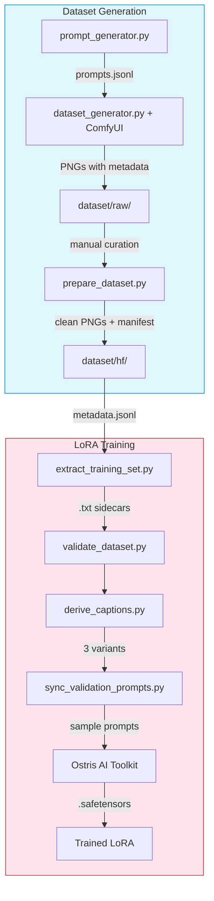

# Top-Down Medieval Pixel Art — FLUX.2 Klein LoRA

A complete pipeline for generating curated top-down medieval pixel-art datasets and fine-tuning FLUX.2 Klein 4B LoRA adapters using the [Ostris AI Toolkit](https://github.com/ostris/ai-toolkit).

The repository has two independent concerns, connected by a single handoff file (`metadata.jsonl`).

## Pipeline Overview



## Quick Links

| Concern | Documentation | Source Code | Configs |
|---------|--------------|-------------|---------|
| **Dataset Generation** | [`docs/generation.md`](docs/generation.md) | [`src/generation/`](src/generation/) | [`config/comfyui/`](config/comfyui/), [`config/prompt_templates.json`](config/prompt_templates.json) |
| **LoRA Training** | [`docs/training.md`](docs/training.md) | [`src/training/`](src/training/) | [`config/training/`](config/training/) |
| ComfyUI deep-dive | [`docs/comfyui-workflows.md`](docs/comfyui-workflows.md) | — | — |
| Experiment design | [`docs/experiment-design.md`](docs/experiment-design.md) | — | — |
| Publishing | [`PUBLISHING.md`](PUBLISHING.md) | — | — |

## Directory Map

```
.
├── docs/                    # Concern documentation
├── config/
│   ├── training/            # 6 LoRA experiment YAMLs
│   ├── comfyui/             # 3 ComfyUI workflow API JSONs
│   └── prompt_templates.json  # Prompt generation templates
├── src/
│   ├── generation/          # ComfyUI orchestrator, metadata, HF export
│   └── training/            # Caption tools, validation, config syncing
├── scripts/
│   ├── generate_images.sh   # ComfyUI preset arguments
│   └── train_experiments.sh # Batch training launcher
├── dataset/
│   ├── raw/                 # Generated PNGs (ComfyUI output)
│   ├── hf/images/           # Published dataset (clean PNGs + metadata.jsonl)
│   ├── prompts/             # Prompt JSONL data
│   └── derived/             # Caption variants (minimal/detailed/ultra_minimal)
├── tests/
│   ├── generation/
│   └── training/
└── output/                  # Training checkpoints and samples
```

## Trigger Token

**`<tdp>`** — the trigger token. Always start prompts with `<tdp> top-down view. [description]` to activate the LoRA:

```
<tdp> top-down view. a medieval granary in steampunk industrial style, 16x16 pixel art, white background
```

The angle phrase `top-down view.` binds the overhead perspective. Both the trigger and angle phrase must be present at inference.

## Getting Started

### Dataset Generation

See [`docs/generation.md`](docs/generation.md). Requires a running ComfyUI server.

```bash
# 1. Generate prompt data
python3 -m src.generation.prompt_generator

# 2. Generate images (use preset wrapper for complex ComfyUI args)
bash scripts/generate_images.sh

# 3. Curate: delete bad PNGs from dataset/raw/

# 4. Prepare HF dataset
python3 -m src.generation.prepare_dataset ./dataset/raw --out-dir ./dataset/hf
```

### LoRA Training

See [`docs/training.md`](docs/training.md). Requires the [Ostris AI Toolkit](https://github.com/ostris/ai-toolkit).

```bash
# 1. Extract sidecar captions
python3 -m src.training.extract_training_set

# 2. Validate dataset
python3 -m src.training.validate_dataset

# 3. Derive caption variants (optional)
python3 -m src.training.derive_captions

# 4. Sync sample prompts into config
python3 -m src.training.sync_validation_prompts

# 5. Train (batch launch)
bash scripts/train_experiments.sh
```

## Prerequisites

- Python 3.10+ with dependencies from `requirements.txt`
- **Generation**: ComfyUI server with [required custom nodes](docs/generation.md#prerequisites)
- **Training**: [Ostris AI Toolkit](https://github.com/ostris/ai-toolkit) + HuggingFace CLI authentication

## License

- **Code**: [Apache 2.0](https://www.apache.org/licenses/LICENSE-2.0)
- **Trained LoRA weights**: [Apache 2.0](https://www.apache.org/licenses/LICENSE-2.0)
- **Base model**: Subject to [FLUX DiT License](https://huggingface.co/black-forest-labs/FLUX.2-dev/blob/main/LICENSE.md) — users must accept on Hugging Face
- **Generated images**: Subject to FLUX DiT License and [Multi-Angles LoRA](https://huggingface.co/lovis93/Flux-2-Multi-Angles-LoRA-v2) license
