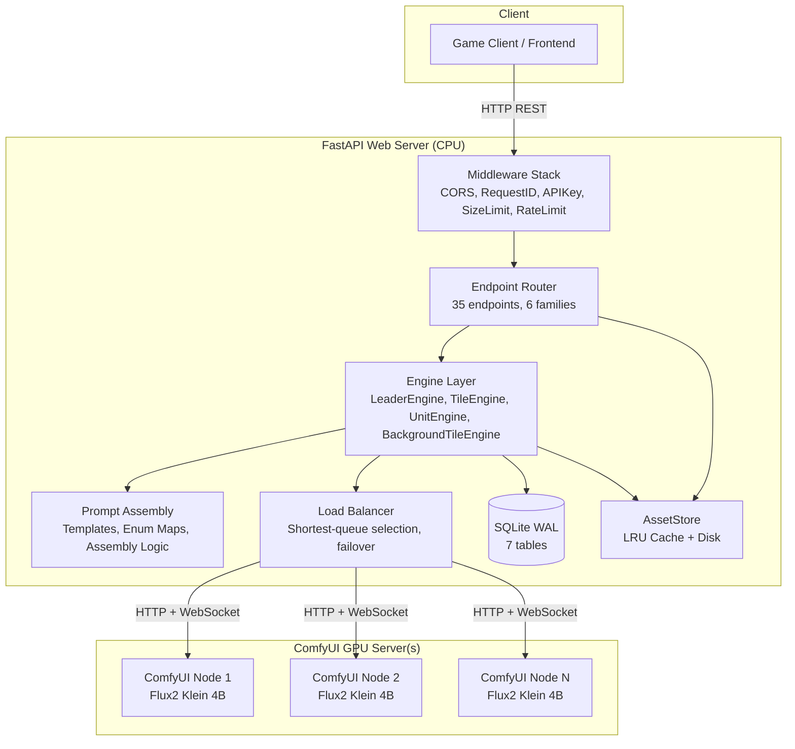

# Image Diffusion Service: Production Architecture

> 📘 This document is a supplementary architecture reference. For the full project report — including design rationale, model selection justification, workflow node-by-node walkthrough, evaluation, and limitations — see [`project-report.md`](../project-report.md).

## 1. System Overview

The Medieval Pixel Art Image Service is a decoupled web service that provides
on-demand generative AI assets for a top-down medieval game.  The web server is
a lightweight orchestrator — it never loads model weights.  All image generation
is delegated to an external **ComfyUI** server via its HTTP + WebSocket API.
Static/pre-made assets are served from a folder structure with zero configuration.
A **placeholder** mode provides always-available procedural fallbacks.



## 2. Core Operational Flow
1. **Request Intake**: `FastAPI` validates incoming payloads (`LeaderRequest`,
   `StructureRequest`, `ObjectRequest`, `TerrainRequest`, `UnitRequest`) using
   strict Pydantic schemas.
2. **Mode Resolution**: Each pipeline engine checks `config.yaml` →
   `generation.modes.{family}` (or `generation.default_mode`) and routes to the
   appropriate generator: `comfyui`, `static`, or `placeholder`.
3. **Asset Processing**:
   - **ComfyUI**: Loads a workflow JSON template, patches in the prompt and seed,
     uploads any input images (for img2img), submits to ComfyUI, polls via
     WebSocket, downloads the result.
   - **Static**: Serves pre-made PNGs from `static_tiles/`. Falls back to
     procedural placeholder if no static PNG is available.
   - **Placeholder**: Always returns a procedural coloured rectangle with text
     label — zero external dependencies.
4. **Caching & Delivery**: The final asset is stored in an in-memory LRU cache
   (thread-safe), persisted to disk, and indexed in SQLite. The asset URL is
   returned to the client.

## 3. Prompt Architecture: Templates > Python

The service follows a strict separation of concerns for prompt assembly:

| Layer | Where | What |
|-------|-------|------|
| **Workflow JSON** | `workflows/*.json` | Model, resolution, sampler, scheduler, steps, CFG, denoise, LoRA nodes, output prefix — everything ComfyUI needs that does NOT vary per request |
| **Prompt templates** | `config/prompt_templates.json` | Prefix + suffix for each asset family. Contains ALL style directives, camera framing, quality tags, LoRA triggers (`<tdp>`), and format constraints. The Python layer never hardcodes prompt prose. |
| **Enum injection maps** | `src/{leader,tile,unit}/prompts.py` | Hand-crafted prose per enum value (archetype, culture, biome, mood, etc.). Structured data mappings — key → rich description. |
| **Assembly logic** | `src/{leader,tile,unit}/prompts.py` | Glue that joins enum prose + user description into the `inner` string, then wraps with template prefix/suffix. No style words. |

**Key principle**: The template JSON is the single source of truth for HOW
something is depicted. The Python layer only contributes WHAT is depicted.

The `<tdp>` LoRA trigger appears in the structure, object, terrain, and unit
templates.  It activates a LoRA that enforces **top-down camera angle** with
medieval pixel-art styling.  Background tiles (seamless ground textures) and
leader portraits use separate templates/workflows without this LoRA.

**Why structured enums over free-form prompts?** This project deliberately rejects the pass-through model (accept a raw prompt string, forward to the model) used by general-purpose image APIs. Structured enums with curated injection maps serve two purposes specific to game development: (1) they eliminate the prompt-engineering burden — game designers send concepts they already work with (`"fortification"`, `"desert_biome"`), not diffusion-model tokens; and (2) they guarantee style consistency by locking all camera framing, quality tags, and LoRA triggers in version-controlled templates that no client request can override. For a full discussion of this tradeoff, see the [project report §3.8.1](../project-report.md#381-design-rationale-structured-enums-vs-free-form-prompts).

## 4. Component Architecture

### A. API Layer (`src/main.py` & per-pipeline `models.py`)
- **FastAPI**: Async HTTP server with 5 middleware layers plus CORS. Endpoints (35 total):
  **Leader**: `POST /leader`, `GET /leader`, `GET /leader/catalog`, `GET /leader/{leader_id}`, `DELETE /leader/{leader_id}`
  **Structure**: `POST /structure`, `GET /structure`, `GET /structure/catalog`, `GET /structure/{structure_id}`, `DELETE /structure/{structure_id}`
  **Object**: `POST /object`, `GET /object`, `GET /object/catalog`, `GET /object/{object_id}`, `DELETE /object/{object_id}`
  **Terrain**: `POST /terrain`, `GET /terrain`, `GET /terrain/catalog`, `GET /terrain/{terrain_id}`, `DELETE /terrain/{terrain_id}`
  **Unit**: `POST /unit`, `GET /unit`, `GET /unit/catalog`, `GET /unit/{unit_id}`, `DELETE /unit/{unit_id}`
  **Background Tile**: `POST /background_tile`, `GET /background_tile`, `GET /background_tile/catalog`, `GET /background_tile/{background_tile_id}`, `DELETE /background_tile/{background_tile_id}`
  **System**: `GET /health`, `GET /health/ready`, `GET /modes`, `GET /catalog`, `GET /assets/{filename}`
  All GET list endpoints support pagination: `?limit=` (1–200, default 50) and `?offset=` (≥0).
- **Pydantic**: Typed request/response schemas with enum validation.
- **Fully async**: Generation runs on the asyncio event loop via `httpx` + `websockets`.

#### Middleware Stack (5 layers + CORS)

| Order | Middleware | Purpose |
|-------|-----------|---------|
| 1 | `CORSMiddleware` | Configurable origins via `server.cors_origins`; `allow_credentials=False`. Outermost — handles browser CORS preflight `OPTIONS` before auth/rate-limit checks. |
| 2 | `RequestIDMiddleware` | Injects a UUID4 `X-Request-ID` into every request for log correlation; echoes in response header |
| 3 | `APIKeyMiddleware` | Validates `X-API-Key` header against `server.api_key` (disabled when key is empty). `/health`, `/health/ready`, and `/assets/` are exempt |
| 4 | `RequestSizeLimitMiddleware` | Rejects POST/PUT/PATCH bodies exceeding `server.max_request_body_mb` (411 if no `Content-Length`, 413 if too large) |
| 5 | `RateLimitMiddleware` | Global token-bucket: 2 POST/s (burst 5), 50 GET/s. Toggle via `rate_limit.enabled`. Innermost — closest to route handlers. |

### B. Storage Layer (`src/storage.py`)
- **AssetStore**: Thread-safe in-memory LRU cache (OrderedDict + Lock, default
  1000 entries).  Transparent disk fallback for cache misses.  Path traversal
  protection via `os.path.basename()`.

### C. ComfyUI Client & Load Balancer (`src/comfyui_client.py`, `src/comfyui_loadbalancer.py`)
- **ComfyUIClient**: Async HTTP + WebSocket client handling the full lifecycle:
  image upload, workflow submission, progress polling, result download, and
  health checks.  Workflow patching targets Flux2 Klein node types
  (SamplerCustomAdvanced, EmptyFlux2LatentImage — no negative prompts).
- **ComfyUILoadBalancer**: Multi-node proxy that duck-types `ComfyUIClient`
  across a pool of server nodes.  Node selection uses shortest-queue
  (pending + running) with round-robin tie-breaking.  Transparent retry
  on a different node for connectivity failures.  Supports both single-node
  (`comfyui.base_url`) and multi-node (`comfyui.nodes`) configurations.
- **Setup guide**: See [`docs/comfyui-setup-guide.md`](comfyui-setup-guide.md)
  for step-by-step ComfyUI provisioning with Flux2 Klein 4B models and an
  automated setup script (`scripts/setup_comfyui.sh`).

### D. Static Catalog (`src/static_catalog.py`)
- Scans `static_tiles/` at startup and builds an in-memory lookup by family
  and subtype.  Powers `GET /catalog` and static asset resolution.

### E. Leader Pipeline (`src/leader/`)
- **Three-stage generation**: splash (txt2img, canonical visual identity) →
  profile (img2img, close-crop portrait, denoise=0.90) → action (img2img,
  denoise=0.85).
- **Multi-leader action**: txt2img composite prompt weaving together multiple
  leaders' descriptions. Triggered by `leader_ids` list.
- **Structured prompt injection**: Clients select enum values; server maps to
  rich prose via `src/leader/prompts.py`.
- **Seed anchoring**: Splash seed stored in `LeaderRecord` and re-used for
  profile/action to maximize img2img consistency.
- **SQLite-backed**: `LeaderRecord` table in `src/database.py`.

### F. Tile Pipeline (`src/tile/`)
- **Three families**: structures, objects, terrain. Each request generates one
  128×128 game tile (downscaled from 1024×1024 generation).
- **Enum-driven prompt assembly**: `src/tile/prompts.py` with prose injection maps.
- **Static fallback**: `StaticTileEngine` resolves from `static_tiles/`.
- **SQLite-backed**: `StructureRecord`, `ObjectRecord`, `TerrainRecord`.

### G. Background Tile Pipeline (`src/tile/background_engine.py`)
- **Independent pipeline**: Separate engine, registry, models, and endpoints
  from the main tile pipeline.
- **Seamless ground textures**: Water, grass, sand, stone, dirt. Uses
  `background_tile.json` workflow — Flux2 Klein without `<tdp>` LoRA.
- **Static fallback**: `StaticBackgroundTileEngine` resolves from `static_tiles/`.
- **SQLite-backed**: `BackgroundTileRecord` with FK to `AssetRecord`.

### H. Unit Pipeline (`src/unit/`)
- **Single-sprite generation**: Each unit type (archer, scout, settler, warrior)
  produces one 128×128 south-facing sprite.
- **Enum-driven prompt assembly**: `src/unit/prompts.py` with injection map.
  South-facing direction and front-view framing live in the template.
- **Static fallback**: `StaticUnitEngine` resolves from `static_tiles/`.
- **SQLite-backed**: `UnitRecord`.

### I. Persistence (`src/database.py`)
- **SQLite** via SQLAlchemy with **Alembic** for schema migrations.
  Migrations run automatically at startup (`alembic upgrade head`). For
  schema recovery, restart with `DATABASE_RESET=true`.
- **7 tables**:
  | Table | Purpose |
  |-------|---------|
  | `asset_records` | Central asset registry — one row per generated image. All other tables FK here. |
  | `leader_records` | Leader identity: splash image, seed, prompt, profile/action image IDs, reference filename. |
  | `structure_records` | Generated structure tiles: category, style, condition, scale, FK to asset. |
  | `object_records` | Generated object tiles: category, biome, season, FK to asset. |
  | `terrain_records` | Generated terrain tiles: category, scale, material, FK to asset. |
  | `unit_records` | Generated unit sprites: unit_type, FK to asset. |
  | `background_tile_records` | Generated background tiles: tile_type, seed, FK to asset. |
- **SQLite PRAGMAs** (set on every connection): `foreign_keys=ON`, `journal_mode=WAL`, `busy_timeout=5000`, `synchronous=NORMAL`.
- **Busy retry**: Application-level retry (3 attempts, 50ms→100ms→200ms backoff) for `SQLITE_BUSY` errors.

## 5. Workflow JSON Templates

Live in `workflows/`.  Resolution, steps, CFG, sampler, scheduler, denoise,
LoRA nodes, and output prefix are all baked into the JSONs — Python only
injects prompt text and seed.

| Workflow | Used by | Notes |
|---|---|---|
| `txt2img.json` | Structures, objects, terrain, units | Top-down tile assets. `<tdp>` LoRA trigger in prompt template. |
| `background_tile.json` | Background ground tiles (water, grass, sand, stone, dirt) | Seamless textures — NO `<tdp>` LoRA. |
| `leader/leader_splash.json` | Leader splash (txt2img, 1920×1088) | Establishes canonical visual identity. |
| `leader/leader_profile.json` | Leader profile (img2img, denoise=0.90) | Uses splash as reference image. |
| `leader/leader_action.json` | Leader action (img2img, denoise=0.85 for single; txt2img for multi) | Uses splash as reference (single-leader only). |

## 6. Generation Modes (Per-Family)

| Mode | Behaviour |
|---|---|
| `comfyui` | Always calls ComfyUI. 503 if unreachable. |
| `static` | Serves from `static_tiles/`. Falls back to placeholder. |
| `placeholder` | Procedural coloured placeholder — zero dependencies. |

Controlled via `config.yaml` (version-controlled) with `.env` overrides using
`__` delimiter for nested keys — ops-level control with zero code changes.

## 7. Known Issues & Fragile Areas

1. **Database Schema Out of Sync**: SQLite can silently skip table creation if DB already exists.
   - Solution: `verify_schema_health()` checks at startup; reset via `DATABASE_RESET=true`.
   - Risk: Data loss if reset is triggered accidentally.

2. **SQLite for Production**: SQLite with WAL journal mode supports concurrent reads and writes safely for single-worker deployments.  For deployments with more than one worker process, run behind a reverse proxy that pins sessions to a single backend.

3. **ComfyUI Client Initialization Race**: Non-async `.http` property can be double-initialized.
   - Solution: Use async `get_http()` instead; all engine code now uses this.

4. **WebSocket Closure Ambiguity**: WS can close before execution_complete message arrives.
   - Handled: Falls back to polling every 2s until timeout (default 300s).

5. **Multi-Node Load Balancer**: Transparent retry on connectivity failure, but no way to cancel already-submitted jobs on dead nodes.

6. **Reference Image Persistence**: Leader pipeline uploads reference image to ComfyUI's `input/` every time — no deduplication.

7. **Error Handling in DB Transactions**: Orphaned asset files if DB persist fails.
   - Best-effort cleanup via `try_remove_asset()` but not guaranteed.

8. **Prompt Template Validation**: Happens at startup; broken templates won't block app start.
   - Will fail later at generation time; check logs at startup.

## 8. Path to Scaled Execution (Future)

- **Task Queues**: Celery + Redis for non-blocking generation at scale.
- **Object Storage**: S3 / Cloudflare R2 for multi-node asset sharing.
- **GPU Cloud**: Separate web server hosting from GPU inference nodes.

## 9. Configuration Layering

### Load Order & Priority

The service merges configuration from multiple sources. Later sources override earlier ones:

| Priority | Source | Purpose |
|----------|--------|---------|
| 1 (lowest) | Pydantic field defaults | Hard-coded fallbacks in `src/config.py` model classes |
| 2 | OS environment variables | Shell environment; overridden by `config.yaml` — use `.env` file instead |
| 3 | `config.yaml` | **Primary source of truth**. Version-controlled, contains every setting with its canonical default. |
| 4 | `.env` file | **Deployment-specific overrides only**. Git-ignored. Values here should differ from `config.yaml` defaults. |
| 5 (highest) | File secrets | Secret files for sensitive values (rarely used). |

This load order is defined in `Settings.settings_customise_sources()` in `src/config.py`.

### Nesting Convention (`__` delimiter)

Pydantic-settings uses `__` (double underscore) as the nesting delimiter for environment variables and `.env` entries:

| `.env` / env var | Resolves to |
|-------------------|-------------|
| `COMFYUI__BASE_URL` | `settings.comfyui.base_url` |
| `COMFYUI__TIMEOUT` | `settings.comfyui.timeout` |
| `COMFYUI__WARMUP_ENABLED` | `settings.comfyui.warmup_enabled` |
| `SERVER__CORS_ORIGINS` | `settings.server.cors_origins` |
| `SERVER__MAX_REQUEST_BODY_MB` | `settings.server.max_request_body_mb` |
| `SERVER__API_KEY` | `settings.server.api_key` |
| `PATHS__OUTPUT_DIR` | `settings.paths.output_dir` |
| `GENERATION__MODES__STRUCTURE` | `settings.generation.modes["structure"]` |
| `GENERATION__DEFAULT_MODE` | `settings.generation.default_mode` |
| `RATE_LIMIT__POST_RPS` | `settings.rate_limit.post_rps` |
| `RATE_LIMIT__ENABLED` | `settings.rate_limit.enabled` |

Top-level keys use the field name directly (e.g., `HOST`, `PORT`, `MODE`, `DATABASE_URL`).

### When to Use `config.yaml` vs `.env`

| Scenario | Where |
|----------|-------|
| Adding a new config key | `config.yaml` + corresponding Pydantic model in `src/config.py` |
| Changing a default value for all deployments | `config.yaml` |
| Pointing to a different ComfyUI server | `.env`: `COMFYUI__BASE_URL` |
| Switching a family to placeholder mode in staging | `.env`: `GENERATION__MODES__STRUCTURE=placeholder` |
| Enabling production safety checks | `.env`: `MODE=production` |
| Setting an API key | `.env`: `SERVER__API_KEY=<key>` |

**Rule**: `config.yaml` is the source of truth for structure and defaults. `.env` contains only what differs per deployment. If you find yourself copying a `config.yaml` value into `.env`, it doesn't belong there.

### Configurable Sections

All sections are defined as nested Pydantic models in `src/config.py` with corresponding blocks in `config.yaml`:

| Section | Model | Key settings |
|---------|-------|-------------|
| **ComfyUI** | `ComfyUISettings` | `base_url`, `nodes`, `timeout`, `health_check_interval`, `max_retries`, `warmup_*` |
| **Generation** | `GenerationSettings` | `modes` (per-family routing), `default_mode` |
| **Paths** | `PathSettings` | `output_dir`, `splash_dir`, `static_tiles_dir`, `leader_reference_dir`, `font_path` |
| **Server** | `ServerSettings` | `cors_origins`, `max_request_body_mb`, `assets_url_prefix`, `cache_max_*`, `api_key` |
| **Rate Limit** | `RateLimitSettings` | `post_rps`, `get_rps`, `burst_size`, `enabled` |
| **Leader** | `LeaderSettings` | Reserved for future per-archetype tuning |
| **Top-level** | `Settings` | `host`, `port`, `database_url`, `mode` |

### Unknown Env Vars

The Settings model uses `extra="ignore"` — unknown environment variables or `.env` entries are silently ignored. There is no warning for typos in `.env` keys. Verify your configuration with:

```bash
python3 -c "from src.config import settings; print(settings.model_dump())"
```
