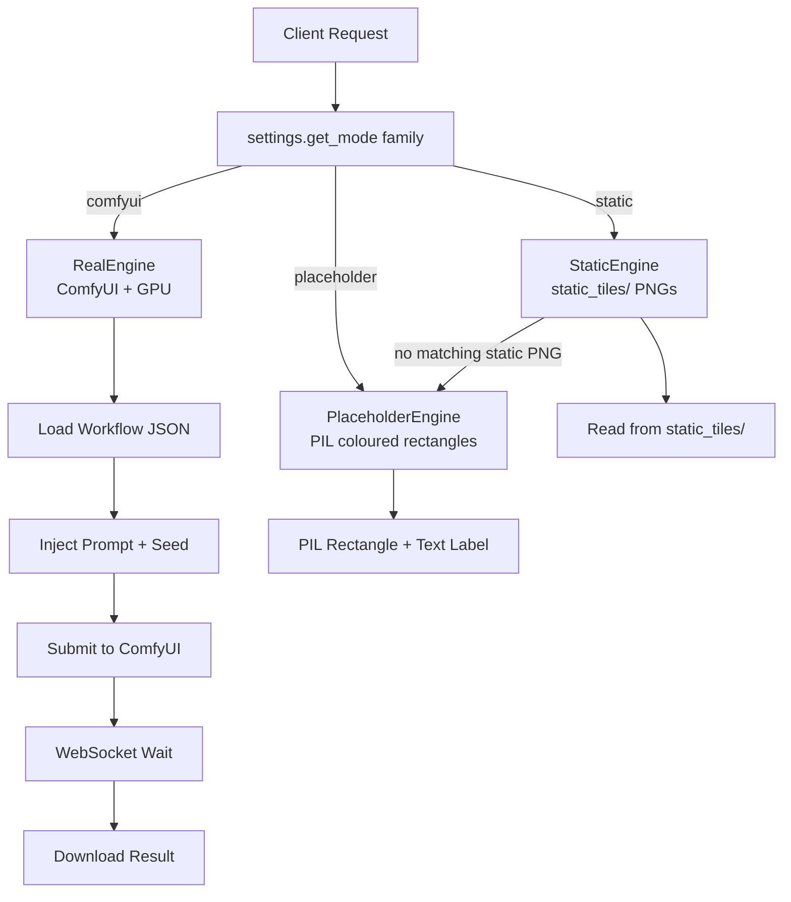
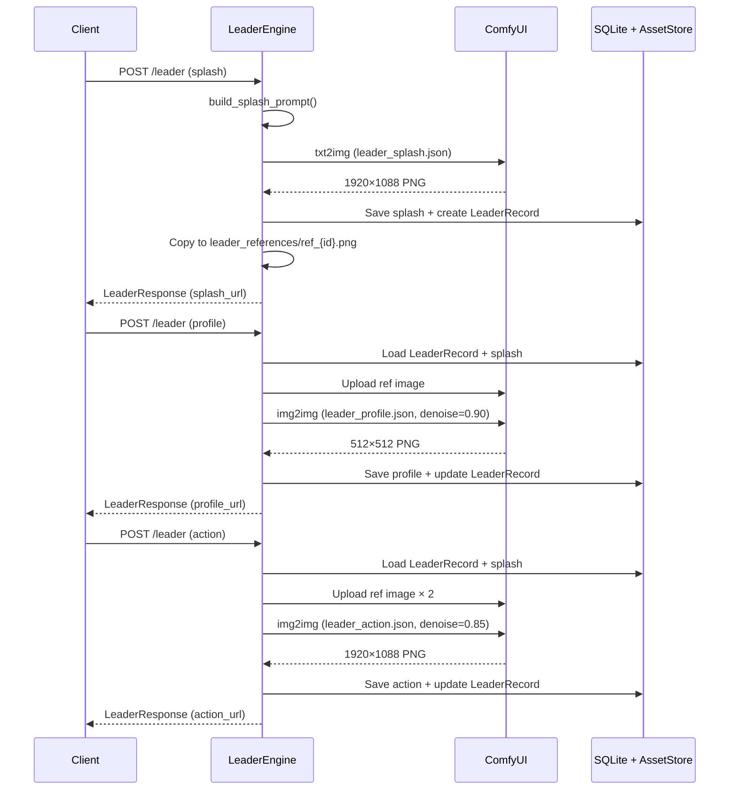

# Asset Family Engine Architecture

> 📘 This document is a supplementary deep-dive for the [Medieval Pixel Art Image Service](../README.md). For the full project report, see [`project-report.md`](../project-report.md).

---

## 1. Architecture Overview

### 1.1 Engine Pattern

Every asset family follows the same **engine pattern** — a single abstract interface with three concrete implementations:

```
RealEngine (ComfyUI)  +  StaticEngine (pre-made PNGs)  +  PlaceholderEngine (PIL rectangles)
```

The mode is selected per-family at startup via `config.yaml` → `generation.modes.{family}`:

```python
mode = settings.get_mode("structure")  # Returns "comfyui", "static", or "placeholder"
```

### 1.2 Mode Dispatch



### 1.3 Mode-Per-Family Configuration

Each asset family can independently select its generation mode:

```yaml
# config.yaml
generation:
  modes:
    structure: "comfyui"
    object: "comfyui"
    terrain: "comfyui"
    background_tile: "comfyui"
    unit: "comfyui"
    leader: "comfyui"
  default_mode: "comfyui"
```

**Deployment flexibility:** A developer can run leader generation in ComfyUI mode (for high-quality character portraits) while serving structure tiles from static pre-mades, all from the same running instance.

### 1.4 Engine Inventory

| Family | RealEngine Class | StaticEngine Class | Workflow Used | Output Size |
|--------|-----------------|-------------------|---------------|-------------|
| **Leader** | `LeaderEngine` | `StaticLeaderEngine` | `leader_splash/profile/action.json` | 1920×1088 / 512×512 |
| **Structure** | `TileEngine` | `StaticTileEngine` | `txt2img.json` | 256×256 |
| **Object** | `TileEngine` | `StaticTileEngine` | `txt2img.json` | 256×256 |
| **Terrain** | `TileEngine` | `StaticTileEngine` | `txt2img.json` | 256×256 |
| **Unit** | `UnitEngine` | `StaticUnitEngine` | `txt2img.json` | 256×256 |
| **Background Tile** | `BackgroundTileEngine` | `StaticBackgroundTileEngine` | `background_tile.json` | 256×256 |

---

## 2. Leader Engine — 3-Stage Identity Preservation

The leader pipeline is the most architecturally sophisticated feature. It generates a coherent character across three distinct visual contexts while maintaining recognisable identity.

### 2.1 Three-Stage Pipeline



### 2.2 Stage 1 — Splash (txt2img)

The **canonical leader identity** is established through a full txt2img generation:

| Parameter | Value | Rationale |
|-----------|-------|-----------|
| Workflow | `leader_splash.json` | Cinematic widescreen workflow |
| Resolution | 1920×1088 | 16:9 cinematic (1088 = 17×64, multiples-of-64 aligned) |
| Denoise | 1.0 | Full generation — no reference image |
| Guidance | 3.5 | Standard prompt adherence |
| Prompt style | Cinematic | "epic cinematic wide composition," "dramatic chiaroscuro lighting," "painterly oil style" |

The splash image serves **three purposes simultaneously**:
1. **Canonical visual reference** for the leader's identity
2. **img2img reference** saved to `leader_references/ref_{leader_id}.png` for subsequent stages
3. **High-quality display asset** for UI menus and loading screens

### 2.3 Stage 2 — Profile (img2img from Splash)

A close-up portrait generated using the splash as a reference image:

| Parameter | Value | Rationale |
|-----------|-------|-----------|
| Workflow | `leader_profile.json` | Close-up portrait with img2img |
| Reference | Splash image | Identity anchor |
| Denoise | 0.90 | Preserves core facial identity, allows composition shift |
| Guidance | 8.0 | **Highest in system** — tight identity preservation for close-ups |
| Output | 512×512 | Square 1:1 format for UI icons |

The `leader_profile.json` workflow loads the reference via `LoadImage → VAEEncode`, injecting the splash latent into the sampling process. At denoise=0.90, the model preserves facial structure and key features while allowing the composition to shift from wide cinematic to close-up portrait framing with Rembrandt-style lighting.

### 2.4 Stage 3 — Action (img2img from Splash)

A new cinematic scene depicting the leader in action:

| Parameter | Value | Rationale |
|-----------|-------|-----------|
| Workflow | `leader_action.json` | Action scene with ImageStitch |
| Reference | Splash image (×2 slots) | Identity anchor |
| Denoise | 0.85 | More creative freedom — new poses, locations, lighting |
| Guidance | 4.5 | Balances action creativity with character consistency |
| Output | 1920×1088 | Native resolution |

### 2.5 Denoise Calibration

The denoise parameter is the critical tuning knob for identity preservation:

| Denoise | Effect | Used For |
|---------|--------|----------|
| 0.0 | Exact copy of reference | Not useful |
| **0.85** | Significant changes, same character | Action scenes — new context, same person |
| **0.90** | Minimal reference influence, allows major framing changes | Profile portraits — close-up crop, new lighting |
| 1.0 | Complete regeneration | Splash (txt2img) |

These values were determined empirically. At denoise ≥ 0.95, leader identity becomes inconsistent between stages. At denoise ≤ 0.80, the model cannot deviate enough from the reference to create a meaningfully different composition.

### 2.6 Reference Image Management

Reference images are stored in `leader_references/`:
- Naming: `ref_{leader_id}.png`
- Path traversal protection: `os.path.basename()` sanitisation + `Path.resolve()` bounds check
- Uploaded to ComfyUI's `input/` folder before each profile/action generation
- Persist across service restarts (filesystem storage)

### 2.7 Multi-Leader Action

The `generate_multi_action()` method supports two-leader action scenes:

- Two `LoadImage` nodes (35 and 36) in `leader_action.json` use sentinel placeholders `__LEADER_REF_1__` and `__LEADER_REF_2__`
- Both leaders' reference images are uploaded and the sentinels replaced with actual filenames at patch time
- A composite prompt weaves both leaders' descriptions: "two leaders interacting: [Leader A], and [Leader B]"
- `ImageStitch` combines the two reference images side-by-side for conditioning
- **Hard limit of 2 leaders** — the ImageStitch node supports exactly two inputs

### 2.8 Seed Anchoring

The splash seed is stored in `LeaderRecord.splash_seed` and re-used for profile and action generations (unless the client overrides it). Using the same seed across all stages maximises img2img consistency — the noise initialisation follows the same trajectory, and the reference image guides it toward the same character.

### 2.9 StaticLeaderEngine Fallback

When `generation.modes.leader = "static"`:
- Serves pre-made leader PNGs from `static_tiles/character_sprite/`
- Falls back to placeholder (coloured rectangle with label) if no static PNG matches
- No multi-stage pipeline — single static image per leader

---

## 3. Tile Engine — Shared txt2img Core

### 3.1 Single `_generate()` Method

All three tile families (structure, object, terrain) share a single `_generate()` method on `TileEngine`:

```python
async def _generate(self, req, build_prompt, generate_id, registry_register, response_cls, family: str):
    prompt = build_prompt(req)
    asset_id = generate_id(req.category)
    seed = req.seed if req.seed is not None else secrets.randbits(32)
    
    img = await self._client.generate(
        "workflows/txt2img.json",
        positive_prompt=prompt,
        seed=seed,
    )
    
    filename = f"{uuid.uuid4()}.png"
    store.save_image(filename, img)
    
    with SessionLocal() as db:
        db.add(AssetRecord(id=filename, asset_family=family, generation_mode="comfyui"))
        registry_register(asset_id=asset_id, ..., image_id=filename, ..., session=db)
        db.commit()
    
    return response_cls(url=f"/assets/{filename}", ...)
```

### 3.2 Family Differences

The families differ only in their **enum vocabularies** and **prompt assembly**:

| Family | Enum Dimensions | Combinations | Example |
|--------|----------------|--------------|---------|
| **Structure** | 4 categories × 7 styles × 5 conditions × 3 scales | 420 | "fortification in Norman Romanesque style, weathered, medium scale" |
| **Object** | 5 categories × 7 biomes × 4 seasons | 140 | "vegetation in temperate forest during autumn" |
| **Terrain** | 5 categories × 3 scales × 5 materials | 75 | "high cliff with rocky material" |

### 3.3 Common Pipeline

All three families:
- Use `txt2img.json` (LoRA + rembg + sharpen → 256×256)
- 128×128 effective game asset size (`GAME_ASSET_SIZE = 128`)
- `<tdp>` LoRA trigger in prompt templates
- Transparent background via rembg
- White-background isolation directives in prompt templates

### 3.4 StaticTileEngine

When `generation.modes.{family} = "static"`:
- **Structures**: Resolved from `static_tiles/structure/{subtype}/` subfolders (fortification, production, housing, sacred)
- **Objects**: Resolved from `static_tiles/nature_object/` flat folder
- **Terrain**: No static terrain assets defined — falls through to placeholder

**Known limitation:** The object category enum value is ignored in static mode — any PNG in `static_tiles/nature_object/` can be returned regardless of the requested category (vegetation, geological, rural_props, urban_props, debris).

---

## 4. Background Tile Engine

### 4.1 Separate Workflow

Background tiles use `background_tile.json` — a dedicated workflow that differs from `txt2img.json`:

| Difference | Reason |
|-----------|--------|
| **No `<tdp>` LoRA** | Pixel-art rigidity creates visible grid patterns when tiles repeat |
| **No rembg** | Textures fill the entire frame — nothing to isolate |
| **No ImageSharpen** | 1024→256 downscale is sufficient for texture crispness |
| **Guidance = 2.5** | Looser guidance for organic texture flow |

### 4.2 Tile Types

| Type | Placeholder Colour | Prompt Essence |
|------|-------------------|----------------|
| `water` | Blue (60, 120, 200) | "top-down seamless repeating water **surface** texture" |
| `grass` | Green (80, 160, 60) | "top-down seamless repeating grass ground texture" |
| `sand` | Tan (220, 200, 140) | "top-down seamless repeating sand ground texture" |
| `stone` | Grey (140, 140, 140) | "top-down seamless repeating stone ground texture" |
| `dirt` | Brown (140, 100, 60) | "top-down seamless repeating dirt ground texture" |

### 4.3 Seamless Tiling Prompt Engineering

The `background_tile` template includes directive language to encourage seamless tiling:

- "The entire image must be one single 16x16 pixel art tile that fully fills the frame with continuous texture"
- "No borders, no centered composition, no empty space"
- "Generate one cohesive tile that can be seamlessly repeated in all directions"
- "No disruptive features or objects touching the outermost pixel edges"
- "Consistent texture density across whole image"
- "Perfect seamless tiling, simple and readable at small scale"

### 4.4 StaticBackgroundTileEngine

When `generation.modes.background_tile = "static"`:
- Resolves from `static_tiles/background_tile/` — flat folder
- Supports `_N` suffix variants: `grass_1.png`, `grass_2.png` → random selection
- Falls back to placeholder if no static PNG matches

---

## 5. Unit Engine

### 5.1 Single South-Facing Sprite

The unit pipeline generates a single south-facing (front view) character sprite using `txt2img.json`:

| Unit Type | Description Prose | Placeholder Colour |
|-----------|------------------|-------------------|
| `archer` | Medieval archer, bow in hand, quiver on back, leather armor, hooded cloak, light build, ranged combat stance | Greenish (60, 140, 80) |
| `scout` | Medieval scout, light leather armor, running pose, small dagger at belt, hood, lean build, fast agile movement | Bluish (60, 100, 180) |
| `settler` | Medieval settler, civilian clothes, wool tunic, carrying bundle of supplies on shoulder, walking stick, non-combatant | Brownish (160, 130, 70) |
| `warrior` | Medieval warrior, heavy plate armor, shield on arm, longsword, helmet with visor or nasal guard, stocky build | Reddish (180, 50, 50) |

**South-facing is canonical** — the character faces the player. The prompt template specifies: "facing camera front view full frontal, character looks at viewer, isolated on transparent background."

### 5.2 StaticUnitEngine

When `generation.modes.unit = "static"`:
- Resolves from `static_tiles/unit/` — flat folder by type name: `archer.png`, `scout.png`, `warrior.png`, `settler.png`
- Falls back to placeholder if no static PNG matches

---

## 6. Placeholder Engines

### 6.1 Architecture

Placeholder engines are always available — they have **zero external dependencies** beyond Pillow (already a production dependency). They are used when:
1. ComfyUI is unreachable (static engine falls back to placeholder)
2. The service is running in testing/CI mode
3. `generation.modes.{family}` is explicitly set to `"placeholder"`

### 6.2 Implementation

All placeholder engines generate a 256×256 image using PIL:

```python
from PIL import Image, ImageDraw
from src.font_utils import get_font

def _generate_placeholder(label: str, color: tuple, size: int = 256) -> Image.Image:
    img = Image.new("RGBA", (size, size), color)
    draw = ImageDraw.Draw(img)
    font = get_font(size=14)
    # Draw centered text label
    bbox = draw.textbbox((0, 0), label, font=font)
    text_x = (size - (bbox[2] - bbox[0])) // 2
    text_y = (size - (bbox[3] - bbox[1])) // 2
    draw.text((text_x, text_y), label, fill="black", font=font)
    return img
```

### 6.3 Per-Family Colour Coding

| Family | Placeholder Colour | Visual Identity |
|--------|-------------------|-----------------|
| Structure | (139, 90, 43) — Brown | Buildings / construction |
| Object | (34, 139, 34) — Green | Nature / vegetation |
| Terrain | (100, 100, 80) — Grey-brown | Earth / elevation |
| Background Tile | Per-type (5 colours) | Water=blue, Grass=green, Sand=tan, Stone=grey, Dirt=brown |
| Unit | Per-type (4 colours) | Archer=green, Scout=blue, Settler=brown, Warrior=red |
| Leader | N/A | No dedicated placeholder — falls through to static |

### 6.4 Font Resolution

Placeholder text labels use `src/font_utils.py` → `get_font(size=14)` which resolves fonts across platforms:
1. Config path (`paths.font_path` in `config.yaml`)
2. System paths (Debian/Ubuntu, Fedora, macOS, Windows/WSL)
3. `PIL.ImageFont.load_default()` — always available bitmap fallback
