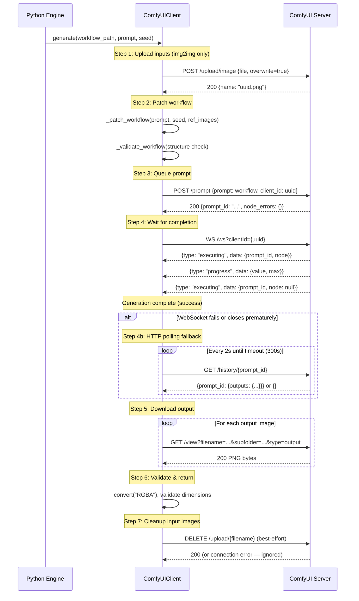

# ComfyUI Communication Protocol

> 📘 This document is a supplementary deep-dive for the [Medieval Pixel Art Image Service](../../README.md). For the full project report, see [`project-report.md`](../project-report.md).

---

## 1. API Endpoints Used

The `ComfyUIClient` in `src/comfyui_client.py` interacts with ComfyUI through six HTTP endpoints and one WebSocket endpoint:

| Method | Path | Purpose | Called By |
|--------|------|---------|-----------|
| `POST` | `/upload/image` | Upload input/reference images to `input/` folder | `upload_image()`, `upload_reference_image()` |
| `POST` | `/prompt` | Submit a workflow JSON for execution | `queue_workflow()` |
| `GET` | `/queue` | Query queue depth (running + pending jobs) | `get_queue_info()` (load balancer) |
| `GET` | `/history/{prompt_id}` | Poll for completion (HTTP fallback) | `get_result()`, `_wait_via_polling()` |
| `GET` | `/view` | Download a generated output image | `download_image()` |
| `GET` | `/system_stats` | Health check ping | `health_check()` |
| `WS` | `/ws?clientId=...` | Real-time execution progress | `_wait_via_ws()` |

---

## 2. Full Lifecycle



---

## 3. WebSocket Protocol

### 3.1 Connection

```python
ws_url = base_url.replace("http://", "ws://").replace("https://", "wss://")
async with websockets.connect(
    f"{ws_url}/ws?clientId={client_id}",
    open_timeout=10,
    close_timeout=5,
) as ws:
    ...
```

- **URL**: `ws://host:8188/ws?clientId={uuid4}`
- **Open timeout**: 10 seconds
- **Close timeout**: 5 seconds
- **client_id**: UUID4, shared with the `POST /prompt` call so ComfyUI routes events to the correct listener

### 3.2 Message Types

| Type | Direction | Data | Meaning |
|------|-----------|------|---------|
| `executing` | ComfyUI → Client | `{prompt_id, node}` | Node execution started; `node: null` = **all nodes complete** (success) |
| `execution_error` | ComfyUI → Client | `{prompt_id, exception_type, exception_message, traceback}` | Execution failed — raises `RuntimeError` |
| `progress` | ComfyUI → Client | `{value, max}` | Step progress (logged for monitoring) |
| `executed` | ComfyUI → Client | `{prompt_id, output: {images: [...]}}` | **Legacy format** — handled for backward compatibility |

### 3.3 Success Detection

Success is detected when an `executing` message arrives with `node: null`:

```python
if msg_type == "executing" and msg_data.get("prompt_id") == prompt_id:
    if msg_data.get("node") is None:
        return  # Execution complete — success
```

### 3.4 Error Detection

Errors are detected via `execution_error` messages:

```python
if msg_type == "execution_error" and msg_data.get("prompt_id") == prompt_id:
    raise RuntimeError(
        f"ComfyUI execution error for {prompt_id}: "
        f"{err_type}: {err_detail}"
    )
```

### 3.5 Message Parsing Robustness

The WebSocket handler includes several robustness measures:

```python
# Handle both bytes and str frames (websockets library version differences)
if isinstance(raw, bytes):
    raw = raw.decode("utf-8", errors="replace")

# Skip empty payloads (ping/pong, empty binary frames)
if not raw or not raw.strip():
    continue

# Graceful handling of unparseable JSON
try:
    data = json.loads(raw)
except (json.JSONDecodeError, UnicodeDecodeError) as exc:
    logger.warning("WebSocket received unparseable message: %r", raw[:200])
    continue
```

### 3.6 Reconnection Strategy

The WebSocket is opened once per generation and closed after completion. There is no persistent connection — each `generate()` call establishes a fresh WebSocket with a new `client_id`. If the WebSocket fails, the client falls back to HTTP polling.

---

## 4. HTTP Polling Fallback

### 4.1 When WebSocket Fails

The WebSocket can fail for several reasons, all of which trigger HTTP polling:

| Failure Mode | Detection | Fallback Behaviour |
|-------------|-----------|-------------------|
| Connection refused | `ConnectionRefusedError` | Immediate polling |
| Connection closed prematurely | `websockets.exceptions.ConnectionClosed` | Verify via polling |
| WebSocket timeout | `asyncio.TimeoutError` | Verify via polling |
| Unexpected exception | Generic `Exception` | Verify via polling |

### 4.2 Polling Loop

```python
async def _wait_via_polling(self, prompt_id: str) -> bool:
    deadline = time.monotonic() + self.timeout
    while time.monotonic() < deadline:
        result = await self.get_result(prompt_id)
        if prompt_id in result:
            return True  # Prompt found in history — complete
        await asyncio.sleep(2)  # Poll every 2 seconds
    return False  # Timeout
```

- **Poll interval**: 2 seconds
- **Timeout**: `comfyui.timeout` (default 300 seconds)
- **Completion signal**: `prompt_id` appears in `/history` response

---

## 5. Error Handling

### 5.1 Error Classification

```python
# Retryable — suggest node connectivity issue
_RETRYABLE_EXCEPTIONS = (
    httpx.ConnectError,
    httpx.TimeoutException,
    httpx.RemoteProtocolError,
    httpx.ConnectTimeout,
    httpx.ReadTimeout,
    httpx.WriteTimeout,
    httpx.PoolTimeout,
    websockets.exceptions.ConnectionClosed,
    OSError,  # ConnectionRefusedError, etc.
)

# Non-retryable — workflow/model error
# - node_errors in queue response
# - execution_error via WebSocket
# - HTTP 4xx (client error)
```

| Error | Classification | Action |
|-------|---------------|--------|
| Connection refused | Retryable | Failover to next node (load balancer) |
| HTTP timeout | Retryable | Failover to next node |
| WebSocket closure | Retryable | Fall back to HTTP polling, then failover |
| HTTP 5xx | Retryable | Failover to next node |
| `node_errors` in `/prompt` response | Non-retryable | Propagate immediately — workflow validation error |
| `execution_error` via WebSocket | Non-retryable | Propagate with exception details |
| HTTP 4xx | Non-retryable | Propagate immediately |
| `RuntimeError("did not complete")` | Retryable | Treated as timeout/dead node |

### 5.2 Download Retry with Backoff

Image downloads include retry logic:

```python
async def _download_with_retry(client, filename, subfolder, folder_type, max_retries=3):
    for attempt in range(max_retries):
        try:
            return await client.download_image(filename, subfolder, folder_type)
        except Exception as exc:
            if attempt == max_retries - 1:
                raise
            await asyncio.sleep(0.5 * (2 ** attempt))  # Exponential backoff
```

### 5.3 Timeout Handling

| Operation | Timeout | Rationale |
|-----------|---------|-----------|
| `/upload/image` | 30s | Image uploads are bounded by file size |
| `/prompt` | 15s | Queue submission is a simple API call |
| `/queue` | min(timeout, 15s) | Lightweight status check |
| `/history` | `comfyui.timeout` (300s) | Full timeout for completion polling |
| `/view` (download) | 30s | Image downloads are bounded by file size |
| `/system_stats` | 5s | Fast health check — fail quickly if down |
| WebSocket receive | `comfyui.timeout` (300s) | Full generation timeout |
| Engine-level `asyncio.wait_for` | `client.timeout + 60s` | Extra 60s buffer for network overhead |

---

## 6. Image Upload for img2img

### 6.1 Upload Flow

For leader profile and action generations, the reference image must be uploaded to ComfyUI before queueing:

```python
# 1. Open reference image from leader_references/
with Image.open(ref_path) as fh:
    ref_img = fh.convert("RGBA")

# 2. Upload to ComfyUI's input/ folder
await client.upload_reference_image(ref_img, leader.reference_filename)

# 3. The filename is injected into LoadImage nodes during workflow patching
```

### 6.2 Upload vs Upload Reference

Two upload methods serve different purposes:

| Method | Overwrite | Persistence | Use Case |
|--------|-----------|-------------|----------|
| `upload_image()` | `overwrite=true` | Temporary — cleaned up after generation | One-shot input images (inpainting, etc.) |
| `upload_reference_image()` | `overwrite=true`, `type=input` | Persistent across generations | Leader reference images reused for profile + action |

### 6.3 Cleanup After Generation

Uploaded input images are cleaned up in a `finally` block to prevent disk accumulation on the ComfyUI server:

```python
try:
    # ... generation ...
finally:
    if uploaded:
        await _cleanup_uploaded_images(self, uploaded.values())
```

This is best-effort — failures during cleanup are logged but do not affect the generation result.

### 6.4 Filename Management

- Upload filenames: `{uuid4}.png` for temporary uploads
- Reference filenames: `ref_{leader_id}.png` — matches the file in `leader_references/`
- Sentinels `__LEADER_REF_1__` and `__LEADER_REF_2__` in workflow JSONs are replaced at patch time with actual filenames
