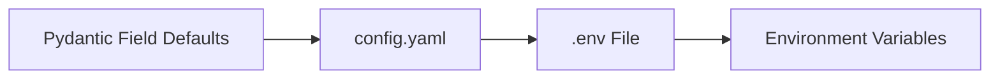

# Configuration Reference

> 📘 This document is a supplementary deep-dive for the [Medieval Pixel Art Image Service](../README.md). For the full project report, see [`project-report.md`](../project-report.md).

---

## 1. Config Layering

Configuration is loaded from multiple sources, merged in priority order (highest wins):



| Priority | Source | Example |
|----------|--------|---------|
| 1 (highest) | Environment variables | `export COMFYUI__TIMEOUT=600` |
| 2 | `.env` file | `COMFYUI__TIMEOUT=600` |
| 3 | `config.yaml` | `comfyui: { timeout: 300 }` |
| 4 (lowest) | Pydantic field defaults | `timeout: int = 300` |

### 1.1 `.env` Override Syntax

Nested settings use a **double-underscore delimiter** (`__`) to traverse the config hierarchy:

```bash
# .env file
COMFYUI__BASE_URL=http://192.168.1.100:8188
COMFYUI__TIMEOUT=600
SERVER__API_KEY=my-secret-key
GENERATION__MODES__STRUCTURE=static
GENERATION__MODES__LEADER=comfyui
```

This maps to the nested structure:
```yaml
comfyui:
  base_url: "http://192.168.1.100:8188"
  timeout: 600
server:
  api_key: "my-secret-key"
generation:
  modes:
    structure: "static"
    leader: "comfyui"
```

### 1.2 Load Order Implementation

```python
# config.yaml → YAML source (priority 3)
# .env → loaded into os.environ via python-dotenv (priority 2)
# Environment variables → native pydantic-settings source (priority 1)
# Pydantic field defaults → lowest priority
```

---

## 2. Top-Level Settings

| Key | Type | Default | Description |
|-----|------|---------|-------------|
| `host` | `str` | `"127.0.0.1"` | Bind address for the HTTP server. Set to `"0.0.0.0"` for Docker/container deployments |
| `port` | `int` | `8000` | HTTP listen port |
| `database_url` | `str` | `sqlite:///{BASE_DIR}/tilemap.db` | SQLAlchemy database URL. Defaults to SQLite at project root |
| `mode` | `DeploymentMode` | `DEVELOPMENT` | Deployment environment — controls safety check strictness |

### 2.1 DeploymentMode Enum

| Value | Behaviour |
|-------|-----------|
| `DEVELOPMENT` | Warnings for config issues (missing workflows, permissive CORS). Service starts regardless |
| `PRODUCTION` | **Refuses to start** on config issues (missing workflows, invalid prompt templates, wildcard CORS). Strict validation |

---

## 3. `comfyui.*` Settings

### 3.1 Connection

| Key | Type | Default | Env Override | Description |
|-----|------|---------|-------------|-------------|
| `comfyui.base_url` | `str` | `"http://127.0.0.1:8188"` | `COMFYUI__BASE_URL` | Single ComfyUI server URL (backward-compatible mode) |
| `comfyui.nodes` | `list[str]` | `[]` | `COMFYUI__NODES` (JSON array) | Multi-node list. When non-empty, overrides `base_url` |
| `comfyui.timeout` | `int` | `300` | `COMFYUI__TIMEOUT` | Per-request timeout in seconds (>0) |
| `comfyui.health_check_interval` | `int` | `30` | `COMFYUI__HEALTH_CHECK_INTERVAL` | Seconds between re-pinging unhealthy nodes (>0) |
| `comfyui.max_retries` | `int` | `3` | `COMFYUI__MAX_RETRIES` | Max nodes to try per generation before failing (≥0) |

### 3.2 Warmup

| Key | Type | Default | Description |
|-----|------|---------|-------------|
| `comfyui.warmup_enabled` | `bool` | `true` | Submit a minimal generation at startup to preload DiT weights into GPU VRAM |
| `comfyui.warmup_timeout` | `int` | `120` | Max seconds to wait for warmup (10–600) |
| `comfyui.warmup_workflow` | `str` | `"background_tile"` | Simplest workflow to use for warmup (no LoRA, no rembg) |

**Warmup behaviour:**
- At startup, a background task submits a minimal generation (prompt: "solid black background", seed=0)
- If warmup completes within the timeout, models are loaded in VRAM — first user request avoids cold-start latency
- If warmup times out, a warning is logged — the first user request pays the cold-start cost
- Warmup failure is non-fatal — the service starts regardless

### 3.3 Node URL Resolution

The `get_urls()` method implements a three-tier resolution:

1. If `nodes` list is non-empty → use it directly
2. If `COMFYUI__NODES` env var is set → parse and use it (catches pydantic-settings YAML source edge cases)
3. Fall back to `[base_url]` — single-node mode with a warning log

---

## 4. `paths.*` Settings

| Key | Type | Default | Description |
|-----|------|---------|-------------|
| `paths.output_dir` | `str` | `"generated_assets"` | Main output directory for generated PNGs |
| `paths.splash_dir` | `str` | `"splash_assets"` | Leader splash portrait storage |
| `paths.static_tiles_dir` | `str` | `"static_tiles"` | Pre-made static PNG catalog |
| `paths.leader_reference_dir` | `str` | `"leader_references"` | Reference images for leader img2img pipeline |
| `paths.font_path` | `str` | `""` | Optional absolute path to a `.ttf`/`.ttc` font. Empty = auto-detect from system |

All paths are resolved relative to the project root (`BASE_DIR`).

---

## 5. `generation.*` Settings

| Key | Type | Default | Description |
|-----|------|---------|-------------|
| `generation.modes` | `dict[str, str]` | All `"comfyui"` | Per-family generation mode mapping |
| `generation.default_mode` | `str` | `"comfyui"` | Fallback mode when a family is not in `modes` |

### 5.1 Valid Mode Values

| Mode | Description |
|------|-------------|
| `"comfyui"` | Full AI generation via Flux2 Klein 4B on ComfyUI |
| `"static"` | Serve pre-made PNGs from `static_tiles/`; fall back to placeholder |
| `"placeholder"` | PIL-generated coloured rectangles with text labels |

### 5.2 `get_mode()` Resolution

```python
def get_mode(self, family: str) -> str:
    return self.generation.modes.get(family, self.generation.default_mode)
```

Resolution order: family-specific key → `default_mode` → hardcoded `"comfyui"`.

### 5.3 Supported Families

| Family Key | Asset Type | Valid Modes |
|-----------|-----------|-------------|
| `structure` | Structure tiles | comfyui, static, placeholder |
| `object` | Nature objects | comfyui, static, placeholder |
| `terrain` | Terrain elevations | comfyui, static, placeholder |
| `background_tile` | Seamless ground textures | comfyui, static, placeholder |
| `unit` | Character sprites | comfyui, static, placeholder |
| `leader` | Leader portraits | comfyui, static, placeholder |
| `character_sprite` | (Reserved) | comfyui, static, placeholder |
| `nature_object` | (Reserved) | comfyui, static, placeholder |
| `story` | (Reserved) | comfyui, static, placeholder |
| `splash` | (Reserved) | comfyui, static, placeholder |

---

## 6. `server.*` Settings

| Key | Type | Default | Env Override | Description |
|-----|------|---------|-------------|-------------|
| `server.cors_origins` | `list[str]` | `["http://localhost:3000"]` | `SERVER__CORS_ORIGINS` (JSON array) | CORS allowed origins. Production must not use wildcards |
| `server.max_request_body_mb` | `int` | `10` | `SERVER__MAX_REQUEST_BODY_MB` | Max request body size in MB (1–100) |
| `server.assets_url_prefix` | `str` | `"/assets"` | `SERVER__ASSETS_URL_PREFIX` | URL prefix for serving generated assets |
| `server.cache_max_entries` | `int` | `1000` | `SERVER__CACHE_MAX_ENTRIES` | Max images in the in-memory LRU cache (1–100,000) |
| `server.cache_max_mb` | `int` | `500` | `SERVER__CACHE_MAX_MB` | Max memory (MB) for the image cache (1–16,384) |
| `server.api_key` | `str` | `""` | `SERVER__API_KEY` | Static API key. Empty = authentication disabled |

### 6.1 CORS Security

- Default `["http://localhost:3000"]` — local development only
- Wildcard `["*"]` triggers a CRITICAL log warning in PRODUCTION mode
- Credentials disabled (`allow_credentials=False`)

### 6.2 API Key Authentication

- When `api_key` is non-empty, all requests must include `X-API-Key: <key>` header
- Uses **constant-time comparison** (`secrets.compare_digest`) to prevent timing attacks
- `/health` and `/health/ready` are exempt from authentication
- Empty `api_key` = authentication disabled (development default)

### 6.3 Cache Sizing

Two eviction triggers — whichever limit is hit first:
- **Count-based**: LRU eviction when entries exceed `cache_max_entries`
- **Size-based**: LRU eviction when total cached bytes exceed `cache_max_mb × 1024 × 1024`

---

## 7. `rate_limit.*` Settings

| Key | Type | Default | Description |
|-----|------|---------|-------------|
| `rate_limit.post_rps` | `float` | `2.0` | Max POST (generation) requests per second globally (>0) |
| `rate_limit.get_rps` | `float` | `50.0` | Max GET (read) requests per second globally (>0) |
| `rate_limit.burst_size` | `int` | `5` | Max burst for POST endpoints before throttling (≥1) |
| `rate_limit.enabled` | `bool` | `true` | Set to `false` to disable rate limiting (e.g., tests) |

### 7.1 Token-Bucket Algorithm

The rate limiter uses a simple **token-bucket** implementation:
- Tokens refill at `post_rps` or `get_rps` per second
- Burst capacity: `burst_size` tokens for POST, `burst_size × 100` for GET
- Global scope (across all clients), NOT per-IP
- For per-IP limits, place a reverse proxy (nginx/Caddy) in front of the service

### 7.2 Rate Limit Headers

Rate limit status is communicated via response headers:
- `X-RateLimit-Limit`: The rate limit for this endpoint type
- `X-RateLimit-Remaining`: Tokens remaining in the current window
- `X-RateLimit-Reset`: Unix timestamp when the bucket refills

Exceeding the limit returns **HTTP 429 Too Many Requests**.

---

## 8. Production vs Development

| Behaviour | DEVELOPMENT | PRODUCTION |
|-----------|-------------|------------|
| Missing workflow JSONs | Warning — service starts | **Fatal** — refuses to start |
| Invalid prompt templates | Warning — service starts | **Fatal** — refuses to start |
| Missing workflow node types | Warning — generation may fail | **Fatal** — refuses to start |
| Permissive CORS (`["*"]`) | Silently accepted | CRITICAL log warning |
| SQLite in production | Info log | Info log with WAL journal note |
| leader_action.json sentinel validation | Warning | Warning (non-fatal check) |
| Schema health check | Warning on failure | Warning on failure |

---

## 9. Environment Variable Reference

### 9.1 Complete `.env` File Example

```bash
# ---- Network ----
SERVER__HOST=0.0.0.0
SERVER__PORT=8000
MODE=production

# ---- ComfyUI Connection ----
# Single node (backward-compatible)
COMFYUI__BASE_URL=http://192.168.1.100:8188
COMFYUI__TIMEOUT=600
COMFYUI__MAX_RETRIES=5
COMFYUI__HEALTH_CHECK_INTERVAL=60

# Multi-node (JSON array)
# COMFYUI__NODES=["http://10.0.0.5:8188","http://10.0.0.6:8188","http://10.0.0.7:8188"]

# Warmup
COMFYUI__WARMUP_ENABLED=true
COMFYUI__WARMUP_TIMEOUT=180

# ---- Paths ----
# PATHS__FONT_PATH=/usr/share/fonts/truetype/custom/MyFont.ttf

# ---- Server ----
SERVER__CORS_ORIGINS=["https://mygame.example.com"]
SERVER__API_KEY=sk-prod-abc123def456
SERVER__MAX_REQUEST_BODY_MB=20
SERVER__CACHE_MAX_ENTRIES=500
SERVER__CACHE_MAX_MB=1000

# ---- Rate Limiting ----
RATE_LIMIT__POST_RPS=5.0
RATE_LIMIT__GET_RPS=100.0
RATE_LIMIT__BURST_SIZE=10
RATE_LIMIT__ENABLED=true

# ---- Generation Modes ----
GENERATION__MODES__STRUCTURE=comfyui
GENERATION__MODES__OBJECT=static
GENERATION__MODES__TERRAIN=placeholder
GENERATION__MODES__LEADER=comfyui
GENERATION__MODES__UNIT=static
GENERATION__MODES__BACKGROUND_TILE=comfyui
GENERATION__DEFAULT_MODE=comfyui

# ---- Database ----
# DATABASE_URL=sqlite:////data/tilemap.db
```

### 9.2 All Environment Variables

| Variable | Maps To | Type | Default |
|----------|---------|------|---------|
| `HOST` | `host` | `str` | `"127.0.0.1"` |
| `PORT` | `port` | `int` | `8000` |
| `MODE` | `mode` | `str` | `"development"` |
| `DATABASE_URL` | `database_url` | `str` | `sqlite:///{BASE_DIR}/tilemap.db` |
| `COMFYUI__BASE_URL` | `comfyui.base_url` | `str` | `"http://127.0.0.1:8188"` |
| `COMFYUI__NODES` | `comfyui.nodes` | `JSON list` | `[]` |
| `COMFYUI__TIMEOUT` | `comfyui.timeout` | `int` | `300` |
| `COMFYUI__HEALTH_CHECK_INTERVAL` | `comfyui.health_check_interval` | `int` | `30` |
| `COMFYUI__MAX_RETRIES` | `comfyui.max_retries` | `int` | `3` |
| `COMFYUI__WARMUP_ENABLED` | `comfyui.warmup_enabled` | `bool` | `true` |
| `COMFYUI__WARMUP_TIMEOUT` | `comfyui.warmup_timeout` | `int` | `120` |
| `COMFYUI__WARMUP_WORKFLOW` | `comfyui.warmup_workflow` | `str` | `"background_tile"` |
| `PATHS__OUTPUT_DIR` | `paths.output_dir` | `str` | `"generated_assets"` |
| `PATHS__SPLASH_DIR` | `paths.splash_dir` | `str` | `"splash_assets"` |
| `PATHS__STATIC_TILES_DIR` | `paths.static_tiles_dir` | `str` | `"static_tiles"` |
| `PATHS__LEADER_REFERENCE_DIR` | `paths.leader_reference_dir` | `str` | `"leader_references"` |
| `PATHS__FONT_PATH` | `paths.font_path` | `str` | `""` |
| `SERVER__CORS_ORIGINS` | `server.cors_origins` | `JSON list` | `["http://localhost:3000"]` |
| `SERVER__MAX_REQUEST_BODY_MB` | `server.max_request_body_mb` | `int` | `10` |
| `SERVER__ASSETS_URL_PREFIX` | `server.assets_url_prefix` | `str` | `"/assets"` |
| `SERVER__CACHE_MAX_ENTRIES` | `server.cache_max_entries` | `int` | `1000` |
| `SERVER__CACHE_MAX_MB` | `server.cache_max_mb` | `int` | `500` |
| `SERVER__API_KEY` | `server.api_key` | `str` | `""` |
| `RATE_LIMIT__POST_RPS` | `rate_limit.post_rps` | `float` | `2.0` |
| `RATE_LIMIT__GET_RPS` | `rate_limit.get_rps` | `float` | `50.0` |
| `RATE_LIMIT__BURST_SIZE` | `rate_limit.burst_size` | `int` | `5` |
| `RATE_LIMIT__ENABLED` | `rate_limit.enabled` | `bool` | `true` |
| `GENERATION__MODES__{FAMILY}` | `generation.modes.{family}` | `str` | `"comfyui"` |
| `GENERATION__DEFAULT_MODE` | `generation.default_mode` | `str` | `"comfyui"` |
