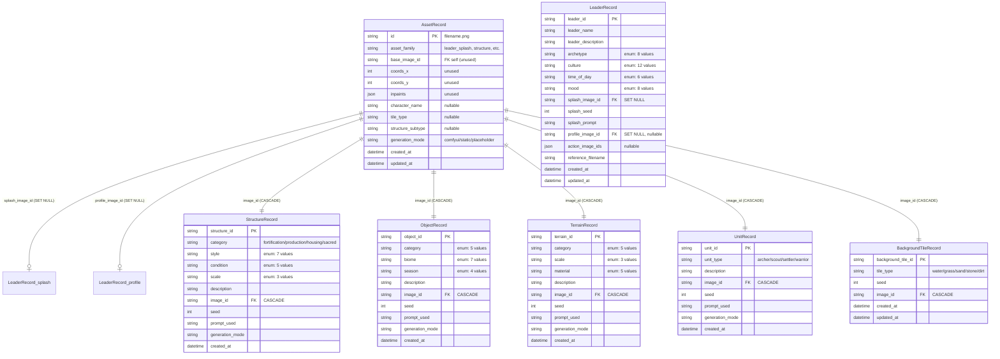

# Database Schema Reference

> 📘 This document is a supplementary deep-dive for the [Medieval Pixel Art Image Service](../README.md). For the full project report, see [`project-report.md`](../project-report.md).

---

## 1. Overview

### 1.1 Technology Stack

| Component | Choice | Rationale |
|-----------|--------|-----------|
| **Database** | SQLite | Zero-configuration, single-file, sufficient for single-node deployments |
| **ORM** | SQLAlchemy 2.0 | Declarative models, session management, migration support |
| **Migrations** | Alembic | Version-controlled schema evolution, auto-migration at startup |
| **Journal mode** | WAL (Write-Ahead Logging) | Concurrent readers + writers without blocking |
| **Connection pool** | `pool_size=2`, `max_overflow=5` | Conservative for SQLite's single-writer architecture |

### 1.2 Engine Configuration

```python
engine = create_engine(
    DATABASE_URL,
    connect_args={"check_same_thread": False},
    pool_size=2,
    max_overflow=5,
    pool_pre_ping=True,
    pool_recycle=3600,
)
```

| Parameter | Value | Rationale |
|-----------|-------|-----------|
| `check_same_thread` | `False` | Required for FastAPI's async event loop (SQLite default is single-thread) |
| `pool_size` | `2` | One connection for reads, one for writes — SQLite serialises all writes anyway |
| `max_overflow` | `5` | Headroom for load spikes without overwhelming the single-writer lock |
| `pool_pre_ping` | `True` | Validates connections before use — prevents stale connection errors |
| `pool_recycle` | `3600` | Recycles connections hourly to prevent memory leaks |

### 1.3 PRAGMAs

Applied on every new SQLite connection via an event listener:

```python
@event.listens_for(Engine, "connect")
def _set_sqlite_pragma(dbapi_connection, connection_record):
    cursor.execute("PRAGMA foreign_keys=ON")     # Enforce FK constraints
    cursor.execute("PRAGMA journal_mode=WAL")    # Write-Ahead Logging
    cursor.execute("PRAGMA busy_timeout=5000")   # 5s wait instead of immediate SQLITE_BUSY
    cursor.execute("PRAGMA synchronous=NORMAL")  # Crash-safe with WAL, better write throughput
```

| PRAGMA | Effect |
|--------|--------|
| `foreign_keys=ON` | Enforces FK constraints (OFF by default in SQLite) |
| `journal_mode=WAL` | Readers and writers run concurrently — critical for multi-user workloads |
| `busy_timeout=5000` | Waits up to 5 seconds instead of failing with `SQLITE_BUSY` |
| `synchronous=NORMAL` | Still crash-safe with WAL, avoids per-transaction fsync penalty of FULL |

### 1.4 Busy-Retry Helper

Even with `busy_timeout=5000`, extreme write contention can exceed the timeout:

```python
def _execute_with_busy_retry(session, operation, *args, **kwargs):
    """Retry on SQLITE_BUSY with exponential backoff (50ms → 100ms → 200ms)."""
    for attempt in range(3):
        try:
            return operation(*args, **kwargs)
        except OperationalError as exc:
            if "database is locked" not in str(exc).lower():
                raise
            if attempt < 2:
                time.sleep([0.05, 0.10, 0.20][attempt])
    raise last_exc
```

---

## 2. Entity-Relationship Diagram



---

## 3. Table Reference

### 3.1 `asset_records` — Central Registry

Every generated image file has exactly one row in `asset_records`. All other record types reference this table via `image_id` foreign keys.

| Column | Type | Constraints | Description |
|--------|------|-------------|-------------|
| `id` | `String` | **PK**, indexed | Filename (e.g., `abc123.png`) — doubles as the primary key |
| `asset_family` | `String` | NOT NULL, indexed | One of: `leader_splash`, `structure`, `object`, `terrain`, `unit`, `background_tile` |
| `base_image_id` | `String` | nullable, indexed | Reserved for future use (tilemap referencing) |
| `coords_x` | `Integer` | nullable | Reserved for future use |
| `coords_y` | `Integer` | nullable | Reserved for future use |
| `inpaints` | `JSON` | nullable | Reserved for future use |
| `character_name` | `String` | nullable | Leader name (populated for leader_splash assets) |
| `tile_type` | `String` | nullable | Tile type (populated for background_tile assets) |
| `structure_subtype` | `String` | nullable | Reserved for future use |
| `generation_mode` | `String` | nullable | One of: `comfyui`, `static`, `placeholder` |
| `created_at` | `DateTime` | server_default=`now()`, indexed | Auto-populated on insert |
| `updated_at` | `DateTime` | server_default=`now()`, onupdate=`now()` | Auto-updated on modification |

### 3.2 `leader_records` — Leader Identity

| Column | Type | Constraints | Description |
|--------|------|-------------|-------------|
| `leader_id` | `String` | **PK**, indexed | Generated ID (e.g., `ldr_alexander_a1b2c3d4`) |
| `leader_name` | `String` | NOT NULL | Display name |
| `leader_description` | `String` | NOT NULL, default `""` | Free-form description from client |
| `archetype` | `String` | NOT NULL | One of 8: warrior_queen, warrior_king, philosopher_king, merchant_prince, spiritual_leader, diplomat, tyrant, visionary |
| `culture` | `String` | NOT NULL | One of 12: ancient_egyptian, classical_greek, roman_imperial, medieval_european, east_asian_imperial, mesopotamian, mesoamerican, nordic_viking, persian, sub_saharan_african, south_asian, islamic_golden_age |
| `time_of_day` | `String` | NOT NULL | One of 6: dawn, golden_hour, midday, twilight, night, storm |
| `mood` | `String` | NOT NULL | One of 8: triumphant, wise_serene, grim_determined, mystical, melancholic, menacing, hopeful, contemplative |
| `splash_image_id` | `String` | **FK** → `asset_records.id` ON DELETE **SET NULL**, indexed, nullable | Splash portrait image |
| `splash_seed` | `Integer` | NOT NULL | Canonical seed — reused for profile/action generations |
| `splash_prompt` | `String` | NOT NULL | Full prompt used for splash generation (for reproducibility) |
| `profile_image_id` | `String` | **FK** → `asset_records.id` ON DELETE **SET NULL**, nullable | Profile portrait image |
| `action_image_ids` | `JSON` | nullable | List of action image filenames |
| `reference_filename` | `String` | NOT NULL | Path to reference image in `leader_references/` |
| `created_at` | `DateTime` | server_default=`now()`, indexed | |
| `updated_at` | `DateTime` | server_default=`now()`, onupdate=`now()` | |

### 3.3 `structure_records`

| Column | Type | Constraints | Description |
|--------|------|-------------|-------------|
| `structure_id` | `String` | **PK**, indexed | Generated ID |
| `category` | `String` | NOT NULL, indexed | One of 4: fortification, production, housing, sacred |
| `style` | `String` | NOT NULL | One of 7: nordic_wooden, anglo_saxon_stone, norman_romanesque, gothic, mediterranean, slavic_timber, moorish |
| `condition` | `String` | NOT NULL | One of 5: pristine, weathered, ruined, under_construction, fortified |
| `scale` | `String` | NOT NULL | One of 3: small, medium, large |
| `description` | `String` | NOT NULL | Free-form description |
| `image_id` | `String` | **FK** → `asset_records.id` ON DELETE **CASCADE**, NOT NULL, indexed | |
| `seed` | `Integer` | NOT NULL | Generation seed |
| `prompt_used` | `String` | NOT NULL | Full prompt (for reproducibility) |
| `generation_mode` | `String` | nullable | |
| `created_at` | `DateTime` | server_default=`now()`, indexed | |

### 3.4 `object_records`

| Column | Type | Constraints | Description |
|--------|------|-------------|-------------|
| `object_id` | `String` | **PK**, indexed | |
| `category` | `String` | NOT NULL, indexed | One of 5: vegetation, geological, rural_props, urban_props, debris |
| `biome` | `String` | NOT NULL | One of 7: temperate_forest, taiga, desert, swamp, mountain, coastal, grassland |
| `season` | `String` | NOT NULL | One of 4: spring, summer, autumn, winter |
| `description` | `String` | NOT NULL | |
| `image_id` | `String` | **FK** → `asset_records.id` ON DELETE **CASCADE**, NOT NULL, indexed | |
| `seed` | `Integer` | NOT NULL | |
| `prompt_used` | `String` | NOT NULL | |
| `generation_mode` | `String` | nullable | |
| `created_at` | `DateTime` | server_default=`now()`, indexed | |

### 3.5 `terrain_records`

| Column | Type | Constraints | Description |
|--------|------|-------------|-------------|
| `terrain_id` | `String` | **PK**, indexed | |
| `category` | `String` | NOT NULL, indexed | One of 5: hill, slope, cliff, plateau, valley |
| `scale` | `String` | NOT NULL | One of 3: low, medium, high |
| `material` | `String` | NOT NULL | One of 5: grassy, rocky, sandy, snowy, barren |
| `description` | `String` | NOT NULL | |
| `image_id` | `String` | **FK** → `asset_records.id` ON DELETE **CASCADE**, NOT NULL, indexed | |
| `seed` | `Integer` | NOT NULL | |
| `prompt_used` | `String` | NOT NULL | |
| `generation_mode` | `String` | nullable | |
| `created_at` | `DateTime` | server_default=`now()`, indexed | |

### 3.6 `unit_records`

| Column | Type | Constraints | Description |
|--------|------|-------------|-------------|
| `unit_id` | `String` | **PK**, indexed | |
| `unit_type` | `String` | NOT NULL, indexed | One of 4: archer, scout, settler, warrior |
| `description` | `String` | NOT NULL | Free-form description |
| `image_id` | `String` | **FK** → `asset_records.id` ON DELETE **CASCADE**, NOT NULL, indexed | |
| `seed` | `Integer` | NOT NULL | |
| `prompt_used` | `String` | NOT NULL | |
| `generation_mode` | `String` | nullable | |
| `created_at` | `DateTime` | server_default=`now()`, indexed | |

### 3.7 `background_tile_records`

| Column | Type | Constraints | Description |
|--------|------|-------------|-------------|
| `background_tile_id` | `String` | **PK**, indexed | |
| `tile_type` | `String` | NOT NULL, indexed | One of 5: water, grass, sand, stone, dirt |
| `seed` | `Integer` | NOT NULL | |
| `image_id` | `String` | **FK** → `asset_records.id` ON DELETE **CASCADE**, NOT NULL, indexed | |
| `created_at` | `DateTime` | server_default=`now()`, indexed | |
| `updated_at` | `DateTime` | server_default=`now()`, onupdate=`now()` | |

---

## 4. Foreign Key Strategy

### 4.1 CASCADE — Single-Image Families

Five families use `ON DELETE CASCADE`:

| Table | FK Column | Rationale |
|-------|-----------|-----------|
| `structure_records` | `image_id` | Structure has exactly one image — deleting the asset should clean up the record |
| `object_records` | `image_id` | Same — one image per object |
| `terrain_records` | `image_id` | Same — one image per terrain |
| `unit_records` | `image_id` | Same — one image per unit |
| `background_tile_records` | `image_id` | Same — one image per background tile |

When a tile asset is deleted: the `AssetRecord` row is removed, and the CASCADE automatically removes the corresponding `*_records` row. The image file on disk is deleted separately by the engine.

### 4.2 SET NULL — Multi-Image Leader Pipeline

The leader pipeline uses `ON DELETE SET NULL`:

```sql
splash_image_id  → asset_records.id ON DELETE SET NULL
profile_image_id → asset_records.id ON DELETE SET NULL
```

**Why the difference?** A leader has potentially three images (splash, profile, action). If one image is deleted:
- **CASCADE would delete the entire `LeaderRecord`** — losing the leader's identity, archetype, culture, mood, and remaining images
- **SET NULL preserves the LeaderRecord** — the leader's metadata and other images survive; only the deleted image reference is cleared

The `action_image_ids` column uses JSON (not FK) specifically because SQLite does not support array foreign keys, and the number of action images varies.

---

## 5. Query Patterns

### 5.1 Session Context Manager

The standard pattern for database operations:

```python
with SessionLocal() as db:
    db.add(AssetRecord(id=filename, asset_family="structure", generation_mode="comfyui"))
    # ... more operations ...
    _execute_with_busy_retry(db, db.commit)
```

The context manager ensures:
- Automatic rollback on unhandled exceptions
- Connection returned to the pool after the block
- No leaked connections

### 5.2 Asset + Registry Record (Atomic)

Creating an asset always involves two tables in one transaction:

```python
try:
    with SessionLocal() as db:
        db.add(AssetRecord(id=filename, ...))
        StructureRegistry.register(structure_id=..., image_id=filename, ..., session=db)
        _execute_with_busy_retry(db, db.commit)
except Exception:
    try_remove_asset(filename)  # Clean up orphaned file on disk
    raise
```

If the database transaction fails, `try_remove_asset()` cleans up the saved image file to prevent orphaned PNGs.

### 5.3 Pagination

All GET list endpoints support pagination:

```python
db.query(StructureRecord)
  .order_by(StructureRecord.created_at.desc())
  .offset(offset)
  .limit(limit)
  .all()
```

- `limit`: 1–200, default 50
- `offset`: ≥ 0, default 0

---

## 6. Alembic Migrations

### 6.1 Migration Workflow

```bash
# Create a new migration after model changes
alembic revision --autogenerate -m "description_of_change"

# Apply migrations
alembic upgrade head

# Roll back one migration
alembic downgrade -1

# View migration history
alembic history
```

### 6.2 Current Migration

**Revision**: `53a33688872d` — `initial_schema`

This single migration creates all 7 tables with all indexes in one consolidated operation. It represents the first-release schema and establishes the complete data model.

The migration creates:
- `asset_records` with 4 indexes (`id`, `asset_family`, `base_image_id`, `created_at`)
- `leader_records` with 3 indexes (`leader_id`, `splash_image_id`, `created_at`), 2 FKs (SET NULL)
- `structure_records` with 4 indexes, 1 FK (CASCADE)
- `object_records` with 4 indexes, 1 FK (CASCADE)
- `terrain_records` with 4 indexes, 1 FK (CASCADE)
- `unit_records` with 4 indexes, 1 FK (CASCADE)
- `background_tile_records` with 3 indexes, 1 FK (CASCADE)
