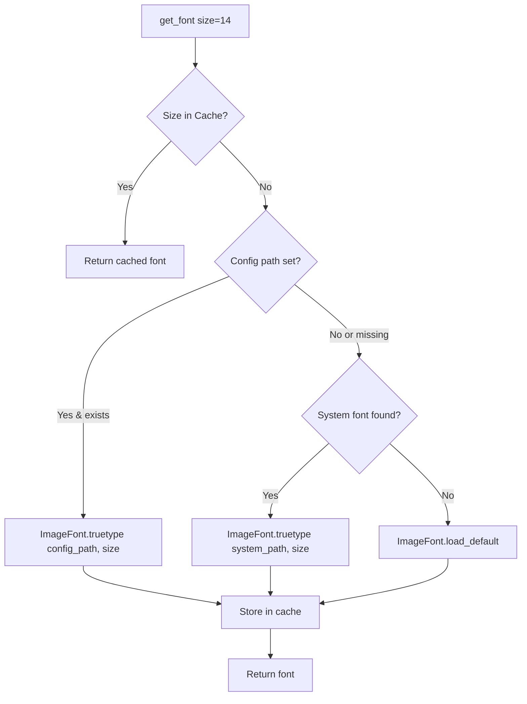

# Font Utilities

> 📘 This document is a supplementary deep-dive for the [Medieval Pixel Art Image Service](../../README.md). For the full project report, see [`project-report.md`](../project-report.md).

---

## 1. Font Resolution Order

The `get_font()` function in `src/font_utils.py` resolves a usable PIL font through a three-tier fallback chain:



### 1.1 Priority Order

| Priority | Source | Example |
|----------|--------|---------|
| 1 (highest) | Config path (`paths.font_path` in `config.yaml`) | `/usr/share/fonts/truetype/custom/MyFont.ttf` |
| 2 | System TrueType font directories (OS-specific) | `/usr/share/fonts/truetype/dejavu/DejaVuSans.ttf` |
| 3 (fallback) | `PIL.ImageFont.load_default()` | Built-in bitmap font — always available |

### 1.2 Config Path

To use a custom font, set the path in `config.yaml`:

```yaml
paths:
  font_path: "/usr/share/fonts/truetype/custom/MyPixelFont.ttf"
```

Or via environment variable:

```bash
PATHS__FONT_PATH=/usr/share/fonts/truetype/custom/MyPixelFont.ttf
```

The path must be absolute. If the file does not exist, the resolver falls through to system paths silently.

---

## 2. System Paths

The font resolver tries common system font locations in order. The first existing TrueType font file is used.

### 2.1 Debian / Ubuntu

```
/usr/share/fonts/truetype/dejavu/DejaVuSans.ttf
/usr/share/fonts/truetype/dejavu/DejaVuSans-Bold.ttf
/usr/share/fonts/truetype/liberation/LiberationSans-Regular.ttf
```

These fonts are provided by the `fonts-dejavu-core` and `fonts-liberation` packages, which are installed by default on most Debian/Ubuntu systems.

### 2.2 Fedora / RHEL

```
/usr/share/fonts/dejavu-sans-fonts/DejaVuSans.ttf
```

Fedora uses a different package structure for DejaVu fonts.

### 2.3 macOS

```
/System/Library/Fonts/Helvetica.ttc
/System/Library/Fonts/SFNSDisplay.ttf
/Library/Fonts/Arial.ttf
```

macOS system fonts are TrueType Collections (`.ttc`) or individual `.ttf` files.

### 2.4 Windows / WSL

```
/mnt/c/Windows/Fonts/arial.ttf
```

When running in WSL (Windows Subsystem for Linux), Windows fonts are accessible via the `/mnt/c/` mount point.

### 2.5 Fallback

If no system font is found, `PIL.ImageFont.load_default()` returns a built-in bitmap font. This font:
- Is always available (bundled with Pillow)
- Is a small fixed-width bitmap font
- Works on all platforms
- Has limited glyph coverage (ASCII only)
- Ignores the `size` parameter (fixed size)

---

## 3. Caching

### 3.1 Per-Size Cache

Fonts are cached by size to avoid repeated filesystem access and font object creation:

```python
_font_cache: dict[int, ImageFont.FreeTypeFont | ImageFont.ImageFont] = {}
```

| Property | Behaviour |
|----------|-----------|
| Key | Font size (int) |
| Value | PIL font object |
| Thread safety | `threading.Lock` — double-checked locking pattern |
| Lifetime | Module-level — persists for the life of the process |
| Memory | Negligible — font objects are lightweight |

### 3.2 Cache Implementation

```python
def get_font(size: int = 14) -> ImageFont.FreeTypeFont | ImageFont.ImageFont:
    if size in _font_cache:
        return _font_cache[size]

    with _font_lock:
        if size in _font_cache:   # Double-check under lock
            return _font_cache[size]
        font = _resolve_font(size)
        _font_cache[size] = font
        return font
```

The double-checked locking pattern ensures:
- Common case (cache hit): No lock acquisition — fast
- Cache miss: Only one thread performs the filesystem scan
- No duplicate font objects for the same size

### 3.3 Thread-Safe Singleton

The module-level cache and lock make `get_font()` safe to call from any thread without coordination:

```python
# Called from placeholder engines (which may run on different asyncio tasks)
font = get_font(14)
draw.text((x, y), label, fill="black", font=font)
```

---

## 4. Usage

### 4.1 Primary Consumer: Placeholder Engines

The font utility is used exclusively by the placeholder engines to render text labels on procedural placeholder images:

```python
from src.font_utils import get_font

def _generate_placeholder(label: str, color: tuple, size: int = 256) -> Image.Image:
    img = Image.new("RGBA", (size, size), color)
    draw = ImageDraw.Draw(img)
    font = get_font(size=14)
    
    # Center the text
    bbox = draw.textbbox((0, 0), label, font=font)
    text_x = (size - (bbox[2] - bbox[0])) // 2
    text_y = (size - (bbox[3] - bbox[1])) // 2
    draw.text((text_x, text_y), label, fill="black", font=font)
    
    return img
```

### 4.2 Engines That Use Fonts

| Engine | Label Content | Font Size |
|--------|--------------|-----------|
| `StaticTileEngine` (placeholder fallback) | Family + subtype name (e.g., "structure: fortification") | 14 |
| `StaticUnitEngine` (placeholder fallback) | Unit type name (e.g., "archer") | 14 |
| `StaticBackgroundTileEngine` (placeholder fallback) | Tile type name (e.g., "grass") | 14 |
| `StaticLeaderEngine` (placeholder fallback) | Leader name | 14 |

### 4.3 Config Override

To use a custom pixel-art font for placeholder labels, add to `config.yaml`:

```yaml
paths:
  font_path: "/usr/share/fonts/truetype/custom/PixelFont.ttf"
```

Or via `.env`:

```bash
PATHS__FONT_PATH=/usr/share/fonts/truetype/custom/PixelFont.ttf
```

---

## 5. Public API

### 5.1 `get_font(size=14)`

```python
def get_font(size: int = 14) -> ImageFont.FreeTypeFont | ImageFont.ImageFont:
    """Return a PIL font at the requested size, with cross-platform fallback.

    The font is cached per *size* on first call — subsequent calls for the
    same size return the cached instance without any filesystem access.

    Parameters
    ----------
    size : int
        Font size in points (default 14).

    Returns
    -------
    ImageFont.FreeTypeFont | ImageFont.ImageFont
        A usable font — never raises.
    """
```

**Guarantees:**
- **Never raises** — always returns a usable font, even if it's the tiny PIL default bitmap font
- **Thread-safe** — can be called from any thread
- **Cached** — O(1) after first call per size
- **Cross-platform** — works on Linux, macOS, Windows, and WSL

### 5.2 No Other Public API

The module exposes only `get_font()`. The internal resolver (`_resolve_font()`) and fallback path list (`_FALLBACK_PATHS`) are private implementation details.

---

## 6. Adding Custom System Paths

To add a custom system font path (e.g., for a new Linux distribution), edit `_FALLBACK_PATHS` in `src/font_utils.py`:

```python
_FALLBACK_PATHS: list[str] = [
    # Debian / Ubuntu
    "/usr/share/fonts/truetype/dejavu/DejaVuSans.ttf",
    # ... existing paths ...
    
    # Your custom distribution
    "/usr/share/fonts/my-distro/SomeFont.ttf",
]
```

Paths are tried in order — the first existing file wins. Place more preferred fonts earlier in the list.
