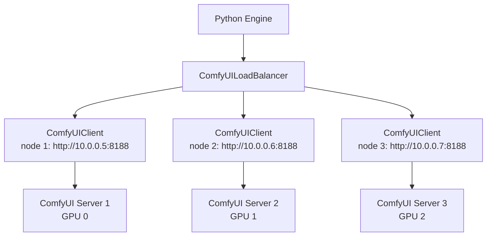

# ComfyUI Load Balancer

> 📘 This document is a supplementary deep-dive for the [Medieval Pixel Art Image Service](../../README.md). For the full project report, see [`project-report.md`](../project-report.md).

---

## 1. Architecture

### 1.1 Design

The `ComfyUILoadBalancer` in `src/comfyui_loadbalancer.py` wraps a pool of `ComfyUIClient` instances (one per ComfyUI server node) and exposes the same `generate()` API. It is a **drop-in replacement** for a single client — calling code does not need to know whether it's talking to one ComfyUI server or many.



### 1.2 Duck-Typing Interface

The load balancer implements the same methods as `ComfyUIClient`:

```python
class ComfyUILoadBalancer:
    async def generate(workflow_path, *, positive_prompt, seed, ...) -> Image.Image: ...
    async def upload_image(image, filename) -> str: ...
    async def upload_reference_image(image, filename) -> str: ...
    async def close() -> None: ...
```

Any code that works with a `ComfyUIClient` can work with a `ComfyUILoadBalancer` — the engines are unaware of the distinction.

### 1.3 Singleton Pattern

The load balancer is a module-level singleton, lazily created on first access:

```python
_comfyui_lb: ComfyUILoadBalancer | None = None

def get_comfyui_loadbalancer() -> ComfyUILoadBalancer | None:
    global _comfyui_lb
    if _comfyui_lb is None:
        _comfyui_lb = ComfyUILoadBalancer()
    return _comfyui_lb
```

---

## 2. Node Selection

### 2.1 Shortest-Queue Algorithm

The core selection algorithm picks the node with the fewest pending + running jobs:

```python
async def _select_node(self) -> _Node:
    # 1. Get queue depths for all healthy nodes
    depths = []
    for node in self._nodes:
        if node.healthy:
            depth = await node.ping()  # GET /queue → pending + running
            if depth is not None:
                depths.append((depth, node))
    
    if not depths:
        raise RuntimeError("No healthy ComfyUI nodes available")
    
    # 2. Sort by queue depth (ascending)
    depths.sort(key=lambda x: x[0])
    min_depth = depths[0][0]
    
    # 3. Filter to nodes with minimum depth
    candidates = [n for d, n in depths if d == min_depth]
    
    # 4. Round-robin tie-breaker
    idx = next(self._rr_counter) % len(candidates)
    return candidates[idx]
```

### 2.2 Tie-Breaking

When multiple nodes have the same queue depth, a **round-robin counter** distributes work evenly:

```python
self._rr_counter = itertools.count()  # Infinite atomic counter
idx = next(self._rr_counter) % len(candidates)
```

### 2.3 Node Capacity Awareness

| Metric | Source | How Used |
|--------|--------|----------|
| Queue depth | `GET /queue` → `queue_running + queue_pending` | Primary selection criterion |
| Health status | `_Node.healthy` flag | Unhealthy nodes excluded from selection |
| Last health check | `_Node.last_health_check` timestamp | Stale nodes re-pinged |

---

## 3. Health Checking

### 3.1 Per-Node Health Flag

Each node has a `healthy` boolean flag:

```python
class _Node:
    healthy: bool = True
    last_health_check: float = 0.0
    queue_depth: int = 0
```

### 3.2 Lazy Recovery

Unhealthy nodes are not actively monitored — they are re-pinged **lazily** when no healthy nodes are available:

```python
async def _select_node(self) -> _Node:
    # Check if any healthy nodes exist
    healthy = [n for n in self._nodes if n.healthy]
    
    if not healthy:
        # Try to recover unhealthy nodes
        for node in self._nodes:
            if not node.healthy:
                depth = await node.ping()
                if depth is not None:
                    node.healthy = True
                    healthy.append(node)
    
    if not healthy:
        raise RuntimeError("No healthy ComfyUI nodes available")
    ...
```

### 3.3 Full Health Check

The `health_check()` method pings all nodes in parallel:

```python
async def health_check(self) -> dict[str, bool]:
    results = await asyncio.gather(
        *[node.ping() for node in self._nodes],
        return_exceptions=True,
    )
    status = {}
    for node, result in zip(self._nodes, results):
        if isinstance(result, Exception):
            node.healthy = False
            status[node.url] = False
        else:
            node.healthy = result is not None
            status[node.url] = node.healthy
    return status
```

---

## 4. Failover

### 4.1 Transparent Retry

If a generation fails on the selected node, the load balancer transparently retries on a different node:

```python
async def generate(self, workflow_path, *, positive_prompt, seed, ...) -> Image.Image:
    errors = []
    for attempt in range(self._max_retries):
        node = await self._select_node()
        try:
            return await node.client.generate(
                workflow_path,
                positive_prompt=positive_prompt,
                seed=seed,
                ...
            )
        except Exception as exc:
            if not _is_retryable(exc):
                raise  # Non-retryable → propagate immediately
            
            node.healthy = False
            errors.append(f"Node {node.url} failed: {exc}")
            # Continue to next attempt with a different node
    
    raise RuntimeError(f"All {self._max_retries} attempts failed:\n" + "\n".join(errors))
```

### 4.2 Retryable vs Non-Retryable Errors

```python
_RETRYABLE_EXCEPTIONS = (
    httpx.ConnectError,           # Cannot reach server
    httpx.TimeoutException,       # Request timed out
    httpx.RemoteProtocolError,    # Protocol error
    httpx.ConnectTimeout,         # Connection timed out
    httpx.ReadTimeout,            # Read timed out
    httpx.WriteTimeout,           # Write timed out
    httpx.PoolTimeout,            # Connection pool exhausted
    websockets.exceptions.ConnectionClosed,  # WebSocket died
    OSError,                      # ConnectionRefusedError, etc.
)

def _is_retryable(exc: BaseException) -> bool:
    if isinstance(exc, _RETRYABLE_EXCEPTIONS):
        return True
    # RuntimeError("...did not complete successfully") → timeout / dead node
    if isinstance(exc, RuntimeError) and "did not complete successfully" in str(exc):
        return True
    # HTTP 5xx → server error, retry on different node
    if isinstance(exc, httpx.HTTPStatusError):
        return 500 <= exc.response.status_code < 600
    return False
```

| Error Type | Retryable? | Rationale |
|-----------|------------|-----------|
| Connection refused | Yes | Node might be restarting — try another |
| HTTP timeout | Yes | Node might be overloaded — try another |
| WebSocket closure | Yes | Node might have crashed mid-generation |
| HTTP 5xx | Yes | Server error — another node may succeed |
| HTTP 4xx | No | Client error — same request would fail on any node |
| `node_errors` in queue | No | Workflow validation error — not node-specific |
| `execution_error` via WS | No | Model/runtime error — same on any node |

### 4.3 Post-Failure Cleanup

When a node fails, a best-effort cancel is fired to clean up the stale prompt:

```python
except Exception as exc:
    node.healthy = False
    # Fire-and-forget cancel — don't block the retry
    task = asyncio.create_task(self._cancel_all_on_node(node))
    task.add_done_callback(
        lambda t: logger.warning("Cancel-on-failure task failed: %s", t.exception())
        if t.exception() else None
    )
```

### 4.4 Max Retries Configuration

| Setting | Default | Description |
|---------|---------|-------------|
| `comfyui.max_retries` | `3` | Maximum number of different nodes to try before failing the generation |
| `comfyui.timeout` | `300` | Per-node timeout in seconds |
| `comfyui.health_check_interval` | `30` | Seconds between re-pinging unhealthy nodes |

---

## 5. Configuration

### 5.1 Single-Node (Backward Compatible)

```yaml
# config.yaml
comfyui:
  base_url: "http://127.0.0.1:8188"
```

The load balancer detects a single URL and logs:
```
ComfyUI load-balancer: single-node mode (http://127.0.0.1:8188)
```

In single-node mode, the load balancer is functionally equivalent to a plain `ComfyUIClient` — no selection logic, no failover.

### 5.2 Multi-Node

```yaml
# config.yaml
comfyui:
  nodes:
    - "http://10.0.0.5:8188"
    - "http://10.0.0.6:8188"
    - "http://10.0.0.7:8188"
  timeout: 300
  health_check_interval: 30
  max_retries: 3
```

Or via environment variable:

```bash
# .env
COMFYUI__NODES=["http://10.0.0.5:8188","http://10.0.0.6:8188","http://10.0.0.7:8188"]
```

The load balancer logs:
```
ComfyUI load-balancer: 3 nodes, max_retries=3
```

### 5.3 Node URL Resolution

The `get_urls()` method implements a three-tier resolution to handle pydantic-settings edge cases where YAML sources can reset list fields:

1. If `nodes` list is non-empty → use directly
2. If `COMFYUI__NODES` env var is set → parse as JSON and use (catches YAML source priority issues)
3. Fall back to `[base_url]` — single-node mode with a warning log

### 5.4 Assumptions

All nodes in the pool are assumed **homogeneous**:
- Same models installed (`flux-2-klein-4b-fp8.safetensors`, `qwen_3_4b.safetensors`, etc.)
- Same LoRAs available (`strategai-lora-detailed-high-step1800.safetensors`)
- Same custom nodes installed (rembg, ImageResizeKJv2, etc.)
- Same workflow JSONs deployed
- Shared or synced `output/` directory (or the Python engine downloads from whichever node generated the image)
