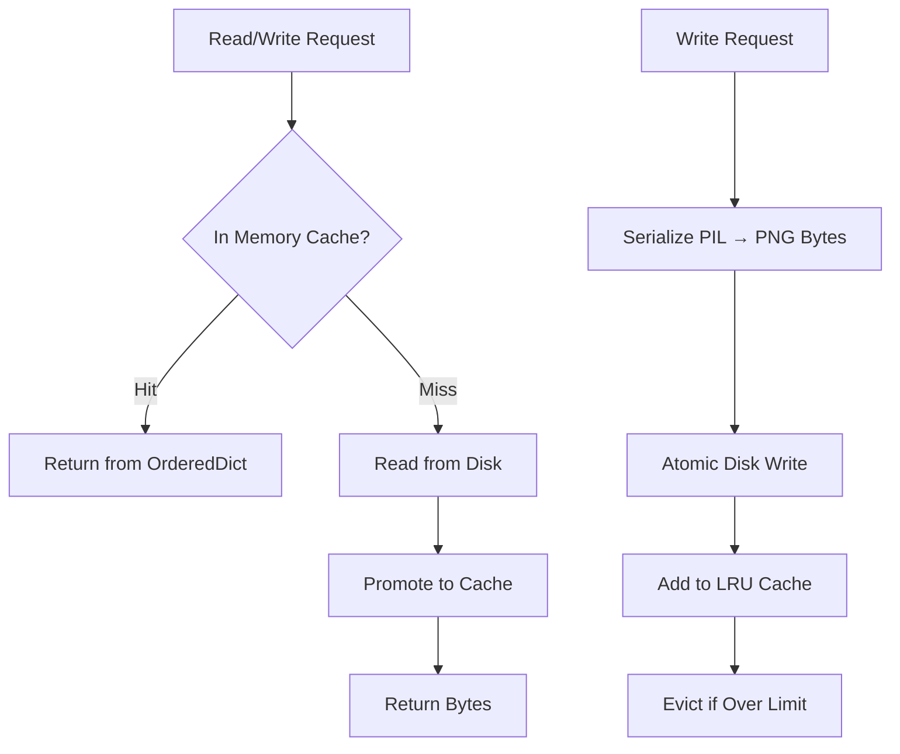

# Storage & Caching Architecture

> 📘 This document is a supplementary deep-dive for the [Medieval Pixel Art Image Service](../../README.md). For the full project report, see [`project-report.md`](../project-report.md).

---

## 1. AssetStore Design

### 1.1 Architecture Overview

The `AssetStore` class in `src/storage.py` provides a unified interface for storing and retrieving generated images. It combines three storage tiers:



### 1.2 In-Memory LRU Cache

The cache uses Python's `OrderedDict` with a `threading.Lock` for thread safety:

```python
class AssetStore:
    def __init__(self, max_cache_size=1000, max_cache_bytes=500 * 1024 * 1024):
        self._memory_cache: OrderedDict[str, bytes] = OrderedDict()
        self.max_cache_size = max_cache_size    # max entries
        self.max_cache_bytes = max_cache_bytes  # max total bytes
        self._cache_bytes: int = 0
        self._lock = threading.Lock()
```

| Property | Value | Configurable Via |
|----------|-------|-----------------|
| Max entries | 1000 | `server.cache_max_entries` |
| Max bytes | 500 MB | `server.cache_max_mb` |
| Eviction policy | LRU (Least Recently Used) | Fixed |
| Thread safety | `threading.Lock` | Fixed |
| Data structure | `OrderedDict` | Fixed |

### 1.3 Cache Eviction

Two triggers — whichever limit is hit first:

```python
def _evict_if_needed(self):
    while self._memory_cache and (
        len(self._memory_cache) > self.max_cache_size
        or self._cache_bytes > self.max_cache_bytes
    ):
        _, evicted = self._memory_cache.popitem(last=False)  # Remove oldest
        self._cache_bytes -= len(evicted)
```

**Eviction behaviour:**
- `popitem(last=False)` removes the **oldest** entry (FIFO end of OrderedDict) — true LRU
- Items are moved to the end on every access (`move_to_end`)
- Eviction is eager — happens immediately when a limit is exceeded, not lazily
- Both limits are checked in a single loop — eviction continues until both are satisfied

### 1.4 Disk Fallback

On cache miss, the store reads from disk and promotes to cache:

```python
def get_image_bytes(self, filename: str) -> bytes | None:
    # 1. Check memory cache
    with self._lock:
        if filename in self._memory_cache:
            self._memory_cache.move_to_end(filename)
            return self._memory_cache[filename]
    
    # 2. Fall back to disk
    path = os.path.join(self._output_dir, filename)
    if os.path.exists(path):
        with open(path, "rb") as f:
            data = f.read()
        # 3. Promote to cache
        with self._lock:
            self._memory_cache[filename] = data
            self._memory_cache.move_to_end(filename)
            self._cache_bytes += len(data)
            self._evict_if_needed()
        return data
    
    return None
```

---

## 2. Atomic Writes

### 2.1 Implementation

All disk writes use **atomic write semantics** — temp file + rename:

```python
def _atomic_write(path: str, data: bytes) -> None:
    dirname = os.path.dirname(path)
    fd, tmp_path = tempfile.mkstemp(dir=dirname, suffix=".png")
    try:
        with os.fdopen(fd, "wb") as fh:
            fh.write(data)
        os.chmod(tmp_path, 0o644)
        os.rename(tmp_path, path)  # Atomic on same filesystem
    except Exception:
        try:
            os.unlink(tmp_path)  # Best-effort cleanup
        except OSError:
            pass
        raise
```

### 2.2 Why Atomic?

| Problem | How Atomic Writes Prevent It |
|---------|------------------------------|
| **Crash during write** | Partial data in temp file; destination untouched. On restart, the valid previous file still exists |
| **Concurrent readers** | `os.rename()` is atomic on POSIX — readers see either the complete old file or the complete new file, never a partial write |
| **Disk full mid-write** | Exception is raised before rename; temp file cleaned up; destination untouched |
| **Permission issues** | `os.chmod(tmp_path, 0o644)` ensures readable permissions even if umask is restrictive |

### 2.3 Write Flow

```
1. mkstemp() → fd, /tmp/generated_assets/tmpXXXXXX.png
2. write(data) → all bytes written to temp file
3. chmod 0o644 → set permissions
4. rename(tmp, final) → atomically replace destination
5. (on error) unlink(tmp) → clean up temp file
```

---

## 3. Path Traversal Protection

### 3.1 Sanitisation

All user-supplied filenames are sanitised before filesystem operations:

```python
def _safe_filename(filename: str) -> str:
    """Strip directory components to prevent path traversal attacks."""
    return os.path.basename(filename)
```

**Attack vectors prevented:**
- `../../../etc/passwd` → `passwd`
- `/absolute/path/to/evil.png` → `evil.png`
- `subdir/../../secret.png` → `secret.png`

### 3.2 Additional Bounds Check (Leader References)

For leader reference images, an additional `Path.resolve()` bounds check is applied:

```python
ref_base = Path(leader_reference_dir).resolve()
ref_path = (ref_base / ref_filename).resolve()
if not str(ref_path).startswith(str(ref_base)):
    raise RuntimeError(f"Reference image path escapes directory: {ref_filename}")
```

This prevents symlink-based escapes where `os.path.basename()` alone might be insufficient.

---

## 4. Orphan Cleanup

### 4.1 `cleanup_orphaned_assets()`

Called at startup, this function scans `generated_assets/` for PNG files with no matching `AssetRecord` in the database:

```python
def cleanup_orphaned_assets(db_session) -> int:
    for entry in os.listdir(output_dir):
        if not entry.lower().endswith(".png"):
            continue
        exists = db_session.query(
            db_session.query(AssetRecord).filter(AssetRecord.id == entry).exists()
        ).scalar()
        if not exists:
            os.unlink(filepath)
            cleaned += 1
    return cleaned
```

**When orphans occur:**
- Database transaction fails after file is written → `try_remove_asset()` cleans up immediately
- Manual file deletion from `generated_assets/` without corresponding DB cleanup
- Process crash between file write and DB commit (atomic writes prevent corruption, but orphan remains)

### 4.2 `try_remove_asset()`

Called by all engines when a database transaction fails after saving an image:

```python
def try_remove_asset(filename: str) -> None:
    try:
        store.delete(filename)
    except Exception as exc:
        logger.error("Failed to clean up orphaned asset %s: %s", filename, exc)
```

This ensures both the on-disk file AND the in-memory LRU cache entry are cleaned up, preventing stale cache entries.

---

## 5. Disk Layout

```
{BASE_DIR}/
├── generated_assets/          # Main output — all generated PNGs
│   ├── a1b2c3d4.png           # Structure tile
│   ├── ldr_alexander_splash.png  # Leader splash
│   ├── ldr_alexander_profile.png # Leader profile
│   └── ...
├── splash_assets/             # Leader splash portrait storage
│   └── ...
├── leader_references/         # Reference images for img2img pipeline
│   ├── ref_ldr_alexander.png
│   └── ...
├── static_tiles/              # Pre-made PNG catalog
│   ├── background_tile/
│   │   ├── water.png
│   │   ├── grass_1.png
│   │   ├── grass_2.png
│   │   └── ...
│   ├── structure/
│   │   ├── fortification/
│   │   ├── production/
│   │   ├── housing/
│   │   └── sacred/
│   ├── nature_object/
│   │   └── ...
│   ├── character_sprite/
│   │   └── ...
│   └── unit/
│       ├── archer.png
│       ├── scout.png
│       ├── settler.png
│       └── warrior.png
└── workflows/                 # ComfyUI workflow JSONs
    ├── txt2img.json
    ├── background_tile.json
    └── leader/
        ├── leader_splash.json
        ├── leader_profile.json
        └── leader_action.json
```

### 5.1 Directory Purposes

| Directory | Purpose | Managed By |
|-----------|---------|------------|
| `generated_assets/` | All AI-generated and static-fallback PNGs | `AssetStore.save_image()` |
| `splash_assets/` | Leader splash portraits (high-res, 1920×1088) | `LeaderEngine` |
| `leader_references/` | img2img reference images (`ref_{id}.png`) | `LeaderEngine` |
| `static_tiles/` | Pre-made PNGs for static mode | Manual deployment; read by `StaticCatalog` |

### 5.2 Naming Conventions

| Asset Type | Filename Pattern | Example |
|-----------|-----------------|---------|
| Tile (structure/object/terrain) | `{uuid4}.png` | `a1b2c3d4e5f6.png` |
| Unit | `{uuid4}.png` | `f6e5d4c3b2a1.png` |
| Background tile | `{uuid4}.png` | `1a2b3c4d5e6f.png` |
| Leader splash | `{leader_id}_splash.png` | `ldr_alexander_a1b2_splash.png` |
| Leader profile | `{leader_id}_profile.png` | `ldr_alexander_a1b2_profile.png` |
| Leader reference | `ref_{leader_id}.png` | `ref_ldr_alexander_a1b2.png` |
| Static tiles | `{type}.png` or `{type}_{N}.png` | `grass_1.png`, `water.png` |

---

## 6. Image Format & Processing

### 6.1 Consistent RGBA

All images in the system are stored and served as **PNG with RGBA colour space**:

```python
def save_image(self, filename: str, img: Image.Image):
    buf = io.BytesIO()
    img.save(buf, format="PNG")  # PIL preserves RGBA if present
    data = buf.getvalue()
    _atomic_write(path, data)
```

```python
def get_image_pil(self, filename: str) -> Image.Image:
    with Image.open(io.BytesIO(data)) as img:
        return img.convert("RGBA")  # Always convert to RGBA
```

### 6.2 Served as Static Files

Generated assets are served via FastAPI's `FileResponse`:

```python
@app.get("/assets/{filename}")
async def serve_asset(filename: str):
    path = os.path.join(output_dir, _safe_filename(filename))
    return FileResponse(path, media_type="image/png")
```

### 6.3 Memory Management

| Concern | Mitigation |
|---------|-----------|
| Large images filling RAM | Size-based eviction (500 MB default) |
| Many small images | Count-based eviction (1000 entries default) |
| Thread contention | `threading.Lock` protects all cache mutations |
| Memory leaks | Fixed-size OrderedDict — bounded growth |
| Disk I/O blocking | Cache hits return from memory without disk access |
