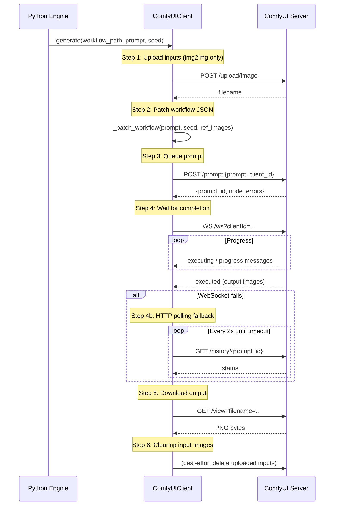
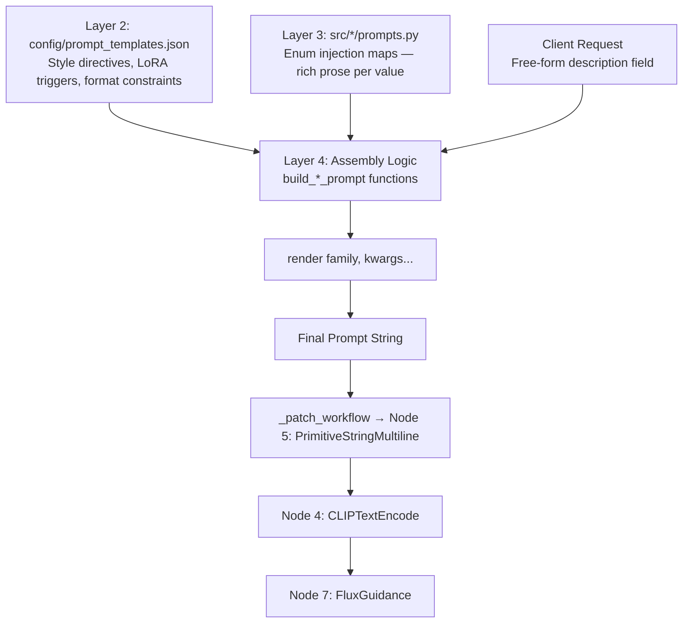

# Image Generation Pipeline: DiT Mechanics & Workflow Design

> 📘 This document is a supplementary deep-dive for the [Medieval Pixel Art Image Service](../README.md). For the full project report, see [`project-report.md`](../project-report.md).

---

## 1. Diffusion Transformers (DiT) — Technical Background

### 1.1 What is a DiT?

A **Diffusion Transformer (DiT)** replaces the convolutional U-Net backbone found in traditional latent diffusion models (LDMs) like Stable Diffusion XL with a Vision Transformer (ViT) operating on latent-space patches. Introduced by Peebles & Xie (2023), DiTs process the latent representation as a sequence of patches through standard Transformer blocks — multi-head self-attention followed by feed-forward networks — before reassembling the output.

Key architectural differences versus U-Net-based diffusion:

| Property | U-Net (SDXL) | DiT (Flux2 Klein) |
|----------|-------------|-------------------|
| **Backbone** | Convolutional with skip connections | Transformer with self-attention |
| **Receptive field** | Fixed by kernel size, grows with depth | Global — every patch attends to every other patch |
| **Scaling behaviour** | Diminishing returns beyond ~3B params | Predictable scaling laws from language modelling |
| **Text conditioning** | Cross-attention into U-Net blocks | Cross-attention into Transformer layers |
| **Text encoder** | CLIP (weaker prompt adherence) | Qwen 3 4B (stronger prompt adherence) |
| **Long-range coherence** | Limited by convolutional locality | Excellent — global attention across full latent |

### 1.2 Rectified Flow Formulation

Flux2 Klein uses a **rectified flow** (Liu et al., 2023) rather than conventional DDPM/DDIM diffusion. In rectified flow:

- The **forward process** is a straight-line path from data to noise: $x_t = (1 - t)x_0 + t\epsilon$
- The **reverse process** follows the same trajectory in reverse
- This formulation enables more efficient **distillation** — the 4-step student can learn to correct the straight-path trajectory in fewer, larger steps

Traditional diffusion models use curved probability-flow ODEs that require many small steps to integrate accurately. Rectified flow's straight-line paths can be approximated with far fewer steps — 4 instead of 50 — with minimal quality degradation.

### 1.3 Distilled 4-Step Inference

The Flux2 Klein 4B Distilled variant was created via **step distillation**:

1. A **teacher model** (50-step base) generates high-quality samples
2. A **student model** (4-step) learns to match the teacher's output distribution in fewer steps
3. The student learns to take larger denoising steps that, when composed, approximate the teacher's 50-step trajectory

The `BasicScheduler` node with scheduler type `simple` applies the correct non-linear sigma distribution for this distilled inference — a schedule that concentrates the largest denoising steps early.

### 1.4 Why Flux2 Klein 4B: Comparison Table

| Criterion | Flux2 Klein 4B Distilled | SDXL Turbo | Flux2 Klein 9B Base |
|-----------|--------------------------|------------|---------------------|
| **Inference steps** | 4 | 8 | 50 |
| **VRAM requirement** | ~8.4 GB | ~8 GB | ~21.7 GB |
| **Inference time (RTX 5090)** | ~1.2 s | ~3–5 s | ~35 s |
| **Inference time (consumer GPU)** | ~3–5 s | ~8–12 s | ~60–90 s |
| **License** | Apache 2.0 | OpenRAIL-M | Non-Commercial (Flux) |
| **Text encoder** | Qwen 3 4B (strong) | CLIP (weaker) | Qwen 3 4B (strong) |
| **Prompt adherence** | Strong | Moderate | Strongest |
| **Native image editing** | Yes (single/multi-ref) | Manual VAEEncode required | Yes (single/multi-ref) |
| **Negative prompts** | Not supported | Supported | Not supported |
| **Fine-tuning ready** | Base variant available | Yes | Base variant is this model |

**Selection rationale (ordered by importance):**

1. **License (Apache 2.0)**: Hard constraint — generated assets must be usable in commercial game projects.
2. **VRAM budget (~8.4 GB)**: Fits consumer GPUs (RTX 3070/4070 class at 8–12 GB).
3. **4-step inference speed**: ~12× faster than the 9B base model, enabling near-interactive generation.
4. **Native image editing**: Essential for the leader pipeline's identity-preserving img2img stages.
5. **Qwen 3 4B text encoder**: Superior prompt adherence for precise game asset descriptions.

**Tradeoff acknowledged.** Flux2 Klein 4B Distilled does not support negative prompts — a consequence of the distillation process baking guidance behaviour into the model weights. All prompt templates use positive-only, affirmative language.

---

## 2. Model Architecture

### 2.1 Split Model Loading

Unlike SDXL's monolithic `CheckpointLoaderSimple`, Flux2 uses **three separate loaders**:

```
UNETLoader (DiT transformer) + CLIPLoader (text encoder) + VAELoader (image codec)
```

**Why split?**

| Advantage | Explanation |
|-----------|-------------|
| **Independent quantisation** | UNet in FP8, CLIP in BF16 — different precision per component |
| **Selective offloading** | ComfyUI can unload the 6 GB UNet while keeping the lighter text encoder in VRAM between generations |
| **Hot-swappable components** | Swap LoRA, upgrade text encoder, or change VAE without touching other files |
| **Independent updates** | UNet can be upgraded without re-downloading the text encoder or VAE |

### 2.2 Model Files

| File | Approx. Size | ComfyUI Directory | Purpose | Source |
|------|-------------|-------------------|---------|--------|
| `flux-2-klein-4b-fp8.safetensors` | ~6 GB | `models/unet/` | DiT transformer (FP8 quantised) — the denoising backbone | Black Forest Labs / HuggingFace |
| `qwen_3_4b.safetensors` | ~8 GB | `models/clip/` | Qwen 3 4B text encoder — converts prompts to conditioning embeddings | Qwen / HuggingFace |
| `flux2-vae.safetensors` | ~320 MB | `models/vae/` | Variational Autoencoder — compresses/decompresses between pixel space and latent space | Black Forest Labs / HuggingFace |
| `flux2_klein_4b_lora_000002400.safetensors` | ~250 MB | `models/loras/` | Top-down pixel-art LoRA (`<tdp>` trigger) — enforces camera angle and pixel-art aesthetics | CivitAI community |

**Total disk footprint**: ~14.6 GB. **Total VRAM at inference**: ~8.4 GB (FP8 precision).

---

## 3. Workflow Inventory

The service uses **5 ComfyUI workflow JSONs**. Each is a self-contained node graph that ComfyUI executes as a batch.

| Workflow | Asset Families Served | Key Characteristic |
|----------|----------------------|-------------------|
| `txt2img.json` | Structures, Objects, Terrain, Units | LoRA + rembg + sharpen → 256×256 game sprites |
| `background_tile.json` | Background Tiles | No LoRA, no rembg — seamless 256×256 ground textures |
| `leader_splash.json` | Leader Splash | 1920×1088 cinematic txt2img portrait |
| `leader_profile.json` | Leader Profile | img2img from splash → 512×512 close-up portrait |
| `leader_action.json` | Leader Action | img2img from splash → 1920×1088 action scene (ImageStitch for multi-leader) |

### 3.1 Parameter Comparison

| Parameter | txt2img | background_tile | leader_splash | leader_profile | leader_action |
|-----------|---------|-----------------|---------------|----------------|---------------|
| **Steps** | 4 | 4 | 4 | 4 | 4 |
| **Guidance** (FluxGuidance) | 3.5 | 2.5 | 3.5 | 8.0 | 4.5 |
| **CFG** (CFGGuider) | 1.0 | 1.0 | 1.0 | 1.0 | 1.0 |
| **Sampler** | euler | euler | euler | euler | euler |
| **Scheduler** | simple | simple | simple | simple | simple |
| **Denoise** | 1.0 | 1.0 | 1.0 | 0.90 | 0.85 |
| **Gen Resolution** | 1024×1024 | 1024×1024 | 1920×1088 | from ref | from ref (stitched) |
| **Output Resolution** | 256×256 | 256×256 | 1920×1088 | 512×512 | 1920×1088 |
| **LoRA (`<tdp>`)** | Yes | No | No | No | No |
| **rembg** | Yes | No | No | No | No |
| **ImageSharpen** | Yes | No | No | No | No |
| **Reference Image** | No | No | No | Yes (splash) | Yes (2× splash via ImageStitch) |

---

## 4. `txt2img.json` — Pipeline Stages

The 22-node workflow can be understood as six sequential stages:

### 4.1 Model Loading Stage

Three models are loaded independently (split loading architecture):
- **UNET** (`flux-2-klein-4b-fp8.safetensors`, ~6 GB) — DiT backbone for latent denoising. FP8 quantized.
- **CLIP** (`qwen_3_4b.safetensors`, ~8 GB) — Qwen 3 4B text encoder. Type: `flux2`.
- **VAE** (`flux2-vae.safetensors`, ~320 MB) — Converts between latent space and pixel space.
- **LoRA** (`flux2_klein_4b_lora_000002400.safetensors`, ~250 MB) — Top-down pixel-art adapter applied to the UNET at strength 1.0. Triggered by the `<tdp>` token in prompts.

> **⚠️ TODO:** The `<tdp>` pixel-art LoRA is a community asset. Its training provenance and optimality for medieval pixel art have not been independently verified. See the [project report §7.2](../project-report.md#72-future-work) for planned investigation.

Why split loading? Models can be updated independently, different quantization formats are supported per component, and ComfyUI can selectively offload the heavy UNET while keeping the lighter CLIP in VRAM between generations.

### 4.2 Prompt Encoding Stage

The prompt string (injected at runtime by `_patch_workflow()`) flows into a **PrimitiveStringMultiline** node → **CLIPTextEncode** → conditioning tensor. This is the sole dynamic input to the pipeline — everything else is baked into the workflow JSON.

### 4.3 Guidance Stage

Flux2 Klein separates guidance into two nodes:
- **FluxGuidance** (guidance=3.5) — Applies the guidance scale to positive conditioning. This controls how strongly the model follows the prompt. Lower values (2.5 for background tiles) allow more variation; higher values (8.0 for leader profiles) enforce tighter prompt adherence.
- **ConditioningZeroOut** — Zeroes the negative conditioning. Flux2 Klein does not support negative prompts — this is architectural, not a limitation. The model was trained without negative conditioning.
- **CFGGuider** (cfg=1) — Classifier-free guidance is disabled for Flux2. The cfg parameter is set to 1 (effectively a no-op) because guidance is handled entirely by FluxGuidance.

### 4.4 Sampling Stage

The core denoising loop assembles:
- **RandomNoise** — Initial noise tensor. Seed injected at runtime.
- **BasicScheduler** (scheduler=simple, steps=4, denoise=1.0) — Manages the rectified flow noise schedule. The `simple` scheduler is the Flux2 default and matches the model's training distribution. 4 steps is the distilled inference count — the model produces quality output in just 4 denoising steps (vs 50+ for base models).
- **KSamplerSelect** (euler) — Euler sampler, standard for distilled rectified flow models.
- **EmptyLatentImage** (1024×1024) — The starting latent canvas. Generation happens at 1024×1024 then downscales to 256×256.

These feed into **SamplerCustomAdvanced** which executes the 4-step denoising loop, producing a latent image.

### 4.5 Decoding Stage

- **VAEDecode** — Converts the latent tensor back to pixel space using the loaded VAE.

### 4.6 Post-Processing Stage

Four sequential operations transform the raw 1024×1024 output into a clean 256×256 pixel-art sprite:
1. **ImageResizeKJv2** (256×256, Lanczos, CPU) — Downscales from 1024×1024. Lanczos provides sharper results than bilinear for pixel art. Running on CPU avoids GPU memory pressure.
2. **ImageSharpen** (radius=1, sigma=1, alpha=0.1) — Crispens pixel edges after downscale. Mild parameters preserve the pixel-art aesthetic without introducing halos.
3. **Image Remove Background (rembg)** (ISNet general-use) — Removes the white background, producing a transparent PNG. The model was prompted to generate on a white background specifically to make this step reliable.
4. **SaveImage** (prefix="txt2img") — Writes the final RGBA PNG to ComfyUI's output directory.

### 4.7 Node Reference Table (for developers patching workflows)

| Node ID | Class Type | Purpose | Injection Point |
|---------|-----------|---------|----------------|
| 1 | UNETLoader | Load FP8 DiT transformer (~6 GB) | — |
| 3 | CLIPLoader | Load Qwen 3 4B text encoder (~8 GB) | — |
| 4 | CLIPTextEncode | Encode prompt → conditioning tensor | — |
| 5 | PrimitiveStringMultiline | Prompt injection point | ✅ Prompt |
| 7 | FluxGuidance | Apply guidance scale (3.5) | — |
| 8 | KSamplerSelect | Euler sampler selection | — |
| 10 | SamplerCustomAdvanced | Orchestrate 4-step denoising | — |
| 11 | VAELoader | Load Flux2 VAE decoder (~320 MB) | — |
| 12 | LoraLoaderModelOnly | Apply `<tdp>` LoRA at strength 1.0 | — |
| 15 | RandomNoise | Noise initialization | ✅ Seed |
| 16 | VAEDecode | Decode latent → pixel space | — |
| 17 | ConditioningZeroOut | Zero negative conditioning | — |
| 18 | CFGGuider | Wire guidance into sampler (cfg=1.0) | — |
| 23 | EmptyLatentImage | 1024×1024 latent canvas | — |
| 24 | PrimitiveInt | Width = 1024 | — |
| 25 | PrimitiveInt | Height = 1024 | — |
| 27 | ImageResizeKJv2 | Lanczos 1024→256 (CPU) | — |
| 28 | PrimitiveInt | Output width = 256 | — |
| 29 | PrimitiveInt | Output height = 256 | — |
| 32 | Image Remove Background (rembg) | ISNet background removal → RGBA | — |
| 43 | SaveImage | Write final PNG | — |
| 47 | ImageSharpen | Crispen edges (r=1, σ=1, α=0.1) | — |
| 62 | BasicScheduler | Rectified flow schedule (4 steps) | — |

---

## 5. How Other Workflows Differ

### 5.1 `background_tile.json`

Differences from `txt2img.json`:
- **No Node 12 (LoraLoaderModelOnly)**: Seamless textures benefit from organic variation — pixel-art rigidity creates visible grid patterns when tiles repeat
- **No Node 32 (rembg)**: Textures fill the entire frame — nothing to isolate
- **No Node 47 (ImageSharpen)**: 1024→256 downscale is sufficient for texture crispness
- **Guidance = 2.5** (vs 3.5): Looser guidance for organic texture flow; at 3.5, rigid patterns create visible grid lines when tiled
- **Different SaveImage prefix**: `background_tile`

### 5.2 `leader_splash.json`

Differences from `txt2img.json`:
- **No LoRA, no rembg, no sharpen**: Cinematic/painterly style — not pixel art
- **Resolution: 1920×1088**: 16:9 cinematic widescreen (1088 = 17×64, multiples-of-64 aligned)
- **Guidance = 3.5**: Standard prompt adherence for cinematic composition
- **No downscale**: Native resolution output (no ImageResizeKJv2)
- **Denoise = 1.0**: Full txt2img — establishes canonical leader identity

### 5.3 `leader_profile.json`

Differences from `txt2img.json`:
- **Adds LoadImage + VAEEncode**: Loads the splash as a reference image, encodes it to latent space for img2img conditioning
- **No LoRA, no rembg**: Portrait style, not pixel art
- **Denoise = 0.90**: Preserves leader's core facial identity while allowing composition shift from wide cinematic to close-up portrait
- **Guidance = 8.0**: Tightest prompt adherence in the system — identity preservation for close-up portraits
- **Output: 512×512** (square 1:1) via ImageResizeKJv2

### 5.4 `leader_action.json`

Differences from `txt2img.json`:
- **Adds ImageStitch + 2× LoadImage nodes**: Stitches two reference images side-by-side for multi-leader action scenes
- **No LoRA, no rembg**: Cinematic action style
- **Denoise = 0.85**: More creative freedom than profile — allows new poses, locations, lighting while maintaining recognisability
- **Guidance = 4.5**: Balances action creativity with character consistency
- **Resolution: 1920×1088** native output

---

## 6. Runtime Workflow Patching

Workflow JSONs are treated as **authoritative configuration**, not code. Parameters are split into two categories:

### Injected at Runtime (varies per request)

| Parameter | Injection Point | Mechanism |
|-----------|----------------|-----------|
| **Prompt** | Node 5 (`PrimitiveStringMultiline`) | `_patch_workflow()` finds by `class_type`, replaces `value` |
| **Seed** | Node 15 (`RandomNoise.noise_seed`) and Node 10 (`SamplerCustomAdvanced.noise_seed`) | Injected by node `class_type` |
| **Reference filenames** | LoadImage nodes in profile/action workflows | Matched by `_meta.title` containing "reference" |

### Baked into JSONs (constant across all requests)

- Model names (UNET, CLIP, VAE, LoRA)
- Resolution (width, height)
- Guidance, CFG, steps, sampler, scheduler, denoise
- LoRA configuration (name, strength)
- Post-processing pipeline (resize, rembg, sharpen, save)

### `extra_overrides` Pattern

Engines can inject additional parameters beyond prompt and seed via the `extra_overrides` dict:
```python
await client.generate(
    workflow_path,
    positive_prompt=prompt,
    seed=seed,
    extra_overrides={
        "35": {"image": "__LEADER_REF_1__"},  # LoadImage node 35
        "36": {"image": "__LEADER_REF_2__"},  # LoadImage node 36
    },
)
```

---

## 7. Post-Processing Pipeline

The `txt2img.json` workflow applies a specific post-processing chain. **Order matters** — each step is optimised for what comes before and after:


### Why This Order

| Step | Reason for Position |
|------|-------------------|
| **Resize first** | Fewer pixels for subsequent operations — sharpen and rembg run on 256×256 (65K pixels) instead of 1024×1024 (1M pixels), ~16× faster |
| **Sharpen second** | Applied to the downscaled result — recovers edge definition lost during Lanczos reduction. Running sharpen before resize would waste work on pixels that get discarded |
| **rembg last** | Background removal on the final-sized, sharpened image. Running rembg on 1024×1024 would be 16× slower and produce identical results after resize |

### Parameters

| Step | Parameter | Value | Rationale |
|------|-----------|-------|-----------|
| Resize | Method | `lanczos` | Best quality for downscaling — sinc-based, preserves high frequencies |
| Resize | Device | `cpu` | Avoids GPU memory fragmentation from repeated alloc/free cycles |
| Sharpen | radius | `1` | 1-pixel kernel — targets pixel-art edge width |
| Sharpen | sigma | `1` | Standard Gaussian sigma |
| Sharpen | alpha | `0.1` | Subtle blend — prevents over-sharpening halos |
| rembg | model | `isnet-general-use` | U²-Net ISNet — best general-purpose salient object detection |

---

## 8. ComfyUI Communication

### 8.1 Full Lifecycle



### 8.2 WebSocket Protocol

The WebSocket connection uses ComfyUI's native protocol with a unique `client_id`:

- **Connection**: `ws://host/ws?clientId={uuid4}`
- **Message types**:
  - `executing` with `node: null` → generation complete (success)
  - `execution_error` → generation failed; contains `exception_type` and `exception_message`
  - `progress` → intermediate step progress (logged for monitoring)
- **Reconnection**: WebSocket failures trigger automatic HTTP polling fallback

### 8.3 HTTP Polling Fallback

When the WebSocket connection fails or closes prematurely:
- Polls `GET /history/{prompt_id}` every **2 seconds**
- Times out after the configured timeout (default **300 seconds**)
- The prompt is considered complete when it appears in the history response

### 8.4 Error Handling & Retry

| Error Type | Classification | Behaviour |
|-----------|---------------|-----------|
| `httpx.ConnectError`, `ConnectionRefusedError` | Retryable | Failover to next node (load balancer) |
| `httpx.TimeoutException`, `httpx.ReadTimeout` | Retryable | Failover to next node |
| WebSocket `ConnectionClosed` | Retryable | Fall back to HTTP polling, then failover |
| HTTP 5xx | Retryable | Failover to next node |
| `node_errors` in queue response | Non-retryable | Propagate immediately — workflow validation error |
| `execution_error` via WebSocket | Non-retryable | Propagate immediately — model/runtime error |

---

## 9. Prompt Assembly in the Pipeline

### 9.1 How the Final Prompt Flows Through the System



### 9.2 The `<tdp>` LoRA Trigger Mechanism

The `<tdp>` (top-down pixel) trigger is the critical mechanism for enforcing pixel-art aesthetics. It appears in four of eight prompt templates:

| Template | `<tdp>` Present? | Rationale |
|----------|-----------------|-----------|
| `structure` | Yes | Top-down game tile — needs orthographic camera + pixel edges |
| `object` | Yes | Top-down game tile |
| `terrain` | Yes | Top-down game tile |
| `unit` | Yes | Top-down character sprite |
| `background_tile` | No | Seamless texture — pixel-art rigidity creates visible grid patterns |
| `leader_splash` | No | Cinematic portrait — painterly, not pixel art |
| `leader_profile` | No | Close-up portrait |
| `leader_action` | No | Cinematic action scene |

The full trigger phrase is:
```
<tdp> Front view overhead shot elevated shot medium shot
```

This activates the LoRA's learned transformations: top-down orthographic camera angle, pixel-art edge treatment, limited colour palette, and medieval fantasy aesthetic. The `<tdp>` token alone is insufficient — the full camera-direction phrase is required for reliable activation.

### 9.3 Example: Full Prompt Assembly for a Structure

**Client request:**
```json
{
  "category": "fortification",
  "style": "norman_romanesque",
  "condition": "weathered",
  "scale": "medium",
  "description": "gatehouse with portcullis"
}
```

**Step 1 — Enum injection (Layer 3):**
- `category="fortification"` → "a sturdy defensive structure with crenellated battlements, arrow slits, thick stone walls, watchtower, military functionality"
- `style="norman_romanesque"` → "heavy stone construction with round arches, thick pillars, small deep-set windows, fortress-like solidity, chevron ornament"
- `condition="weathered"` → "aged stone with patches of moss and lichen, faded and greyed timber, subtle settlement cracks, lived-in character, slightly worn edges"
- `scale="medium"` → "substantial multi-room building, prominent in a village or town setting, balanced proportions with architectural detail"

**Step 2 — Assembly (Layer 4):** Joins enum prose + user description → `{inner}`:
```
a sturdy defensive structure with crenellated battlements, arrow slits, thick stone walls, watchtower, military functionality, heavy stone construction with round arches, thick pillars, small deep-set windows, fortress-like solidity, chevron ornament, aged stone with patches of moss and lichen, faded and greyed timber, subtle settlement cracks, lived-in character, slightly worn edges, substantial multi-room building, prominent in a village or town setting, balanced proportions with architectural detail, gatehouse with portcullis
```

**Step 3 — Template rendering (Layer 2):** Wraps `{inner}` with style directives:
```
<tdp> Front view overhead shot elevated shot medium shot. The structure is viewed from directly above, showing its roof and layout. The structure blends naturally at its base edges. Isolate on a plain white background, only focusing on the specified object. [INNER PROSE]. Pixel art 16x16 game tile asset, crisp pixel edges, no anti-aliasing, sharp blocky pixels, centered single asset on white. Grounded stable perspective, no floating objects.
```

**Step 4 — Injection:** The final prompt is injected into Node 5 (`PrimitiveStringMultiline`) of `txt2img.json`.
