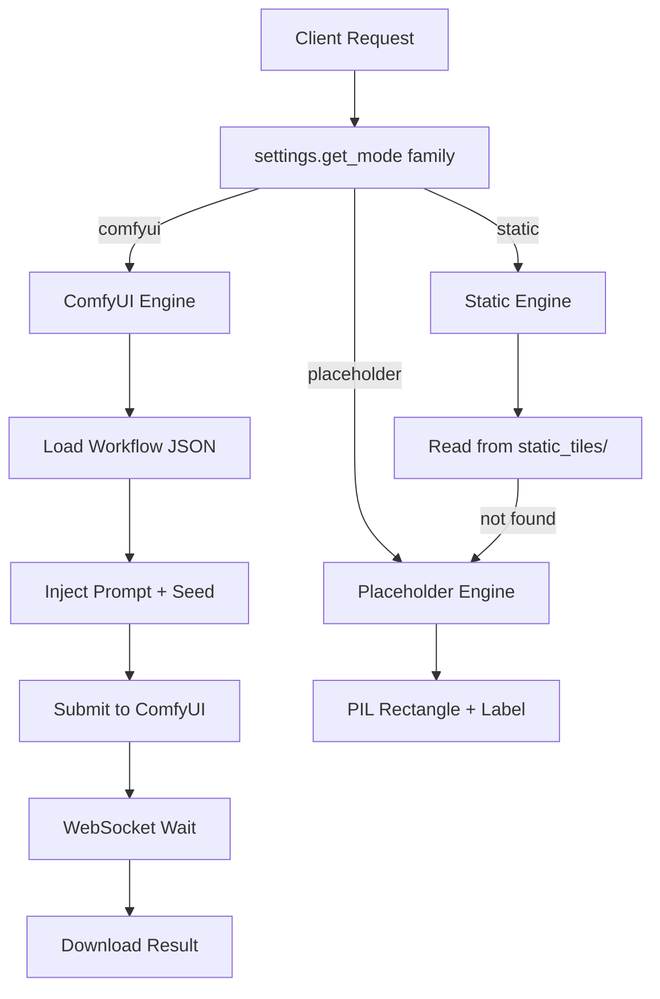
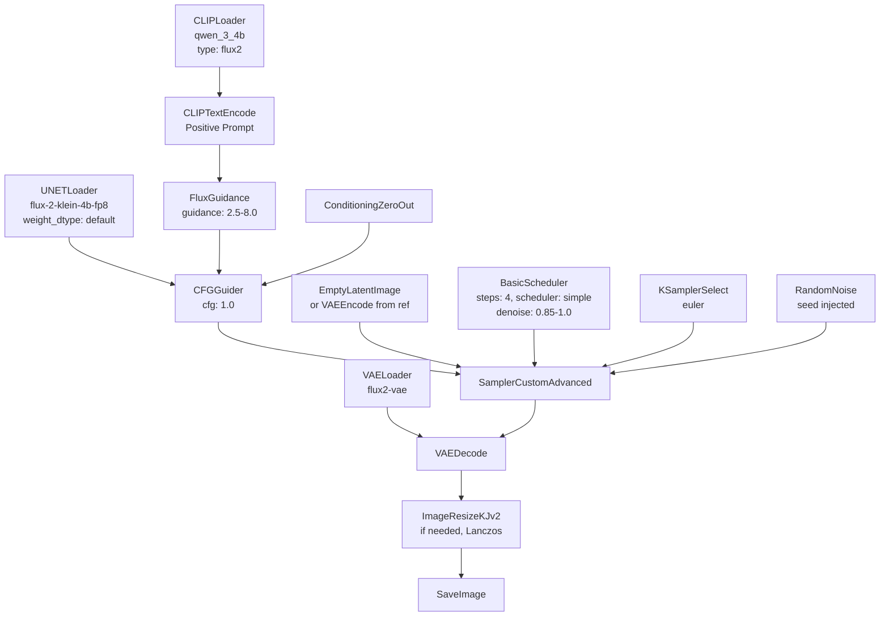
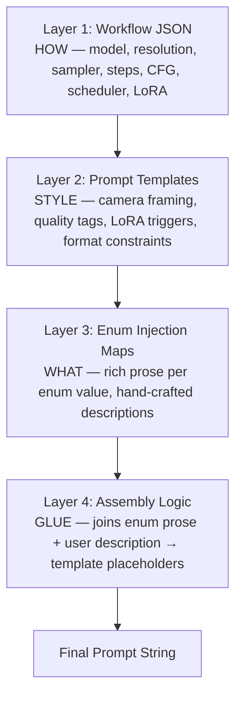
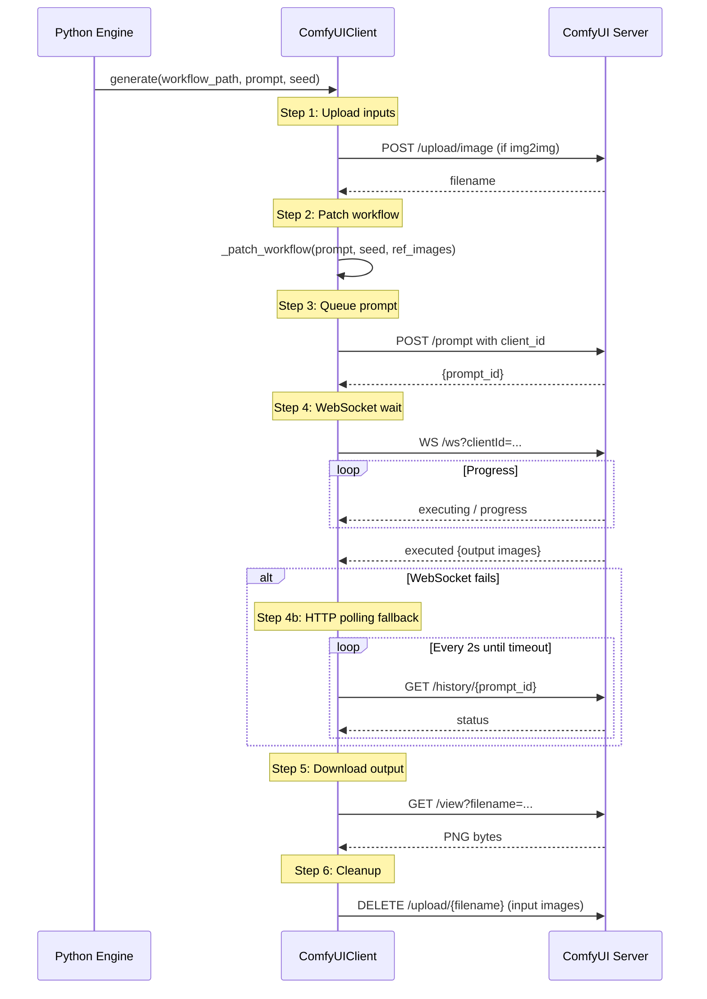
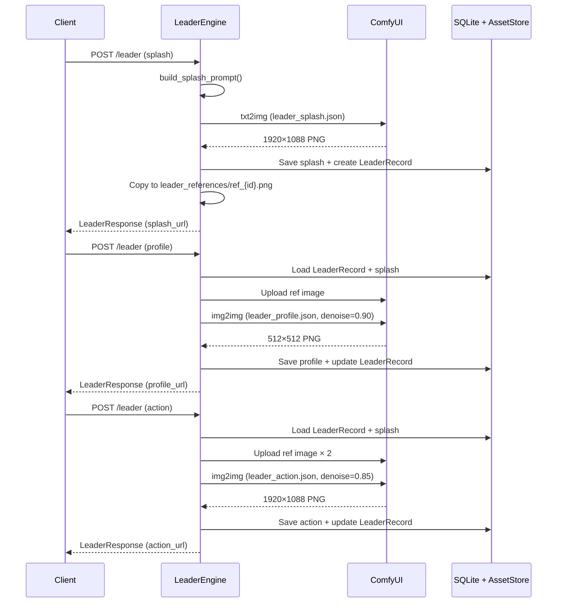
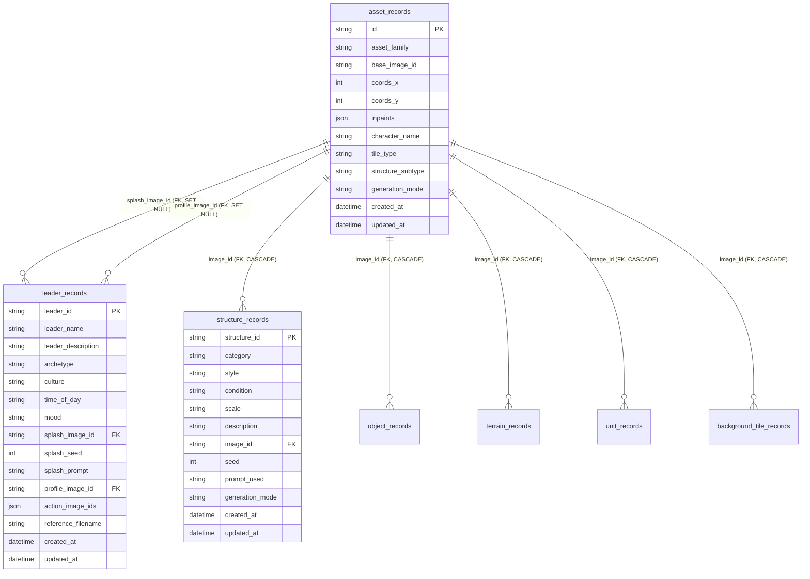

# Project Report: Medieval Pixel Art Image Generation Service

## Abstract

Game asset creation is one of the most labour-intensive bottlenecks in independent game development. A single top-down medieval role-playing game may require hundreds of distinct sprites — structures, terrain elevations, environmental objects, character units, seamless ground textures, and narrative leader portraits — each traditionally hand-crafted by artists over weeks or months. This project investigates whether a single consumer GPU running open-weight generative models can serve as a viable game asset pipeline, producing consistent, style-coherent pixel-art assets across multiple categories without manual artist intervention.

We present a decoupled FastAPI ↔ ComfyUI microservice architecture backed by the Flux2 Klein 4B Diffusion Transformer (DiT) model, a distilled 4-step inference model operating at approximately 8.4 GB VRAM under an Apache 2.0 license. The system implements a four-layer prompt assembly architecture separating style directives (HOW) from content descriptions (WHAT), a three-stage leader generation pipeline using image-to-image (img2img) for character identity preservation, a multi-mode generation dispatch system (ComfyUI / static / placeholder) configurable per asset family, and a comprehensive test suite of 547 tests achieving approximately 82% code coverage. The service exposes 35 REST endpoints serving six asset families (leaders, structures, objects, terrain, units, background tiles) with consistent CRUD patterns. All generation is delegated to an external ComfyUI inference server — the web tier never loads model weights, enabling horizontal scaling of inference independently from the API layer.

---

## 1. Introduction

### 1.1 Motivation

Independent ("indie") game development has undergone a renaissance in the past decade, enabled by accessible engines like Unity and Godot, digital distribution platforms like Steam and itch.io, and thriving asset marketplaces. Yet one bottleneck remains stubbornly resistant to democratisation: **art asset creation**. A top-down 2D role-playing game of even modest scope — a few dozen NPCs, several building types, varied terrain, and environmental objects — can require hundreds of hand-crafted sprites. For a solo developer or a team of two or three, the art pipeline alone can extend development timelines by months or years.

Existing AI-assisted game art tools (Scenario.gg, Layer.ai, Leonardo.ai) offer powerful capabilities but operate as SaaS platforms with usage limits, subscription fees, and cloud dependency. For a student or hobbyist developer working on a zero-budget project, these constraints are prohibitive. This project asks: **can a single consumer GPU running entirely open-weight, permissively-licensed models serve as a complete, self-hosted game asset pipeline?**

The question matters beyond game development. It touches on broader themes in generative AI: the feasibility of local-first AI tooling, the architectural patterns for decoupling web services from GPU inference, and the prompt engineering challenges of producing _consistent_ outputs across hundreds of generations rather than cherry-picked one-off results.

### 1.2 Problem Statement

Generate consistent, style-coherent pixel-art game assets across six categories (leaders, structures, objects, terrain, units, background tiles) with the following constraints:

1. **Decoupled architecture**: The web server must never load model weights into memory. All GPU inference is delegated to an external ComfyUI server via HTTP + WebSocket.
2. **Style consistency**: All assets must share a unified top-down medieval pixel-art aesthetic, enforced through a combination of LoRA weights, prompt templates, and identical ComfyUI workflow parameters.
3. **Identity preservation**: Leader characters — the most complex asset type — must maintain recognisable identity across three distinct generation stages (cinematic splash, close-up profile portrait, action scene) using img2img reference-image conditioning.
4. **Graceful degradation**: When GPU inference is unavailable, the system must still serve assets via static pre-made PNGs or procedurally generated placeholders — never fail entirely.
5. **Permissive licensing**: All model weights must carry licences compatible with commercial game development (Apache 2.0 preferred).

### 1.3 Contributions

This project makes the following contributions:

1. **A decoupled FastAPI ↔ ComfyUI architecture** for game asset generation, where the API layer is a lightweight orchestrator (zero model-weight memory footprint) and all inference happens on a separate GPU server, connected via an async HTTP + WebSocket client with multi-node load balancing.

2. **A structured prompt architecture using enums and templates** rather than free-form prompt strings. The four-layer assembly system (workflow JSON → prompt templates → enum injection maps → assembly logic) deliberately restricts client freedom in exchange for two properties critical to game development: (a) _zero prompt-engineering burden_ — clients send game-design concepts like `"fortification"` and `"desert"`, not raw diffusion-model prompts; and (b) _guaranteed style consistency_ — all style directives (camera framing, LoRA triggers, pixel-art quality tags) are locked in version-controlled JSON templates that no client request can override. This design rejects the conventional "pass-through" approach (where the API is a thin wrapper that forwards a raw prompt string to the model) in favour of a curated, domain-specific interface that dramatically lowers the adaptation barrier for game developers who are not prompt engineers.

3. **A three-stage leader generation pipeline** (splash → profile → action) using Flux2 Klein 4B Distilled's native image-editing capability for character identity preservation. The splash establishes a canonical visual identity; subsequent stages use img2img with calibrated denoise parameters to maintain recognisability while allowing composition changes.

4. **A Flux2 Klein 4B DiT workflow design** optimised for pixel-art game assets: split model loading (UNETLoader + CLIPLoader + VAELoader), BasicScheduler for rectified flow, FluxGuidance + CFGGuider for guidance control, LoRA-based pixel-art styling via the `<tdp>` trigger, Lanczos downscaling (1024→256), and rembg background removal.

5. **A multi-mode generation system** (ComfyUI / static / placeholder) configurable per asset family via `config.yaml` with `.env` overrides, enabling the same codebase to run in production (GPU inference), testing (placeholder mode), or any intermediate configuration.

6. **A comprehensive test suite** of 547 tests across 36 test files achieving approximately 82% code coverage, validating the full stack from configuration parsing to prompt assembly to database operations to API response schemas.

### 1.4 Related Work

**Text-to-image models.** The field has evolved rapidly from U-Net-based latent diffusion models (Stable Diffusion XL, SDXL Turbo) to Diffusion Transformer (DiT) architectures. Peebles & Xie (2023) introduced the DiT architecture, replacing the U-Net backbone with a Transformer operating on latent patches. Black Forest Labs' Flux family (2024) scaled this approach, with the Flux2 Klein 4B distilled variant achieving 4-step inference via rectified flow distillation (Liu et al., 2023). The shift from 50-step base models to 4-step distilled variants represents a ~12× inference speed improvement, making real-time asset generation feasible on consumer hardware.

**Game asset generation tools.** Scenario.gg (2023) pioneered LoRA-based fine-tuning for game art, allowing users to train custom style LoRAs on uploaded reference images. Layer.ai (2024) introduced asset pipeline concepts — chaining multiple generation steps with consistent styling. Leonardo.ai provides general-purpose AI image generation with game asset presets. All three operate as SaaS platforms with usage-based pricing; none offer a fully self-hosted, open-weight alternative. This project fills that gap.

**ComfyUI as inference backend.** ComfyUI (2023–2026) has become the de facto standard node-graph interface for Stable Diffusion and Flux-family models. Its advantages over programmatic libraries like HuggingFace diffusers include: visual workflow debugging, community-contributed custom nodes (rembg, PixelArtDetector, ImageResizeKJv2), hot-swappable model files without code changes, and a stable HTTP + WebSocket API suitable for microservice integration. This project uses ComfyUI exclusively as an inference backend — the web server never interacts with Python diffusion libraries directly.

**Prompt engineering for pixel art.** The `<tdp>` (top-down pixel) LoRA trigger token approach, documented in the CivitAI community (2025), uses a LoRA fine-tuned on top-down pixel-art game sprites. The trigger phrase `<tdp> top-down view.` activates the LoRA's learned camera-angle and pixel-art transformations. This project adopts and validates this approach, finding it essential for producing consistent top-down perspective across all tile asset families.

---

## 2. System Architecture

### 2.1 High-Level Design

```mermaid
graph TD
    subgraph Client
        GAME[Game Client / Frontend]
    end

    subgraph "FastAPI Web Server (CPU)"
        MW[Middleware Stack<br/>CORS → RequestID → APIKey → SizeLimit → RateLimit]
        ROUTER[Endpoint Router<br/>35 endpoints — 6 families × 5 + 5 global]
        ENGINES[Engine Layer<br/>LeaderEngine | TileEngine | UnitEngine | BackgroundTileEngine]
        PROMPT[Prompt Assembly<br/>Templates + Enum Maps + Assembly Logic]
        DB[(SQLite WAL<br/>7 tables)]
        STORE[AssetStore<br/>LRU Cache + Disk]
    end

    subgraph "ComfyUI Server (GPU)"
        LB[Load Balancer<br/>Shortest-queue selection]
        NODE1[ComfyUI Node 1<br/>Flux2 Klein 4B]
        NODE2[ComfyUI Node 2<br/>Flux2 Klein 4B]
        NODEN[ComfyUI Node N<br/>Flux2 Klein 4B]
    end

    GAME -->|HTTP REST| MW
    MW --> ROUTER
    ROUTER --> ENGINES
    ENGINES --> PROMPT
    ENGINES -->|HTTP + WebSocket| LB
    LB --> NODE1
    LB --> NODE2
    LB --> NODEN
    ENGINES --> DB
    ENGINES --> STORE
    ROUTER --> STORE
```

The architecture follows a strict separation of concerns: the FastAPI server (CPU-only, ~100 MB RAM) handles request validation, prompt assembly, asset storage, and database persistence. All GPU inference is delegated to one or more ComfyUI servers via an async HTTP + WebSocket client. A load balancer distributes work across multiple ComfyUI nodes using shortest-queue selection (pending + running jobs) with round-robin tie-breaking.

### 2.2 Technology Stack

| Layer | Technology | Rationale |
|-------|-----------|-----------|
| **Web framework** | FastAPI (async) | Native async/await, automatic OpenAPI schema generation, Pydantic validation integration, lifespan context managers for startup/shutdown |
| **Inference engine** | ComfyUI ≥ 0.9.2 | Node-graph workflow engine, community custom node ecosystem (rembg, PixelArtDetector), stable HTTP + WebSocket API, hot-swappable model files |
| **Image model** | Flux2 Klein 4B Distilled (FP8) | Apache 2.0 license, 4-step distilled inference, ~8.4 GB VRAM, Qwen 3 4B text encoder, native image editing for img2img identity preservation |
| **Text encoder** | Qwen 3 4B | Strong prompt adherence vs. CLIP-based alternatives, Flux2-native integration |
| **Pixel-art LoRA** | `<tdp>` community LoRA | Enforces top-down camera angle and medieval pixel-art styling; ~250 MB, applied at strength 1.0 |
| **Database** | SQLite + SQLAlchemy ORM | Zero-configuration, WAL journal mode for concurrent read/write, sufficient for single-node deployments |
| **Schema migrations** | Alembic | Version-controlled schema evolution, automatic migration at startup |
| **Storage** | Filesystem + in-memory LRU cache | Atomic writes (temp file + `os.rename`), path traversal protection, 1000-entry / 500 MB cache limits |
| **Configuration** | Pydantic-settings + YAML | Typed, layered (defaults → env → config.yaml → .env), `__` delimiter for nested keys |
| **HTTP client** | httpx (async) | Connection pooling, timeout management, async/await native |
| **WebSocket client** | websockets ≥ 12.0 | Real-time ComfyUI progress monitoring with HTTP polling fallback |

### 2.3 Middleware Stack

Five middleware layers plus CORS are registered in a specific order (outermost first) to ensure proper request processing:

| Order | Middleware | Purpose | Configuration |
|-------|-----------|---------|---------------|
| 1 | `CORSMiddleware` | Handles browser CORS preflight (`OPTIONS`) before auth/rate-limit checks | `server.cors_origins` (configurable origins), `allow_credentials=False` |
| 2 | `RequestIDMiddleware` | Injects UUID4 `X-Request-ID` into every request for log correlation; echoes in response header | Automatic (no configuration needed) |
| 3 | `APIKeyMiddleware` | Validates `X-API-Key` header against `server.api_key` using constant-time comparison; disabled when key is empty | `server.api_key` (empty = disabled) |
| 4 | `RequestSizeLimitMiddleware` | Rejects POST/PUT/PATCH bodies exceeding `server.max_request_body_mb` (411 if no `Content-Length`, 413 if too large) | `server.max_request_body_mb` (default 10 MB) |
| 5 | `RateLimitMiddleware` | Global token-bucket rate limiter: 2 POST/s (burst 5), 50 GET/s (burst 500) | `rate_limit.post_rps`, `rate_limit.get_rps`, `rate_limit.burst_size`, `rate_limit.enabled` |

**Design rationale.** CORS must be outermost so browser preflight `OPTIONS` requests are never blocked by authentication or rate limiting. Rate limiting is innermost (closest to route handlers) so it only counts requests that pass all other middleware checks. The `/health` and `/health/ready` endpoints are exempt from both authentication and rate limiting to ensure monitoring tools can always reach them.

### 2.4 Generation Mode Dispatch

Each asset family can independently operate in one of three generation modes, configured via `config.yaml` and overridable via `.env`:



| Mode | Behaviour | Dependencies | Use Case |
|------|----------|-------------|----------|
| **ComfyUI** | Full AI generation via Flux2 Klein 4B | ComfyUI server + GPU (≥8 GB VRAM) | Production-quality asset generation |
| **Static** | Serves pre-made PNGs from `static_tiles/` directory; falls back to placeholder if no match | None (filesystem only) | Rapid prototyping, demo environments |
| **Placeholder** | PIL-generated coloured rectangles with text labels | Pillow only | Testing, CI/CD, ComfyUI-free development |

The mode-per-family configuration enables flexible deployment strategies. For example, a developer can run leader generation in ComfyUI mode (for high-quality character portraits) while serving structure tiles from static pre-mades, all from the same running instance.

---

## 3. Image Generation Pipeline

> *This section constitutes the core technical contribution of the project. It describes the Diffusion Transformer architecture, model selection rationale, workflow design, prompt architecture, and ComfyUI communication protocol in detail.*

### 3.1 Diffusion Transformers (DiT) — Background

Traditional latent diffusion models (LDMs) like Stable Diffusion XL use a convolutional U-Net as the denoising backbone. The U-Net progressively downsamples and upsamples latent representations through convolutional blocks with skip connections. While effective, U-Nets have architectural limitations: they process spatial information through fixed convolutional receptive fields, struggle with long-range dependencies, and are difficult to scale beyond certain parameter counts without diminishing returns.

**Diffusion Transformers (DiTs)** replace the U-Net backbone with a Vision Transformer (ViT) operating on latent-space patches. Introduced by Peebles & Xie (2023), DiTs treat the latent representation as a sequence of patches, process them through standard Transformer blocks (multi-head self-attention + feed-forward networks), and reassemble the output. Key advantages:

- **Scalability**: Transformers scale more predictably with parameter count than U-Nets, following established scaling laws from language modelling.
- **Global context**: Self-attention operates over the entire latent sequence, enabling long-range coherence that benefits complex compositions.
- **Text conditioning**: Cross-attention layers naturally integrate text embeddings from large language models (Qwen 3 4B in Flux2), providing stronger prompt adherence than CLIP-based conditioning in U-Net architectures.

**Rectified flow formulation.** Flux2 Klein 4B Distilled uses a rectified flow (Liu et al., 2023) rather than conventional DDPM/DDIM diffusion. In rectified flow, the forward process is a straight-line path from data to noise, and the reverse process follows the same trajectory. This formulation enables more efficient distillation — the 4-step distilled variant achieves comparable quality to 50-step base models by learning to correct the straight-path trajectory in fewer, larger steps.

**Distilled 4-step inference.** The Flux2 Klein 4B Distilled variant was trained via step distillation: a teacher model (50-step base) generates high-quality samples, and a student model (4-step) learns to match the teacher's output distribution in fewer steps. The `BasicScheduler` node with scheduler type `simple` applies the correct noise schedule for this distilled inference — a non-linear sigma distribution that concentrates the largest denoising steps early in the schedule.

### 3.2 Model Selection: Flux2 Klein 4B Distilled

The choice of image generation model is the single most consequential design decision in the project. We evaluated three candidates against criteria relevant to game asset generation:

| Criterion | Flux2 Klein 4B Distilled | SDXL Turbo (previous) | Flux2 Klein 9B Base |
|-----------|--------------------------|----------------------|---------------------|
| **Inference steps** | 4 | 8 | 50 |
| **VRAM requirement** | ~8.4 GB | ~8 GB | ~21.7 GB |
| **Inference time (Blackwell RTX 6000)** | ~2.5–6 s | ~3–5 s | ~35 s |
| **Inference time (RTX 3090)** | ~3.5–7 s | ~8–12 s | ~60–90 s |
| **License** | Apache 2.0 | OpenRAIL-M | Non-Commercial (Flux) |
| **Text encoder** | Qwen 3 4B (strong) | CLIP (weaker) | Qwen 3 4B (strong) |
| **Prompt adherence** | Strong | Moderate | Strongest |
| **Native image editing** | Yes (single/multi-ref) | Manual VAEEncode required | Yes (single/multi-ref) |
| **Negative prompts** | Not supported | Supported | Not supported |
| **Fine-tuning ready** | Base variant available | Yes | Base variant is this model |

**Selection rationale (ordered by importance):**

1. **License (Apache 2.0).** This was the hard constraint. For game asset generation, the output images must be usable in commercial game projects. The Flux2 Klein 4B Distilled model is released under Apache 2.0 by Black Forest Labs, permitting commercial use, modification, and distribution. SDXL Turbo's OpenRAIL-M license includes use restrictions that complicate commercial game development. The Flux2 Klein 9B Base uses a stricter non-commercial license.

2. **VRAM budget (~8.4 GB).** This fits within workstation GPU constraints (Blackwell RTX 6000 at 14–16 GB with FP8 precision). The 9B Base model's ~21.7 GB requirement would necessitate datacenter GPUs (A100, RTX 6000 Ada), defeating the purpose of a self-hosted, accessible pipeline.

3. **4-step inference speed.** At 2.5–6 seconds per generation on a Blackwell RTX 6000 (3.5–7 seconds on an RTX 3090), the distilled model makes interactive asset generation feasible. Compare to 35 seconds for the 9B base model — a ~12× speed difference that transforms the user experience from batch-processing to near-interactive.

4. **Native image editing.** Flux2 Klein 4B Distilled supports single-reference and multi-reference image editing natively — essential for the leader pipeline's identity-preserving img2img stages. With SDXL Turbo, VAE encoding of reference images would require manual latent-space manipulation with less reliable identity preservation.

5. **Qwen 3 4B text encoder.** The stronger text encoder provides superior prompt adherence compared to SDXL's CLIP-based encoder, which is critical for precise game asset descriptions (e.g., "a stone fortification with crenellated battlements, arrow slits, thick stone walls, in Norman Romanesque style").

**Tradeoff acknowledged.** Flux2 Klein 4B Distilled does not support negative prompts. Black Forest Labs' official documentation states: "No negative prompts: FLUX.2 does not support negative prompts. Focus on describing what you want, not what you don't want." This is a consequence of the distillation process baking guidance behaviour into the model weights. We mitigate this by using positive-only, affirmative language in all prompt templates — describing desired qualities rather than excluding undesired ones.

### 3.3 Model Files

The Flux2 Klein 4B deployment requires four model files, all loaded by ComfyUI from its `models/` directory structure:

| File | Approx. Size | ComfyUI Directory | Purpose | Source |
|------|-------------|-------------------|---------|--------|
| `flux-2-klein-4b-fp8.safetensors` | ~6 GB | `models/unet/` | DiT transformer (FP8 quantized) — the denoising backbone | Black Forest Labs / HuggingFace |
| `qwen_3_4b.safetensors` | ~8 GB | `models/clip/` | Qwen 3 4B text encoder — converts prompts to conditioning embeddings | Qwen / HuggingFace |
| `flux2-vae.safetensors` | ~320 MB | `models/vae/` | Variational Autoencoder — compresses/decompresses between pixel space and latent space | Black Forest Labs / HuggingFace |
| `strategai-lora-detailed-high-step1800.safetensors` | ~250 MB | `models/loras/` | Top-down medieval style LoRA (custom-trained by StrategAI team) (`<tdp>` trigger) — enforces camera angle and pixel-art aesthetics | Custom-trained; published at https://huggingface.co/stixxert/strategai-topdown-medieval-style-lora |

> **LoRA provenance:** The `<tdp>` LoRA (`strategai-lora-detailed-high-step1800.safetensors`, trained for 1,800 steps) was custom-trained by the StrategAI team specifically for this project using the Ostris AI Toolkit on a Blackwell RTX 6000 GPU (2 hours training time). The trigger token `<tdp>` is baked into four of eight prompt templates and directly controls the pixel-art aesthetic of all tile and unit assets. The LoRA was trained on the curated 100-image dataset `stixxert/topdown-medieval-pixelart` and is published at https://huggingface.co/stixxert/strategai-topdown-medieval-style-lora.

**Total disk footprint**: ~14.6 GB for model weights. **Total VRAM at inference**: ~8.4 GB (models loaded in FP8 precision).

The split-file architecture (separate UNet, CLIP, VAE, LoRA files) enables independent updates — the LoRA can be swapped for a different style without re-downloading the 6 GB UNet, and the text encoder can be upgraded independently of the image model.

### 3.4 Workflow Design — Universal Node Graph

All five ComfyUI workflows in this project share a common Flux2-native node architecture. This is fundamentally different from the SDXL-era `CheckpointLoaderSimple → CLIPTextEncode → KSampler` pattern:



**Key architectural decisions:**

**Split model loading (UNETLoader + CLIPLoader + VAELoader).** Unlike SDXL's monolithic `CheckpointLoaderSimple`, Flux2 uses separate loaders for the UNet, text encoder, and VAE. This enables: (a) different quantisation formats per component (FP8 UNet + BF16 CLIP), (b) independent updates — the UNet can be swapped without touching the text encoder, and (c) selective GPU offloading — ComfyUI can unload the large UNet while keeping the smaller text encoder in VRAM between generations, reducing memory pressure.

**BasicScheduler instead of generic KSampler scheduling.** Flux2 uses a rectified flow formulation, not standard diffusion. The `BasicScheduler` node applies the correct non-linear sigma distribution for the 4-step distilled inference. Using a generic scheduler produces suboptimal results because the noise schedule does not match the model's training distribution. Scheduler type `simple` is the Flux2 default.

**FluxGuidance + CFGGuider separation.** In SDXL, classifier-free guidance (CFG) was a single parameter on the KSampler node. Flux2 separates guidance into two nodes:
- **`FluxGuidance`**: The user-facing guidance control. Sets guidance strength applied to positive conditioning. Values range from 2.5 (background tiles — organic textures benefit from looser guidance) to 8.0 (leader profiles — strong identity preservation requires tight guidance).
- **`CFGGuider`**: An internal wiring node connecting the model, positive conditioning (from FluxGuidance), and zeroed-out negative conditioning. Its `cfg` parameter is always **1.0** — this is an architectural requirement, not a tuning knob.

**ConditioningZeroOut for negative conditioning.** Since Flux2 Klein 4B Distilled does not support negative prompts, the `ConditioningZeroOut` node provides zeroed-out conditioning to the CFGGuider. This is a technical requirement of the Flux2 architecture — the CFGGuider expects both positive and negative conditioning inputs, even when negative conditioning is unused.

### 3.5 The `txt2img.json` Workflow — Node-by-Node Walkthrough

The `txt2img.json` workflow is the most heavily used workflow in the system, serving four of six asset families (structures, objects, terrain, units). It implements the complete generation → downscale → post-process pipeline for 256×256 game assets. The following walkthrough examines every node in the workflow as defined in the actual `workflows/txt2img.json` file:

---

**Node 1 — UNETLoader** (`class_type: "UNETLoader"`)

| Input | Value | Purpose |
|-------|-------|---------|
| `unet_name` | `flux-2-klein-4b-fp8.safetensors` | FP8-quantised DiT transformer — the denoising backbone |
| `weight_dtype` | `default` | Uses the file's native precision (FP8) — no further quantisation |

Loads the 6 GB DiT UNet from ComfyUI's `models/unet/` directory. FP8 quantisation reduces VRAM usage by approximately 50% compared to BF16 with minimal quality degradation for pixel-art outputs.

---

**Node 3 — CLIPLoader** (`class_type: "CLIPLoader"`)

| Input | Value | Purpose |
|-------|-------|---------|
| `clip_name` | `qwen_3_4b.safetensors` | Qwen 3 4B text encoder — 8 GB |
| `type` | `flux2` | Required for Flux2 model family compatibility |
| `device` | `default` | GPU placement |

Loads the text encoder that will convert the prompt string into conditioning embeddings. The `type: flux2` parameter ensures correct tokeniser and embedding format for the Flux2 architecture.

---

**Node 4 — CLIPTextEncode** (`class_type: "CLIPTextEncode"`)

| Input | Value | Purpose |
|-------|-------|---------|
| `text` | `[connected to Node 5 output]` | The positive prompt string |
| `clip` | `[connected to Node 3 output]` | The loaded CLIP model |

Encodes the prompt string into conditioning embeddings consumed by FluxGuidance. This node is connected to Node 5 (the prompt injection point) rather than containing a hard-coded string.

---

**Node 5 — PrimitiveStringMultiline** (`class_type: "PrimitiveStringMultiline"`)

| Input | Value | Purpose |
|-------|-------|---------|
| `value` | `""` (empty — injected at runtime) | **Runtime injection point** for the assembled prompt |

This node is the **critical injection point** where the Python engine patches the workflow. The `_patch_workflow()` function in `src/comfyui_client.py` locates this node by its `class_type` and replaces the empty `value` with the fully assembled prompt string. All prompt assembly (template rendering, enum injection, user description concatenation) happens before this injection — ComfyUI receives the complete, final prompt.

---

**Node 7 — FluxGuidance** (`class_type: "FluxGuidance"`)

| Input | Value | Purpose |
|-------|-------|---------|
| `guidance` | `3.5` | Guidance strength — controls prompt adherence vs. creative freedom |
| `conditioning` | `[connected to Node 4 output]` | Positive conditioning from CLIPTextEncode |

Applies guidance scale 3.5 to the positive conditioning. At 3.5, the model has strong prompt adherence (faithful to the described structure/object/terrain/unit) while retaining sufficient creative freedom for natural variation in details like weathering, colour distribution, and edge treatment. This value was chosen empirically — lower values (2.0–2.5) produced inconsistent asset types; higher values (5.0+) produced rigid, overly "literal" interpretations.

---

**Node 8 — KSamplerSelect** (`class_type: "KSamplerSelect"`)

| Input | Value | Purpose |
|-------|-------|---------|
| `sampler_name` | `euler` | Sampling algorithm |

Selects the Euler ancestral sampler. Euler is the standard choice for Flux2 distilled models — it provides stable, fast convergence in 4 steps without the artifacts sometimes introduced by DPM++ or UniPC samplers at very low step counts.

---

**Node 10 — SamplerCustomAdvanced** (`class_type: "SamplerCustomAdvanced"`)

| Input | Value | Purpose |
|-------|-------|---------|
| `noise` | `[connected to Node 15]` | Random noise initialisation (seed injected) |
| `guider` | `[connected to Node 18]` | CFGGuider output |
| `sampler` | `[connected to Node 8]` | Euler sampler |
| `sigmas` | `[connected to Node 62]` | Noise schedule from BasicScheduler |
| `latent_image` | `[connected to Node 23]` | Initial latent canvas (1024×1024) |

The core sampling node — orchestrates the 4-step denoising process. At each step, it: (1) takes the current noisy latent, (2) passes it through the CFGGuider (which runs the UNet with guidance), (3) applies the Euler update step using the current sigma from BasicScheduler, and (4) repeats. After 4 steps, the latent is fully denoised and ready for VAE decoding.

---

**Node 11 — VAELoader** (`class_type: "VAELoader"`)

| Input | Value | Purpose |
|-------|-------|---------|
| `vae_name` | `flux2-vae.safetensors` | Flux2 VAE decoder (~320 MB) |

Loads the VAE that will decode the denoised latent representation into pixel space.

---

**Node 12 — LoraLoaderModelOnly** (`class_type: "LoraLoaderModelOnly"`)

| Input | Value | Purpose |
|-------|-------|---------|
| `model` | `[connected to Node 1 output]` | Loaded UNet |
| `lora_name` | `strategai-lora-detailed-high-step1800.safetensors` | Top-down medieval style LoRA (custom-trained) |
| `strength_model` | `1.0` | LoRA weight (full strength) |

Applies the `<tdp>` (top-down pixel) LoRA to the UNet at full strength. This LoRA was trained on top-down pixel-art game sprites and enforces: (a) top-down orthographic camera angle, (b) pixel-art edge treatment (hard edges, limited colour palette), and (c) medieval fantasy aesthetic. The LoRA is applied between the UNETLoader and the CFGGuider — it modifies the model weights before sampling begins.

The `<tdp>` trigger token in the prompt activates the LoRA's learned transformations. The full trigger phrase `<tdp> top-down view.` must appear at the start of the prompt — the `<tdp>` token alone is insufficient.

**This node is absent from leader workflows and the background_tile workflow.** Leaders use cinematic/painterly styles (no pixel-art LoRA), and background tiles are seamless textures that benefit from organic variation rather than pixel-art rigidity.

---

**Node 15 — RandomNoise** (`class_type: "RandomNoise"`)

| Input | Value | Purpose |
|-------|-------|---------|
| `noise_seed` | `[injected at runtime]` | **Runtime injection point** for the generation seed |

The seed is injected by the Python engine via `_patch_workflow()`. Seeds are generated using `secrets.randbits(31)` (cryptographically secure) unless the client provides a specific seed for reproducibility.

---

**Node 16 — VAEDecode** (`class_type: "VAEDecode"`)

| Input | Value | Purpose |
|-------|-------|---------|
| `samples` | `[connected to Node 10 output]` | Denoised latent |
| `vae` | `[connected to Node 11 output]` | Loaded VAE |

Decodes the 1024×1024 latent representation into a 1024×1024 pixel-space image.

---

**Node 17 — ConditioningZeroOut** (`class_type: "ConditioningZeroOut"`)

| Input | Value | Purpose |
|-------|-------|---------|
| `conditioning` | `[connected to Node 4 output]` | Positive conditioning (zeroed for negative) |

Zeroes the conditioning for the negative prompt input to CFGGuider. This is required because Flux2 Klein 4B Distilled does not support negative prompts — the CFGGuider expects both positive and negative conditioning inputs, so the negative input is zeroed.

---

**Node 18 — CFGGuider** (`class_type: "CFGGuider"`)

| Input | Value | Purpose |
|-------|-------|---------|
| `model` | `[connected to Node 12 output]` | LoRA-patched UNet |
| `positive` | `[connected to Node 7 output]` | Guidance-enhanced positive conditioning |
| `negative` | `[connected to Node 17 output]` | Zeroed-out negative conditioning |
| `cfg` | `1.0` | CFG scale (always 1.0 for Flux2 — architectural requirement) |

Internal wiring node — connects the model, positive conditioning, and zeroed negative conditioning into a single "guider" that `SamplerCustomAdvanced` uses. The `cfg: 1.0` is not a tuning parameter — it is an architectural requirement of Flux2's guidance mechanism.

---

**Node 23 — EmptyLatentImage** (`class_type: "EmptyLatentImage"`)

| Input | Value | Purpose |
|-------|-------|---------|
| `width` | `1024` | Generation canvas width |
| `height` | `1024` | Generation canvas height |
| `batch_size` | `1` | Single image per generation |

Creates a blank 1024×1024 latent canvas. Flux2 Klein 4B Distilled generates at this resolution natively — the 1024×1024 canvas provides 1,048,576 pixels for the LoRA to work with, producing coherent pixel-art patterns before downscaling.

**Why 1024 and not 128?** Three reasons: (1) Flux2 Klein 4B Distilled produces significantly more coherent outputs at 1024×1024 — the model has more "canvas" for fine details, edge definition, and colour variation; (2) the `<tdp>` LoRA was trained to produce pixel-art aesthetics and requires sufficient pixel count (≥1M) for meaningful pattern activation; (3) Lanczos downscaling from 1024→256 (4× reduction) naturally anti-aliases while preserving edge definition, producing crisp pixel-art results.

**Multiples-of-64 constraint.** Flux2 Klein 4B Distilled's UNet processes images in patches aligned to 64-pixel boundaries. Non-aligned resolutions cause internal padding, increasing generation time and potentially introducing edge artifacts (documented in ComfyUI issue #11916). 1024 ÷ 64 = 16 — perfectly aligned.

---

**Node 27 — ImageResizeKJv2** (`class_type: "ImageResizeKJv2"`)

| Input | Value | Purpose |
|-------|-------|---------|
| `image` | `[connected to VAE decode + rembg output]` | Post-processed 1024×1024 image |
| `width` | `256` | Target output width |
| `height` | `256` | Target output height |
| `keep_proportion` | `stretch` | Force exact 256×256 |
| `upscale_method` | `lanczos` | Highest-quality downscaling |
| `device` | `cpu` | CPU-side resize (avoids GPU memory fragmentation) |

Downscales from 1024×1024 to 256×256 using Lanczos interpolation. Lanczos is the gold standard for downscaling — it uses a sinc-based kernel that preserves high-frequency detail (sharp edges) while suppressing aliasing (jagged stair-step artifacts). For pixel art, the Lanczos downscale naturally clusters similar colours into pixel-like blocks.

**Why ComfyUI-side and not Python PIL?** Keeping the resize in the workflow ensures: (a) pipeline integrity — the entire generation pipeline is self-contained in one JSON file, (b) intermediate inspection — pre-resize output can be viewed in ComfyUI for debugging, and (c) engine simplicity — the Python engine receives the final-sized image directly.

---

**Node 32 — Image Remove Background (rembg)** (`class_type: "Image Remove Background (rembg)"`)

| Input | Value | Purpose |
|-------|-------|---------|
| `image` | `[from upscaled image]` | Input image |
| `model` | `u2net` | ISNet general-use segmentation model |

Removes the white/transparent background, producing a clean RGBA image with the asset isolated on transparency. Essential for game assets that must composite over background tiles in the game engine. Uses the `u2net` (U²-Net) model for general-purpose salient object detection.

**This node is absent from the background_tile workflow** — background tiles fill the entire frame and must not have transparency.

---

**Node 47 — ImageSharpen** (`class_type: "ImageSharpen"`)

| Input | Value | Purpose |
|-------|-------|---------|
| `image` | `[from rembg output]` | Background-removed image |
| `sharpen_radius` | `1` | Kernel radius in pixels |
| `sigma` | `1` | Gaussian sigma |
| `alpha` | `0.1` | Blend factor (subtle) |

Applies subtle sharpening to crisp pixel edges after the downscale. The mild alpha of 0.1 prevents over-sharpening while ensuring pixel-art edges remain defined after the 4× Lanczos reduction.

---

**Node 43 — SaveImage** (`class_type: "SaveImage"`)

| Input | Value | Purpose |
|-------|-------|---------|
| `images` | `[from sharpen output]` | Final processed image |
| `filename_prefix` | `txt2img` | Output filename prefix |

Saves the final 256×256 game asset to ComfyUI's `output/` directory. The Python engine downloads it from there via `GET /view?filename=...`.

---

**Node 62 — BasicScheduler** (`class_type: "BasicScheduler"`)

| Input | Value | Purpose |
|-------|-------|---------|
| `scheduler` | `simple` | Flux2 default noise schedule |
| `steps` | `4` | Distilled 4-step inference |
| `denoise` | `1.0` | Full txt2img (no reference image) |

Generates the sigma (noise level) schedule for the 4-step distilled inference. The `simple` scheduler matches Flux2 Klein 4B Distilled's training distribution. `denoise: 1.0` indicates a full txt2img generation — starting from pure noise (sigma_max) and denoising to a clean image (sigma_min). For img2img workflows (leader profile/action), denoise is reduced to 0.85–0.90 to preserve reference image content.

---

### 3.6 How Other Workflows Differ

The five workflows share a common node architecture but differ in key parameters to serve different asset types:

| Parameter | txt2img | background_tile | leader_splash | leader_profile | leader_action |
|-----------|---------|-----------------|---------------|----------------|---------------|
| **Model** | flux-2-klein-4b-fp8 | flux-2-klein-4b-fp8 | flux-2-klein-4b-fp8 | flux-2-klein-4b-fp8 | flux-2-klein-4b-fp8 |
| **Text encoder** | qwen_3_4b | qwen_3_4b | qwen_3_4b | qwen_3_4b | qwen_3_4b |
| **VAE** | flux2-vae | flux2-vae | flux2-vae | flux2-vae | flux2-vae |
| **Steps** | 4 | 4 | 4 | 4 | 4 |
| **Guidance** (FluxGuidance) | 3.5 | 2.5 | 3.5 | 8.0 | 4.5 |
| **CFG** (CFGGuider) | 1.0 | 1.0 | 1.0 | 1.0 | 1.0 |
| **Sampler** | euler | euler | euler | euler | euler |
| **Scheduler** | simple | simple | simple | simple | simple |
| **Denoise** | 1.0 | 1.0 | 1.0 | 0.90 | 0.85 |
| **Generation resolution** | 1024×1024 | 1024×1024 | 1920×1088 | from ref | from ref (stitched) |
| **Output resolution** | 256×256 | 256×256 | 1920×1088 | 512×512 | 1920×1088 |
| **LoRA** (`<tdp>`) | Yes | No | No | No | No |
| **rembg** (background removal) | Yes | No | No | No | No |
| **ImageSharpen** | Yes | No | No | No | No |
| **Reference image** | No | No | No | Yes (splash) | Yes (2× splash via ImageStitch) |

**Key differences explained:**

- **Guidance variation**: Background tiles use 2.5 (organic variation for seamless tiling), txt2img and leader_splash use 3.5 (standard prompt adherence), leader_action uses 4.5 (stronger adherence for action context), and leader_profile uses 8.0 (strongest — tight identity preservation for close-up portraits).
- **Denoise for img2img**: Leader profile (0.90) preserves the leader's core facial identity while allowing the composition to shift from wide cinematic to close-up portrait. Leader action (0.85) provides more creative freedom for new poses and scenes while maintaining recognisability.
- **Resolution**: Leader splash and action use 1920×1088 (16:9 cinematic, 1088 = 17×64 — multiples-of-64 aligned), profile downscales to 512×512 (square icon format), tile assets generate at 1024×1024 and downscale to 256×256.
- **LoRA usage**: Only tile asset workflows (txt2img.json) include the `<tdp>` LoRA. Leaders use cinematic/painterly styles. Background tiles are seamless textures where pixel-art rigidity would create visible grid patterns.

### 3.7 Runtime Workflow Patching

Not all workflow parameters can be baked into the JSON files. Some vary per request and must be injected at runtime. The `_patch_workflow()` function in `src/comfyui_client.py` handles this injection:

**Injected at runtime (varies per request):**
- **Prompt** (Node 5 — `PrimitiveStringMultiline`): The fully assembled prompt string from the four-layer prompt architecture
- **Seed** (Nodes 10 and 15 — `SamplerCustomAdvanced.noise_seed` and `RandomNoise.noise_seed`): Deterministic seed for reproducibility
- **Reference image filenames** (LoadImage nodes in leader_profile.json and leader_action.json): The uploaded reference image filename

**Baked into JSONs (constant across all requests):**
- Model names (UNET, CLIP, VAE, LoRA)
- Resolution (width, height)
- Guidance, CFG, steps, sampler, scheduler, denoise
- LoRA configuration (name, strength)
- Post-processing pipeline (resize, rembg, sharpen, save)

**Design rationale.** This separation treats workflow JSONs as *authoritative configuration*, not code. A workflow designer can modify resolution, guidance, or post-processing in the ComfyUI visual editor, export the JSON, and the Python engine will use it without code changes — as long as the same injection points (prompt, seed, reference filenames) exist. The engine discovers injection points by `class_type` (e.g., finds all `PrimitiveStringMultiline` nodes and injects the prompt into the first one), not by hard-coded node IDs, making the system robust to node ID renumbering when workflows are edited in the ComfyUI UI.

The `extra_overrides` mechanism allows engines to inject additional parameters beyond prompt and seed — for instance, the leader action engine can specify which LoadImage node IDs map to which leader reference images.

### 3.8 Prompt Architecture — Four-Layer Design

The prompt assembly system is the project's most carefully engineered component. It implements a rigorous separation of concerns across four layers:



**Layer 1 — Workflow JSON** (`workflows/*.json`): Contains everything ComfyUI needs that does NOT vary per request — model selection, resolution, sampler, scheduler, steps, CFG, denoise, LoRA nodes, post-processing pipeline. This is the "HOW" layer — it controls the technical parameters of image generation.

**Layer 2 — Prompt Templates** (`config/prompt_templates.json`): Contains ALL style directives, camera framing, quality tags, LoRA triggers (`<tdp>`), and format constraints. Eight templates serve the six asset families (structure, object, terrain, unit, background_tile, leader_splash, leader_profile, leader_action). Each template uses `{placeholder}` variables that are filled at render time. Style words live exclusively here — the Python layer never hard-codes prompt prose.

Example (structure template):
```
<tdp> top-down view. The structure is viewed from directly above, showing its roof and layout. The structure blends naturally at its base edges. Isolate on a plain white background, only focusing on the specified object. {inner}. Pixel art 16x16 game tile asset, crisp pixel edges, no anti-aliasing, sharp blocky pixels, centered single asset on white. Grounded stable perspective, no floating objects.
```

**Layer 3 — Enum Injection Maps** (`src/{leader,tile,unit}/prompts.py`): Rich prose descriptions for each enum value. When a client sends `category: "fortification"` and `style: "norman_romanesque"`, the injection maps translate these to:

- `"a sturdy defensive structure with crenellated battlements, arrow slits, thick stone walls, watchtower, military functionality"`
- `"heavy stone construction with round arches, thick pillars, small deep-set windows, fortress-like solidity, chevron ornament"`

The project defines 93 enum values across 16 injection maps, each with hand-crafted descriptive prose averaging 20–40 words. These maps are the "WHAT" layer — they describe content, never style.

**Layer 4 — Assembly Logic** (`src/{leader,tile,unit}/prompts.py` build functions): Glue code that joins enum prose with the user's free-form description into the `{inner}` string, then calls the template renderer with all placeholder values. The assembly functions contribute no style words — they only concatenate and route.

**Design principle.** This four-layer separation means:
- A game designer can adjust the "look" of all assets by editing `config/prompt_templates.json` — no Python changes needed
- A content designer can enrich enum descriptions in the injection maps — no template changes needed
- A developer can add new enum values without touching templates or workflows
- The template JSON is the single source of truth for HOW something is depicted; the Python layer only contributes WHAT is depicted

This separation is motivated by the design tradeoff discussed in [§3.8.1](#381-design-rationale-structured-enums-vs-free-form-prompts): structured enums lower the adaptation barrier for game developers while guaranteeing style consistency across all generations.

### 3.8.1 Design Rationale: Structured Enums vs. Free-Form Prompts

A natural alternative to the four-layer system would be a "pass-through" API: accept a raw prompt string from the client, forward it directly to the diffusion model, and return the result. This is the approach taken by many general-purpose image generation APIs (OpenAI DALL·E, Stability AI, Replicate). It offers maximum creative freedom — the client controls every word in the prompt.

This project deliberately rejects that model for three reasons grounded in the game development use case:

**1. Prompt engineering is a specialised skill, not a game design skill.** Effective diffusion-model prompting requires knowledge of LoRA trigger tokens (`<tdp>`), camera framing vocabulary ("top-down view."), quality tags ("crisp pixel edges, no anti-aliasing, sharp blocky pixels"), format directives ("isolate on a plain white background"), and model-specific quirks (Flux2 Klein 4B Distilled has no negative prompt support). Expecting a game designer — whose expertise is gameplay mechanics, narrative, and level design — to also master prompt engineering is an unreasonable adaptation burden. Our enum-based API accepts concepts the game designer already works with: `"fortification"` in `"desert"` biome during `"summer"`. The system translates these into model-optimised prose automatically.

**2. Style consistency across hundreds of assets requires centralised control.** A game with 200 generated assets must look like they belong in the same world. If each asset is generated from a client-written free-form prompt, style drift is inevitable — one structure might be "pixel art" while another is "stylised illustration" because the client phrased the prompt differently. By locking all style directives in version-controlled JSON templates (`config/prompt_templates.json`), we guarantee that every asset passes through the same camera framing, the same quality tags, and the same format constraints. The client controls _what_ appears; the template controls _how_ it appears.

**3. API contract clarity enables validation and testing.** With free-form prompts, the API contract is a single string field with no semantic constraints — the server cannot validate whether a prompt will produce a usable game asset. With structured enums, the Pydantic validation layer rejects malformed requests before they reach the generation pipeline (e.g., `"category": "spaceship"` fails because `"spaceship"` is not a valid `StructureCategory`). Every valid enum combination maps to a known prompt structure that can be tested, compared, and iteratively improved. The 16 enum consistency tests in the test suite validate that every documented enum value has a corresponding prose injection — a guarantee that would be impossible with free-form prompts.

**The tradeoff.** This design sacrifices flexibility for accessibility. A power user who wants to generate "a baroque fortress in the style of H.R. Giger at golden hour with volumetric fog and rim lighting" cannot express that through our enums. They could write a custom prompt, but our API does not expose a raw prompt field. This is an intentional limitation: the system optimises for the common case (consistent, on-brand game assets produced by non-AI-specialist developers) over the edge case (one-off artistic experiments by prompt experts). For projects that need the latter, the ComfyUI workflow JSONs are fully self-contained and can be used directly through ComfyUI's own API without going through this service.

**Comparison with existing tools:**

| Approach | Example Tools | Prompt Burden | Style Consistency | Validation |
|----------|--------------|---------------|-------------------|------------|
| Free-form prompt string | DALL·E API, Stability API, Replicate | Full burden on client | Client's responsibility | None — any string accepted |
| Curated prompt templates (this project) | This service | None — enums only | Guaranteed by locked templates | Full — Pydantic enum validation |
| Hybrid (free-form with system prompt) | OpenAI GPT-4o image generation | Shared — system prompt provides style, user prompt provides content | Partial — user can override style | Partial — system prompt validated, user prompt not |

The hybrid approach was considered but rejected because it provides no enforcement mechanism: a system prompt suggesting pixel-art style can be overridden by a user prompt requesting photorealistic rendering. Our template-first design makes style directives structurally impossible to override — they are physically concatenated around the user's content description in the final prompt string, with the template providing both prefix and suffix.

### 3.9 ComfyUI Communication Protocol

The ComfyUIClient implements a six-step async protocol for each generation request:



1. **Upload input images** (img2img workflows only): Reference images are uploaded via `POST /upload/image` to ComfyUI's `input/` directory.
2. **Patch and queue workflow**: The workflow JSON is loaded from disk, prompt/seed/reference filenames are injected via `_patch_workflow()`, and the patched workflow is submitted via `POST /prompt` with a unique `client_id`.
3. **WebSocket wait**: The client opens a WebSocket connection (`ws://host/ws?clientId=...`) and listens for `executed` (success) or `execution_error` (failure) messages. Progress messages are logged for monitoring.
4. **HTTP polling fallback**: If the WebSocket connection fails or closes prematurely, the client falls back to polling `GET /history/{prompt_id}` every 2 seconds until the configured timeout (default 300 seconds).
5. **Download output**: The generated image is downloaded via `GET /view?filename=...` with retry logic for transient failures.
6. **Cleanup**: Uploaded input images are deleted from the ComfyUI server to prevent disk accumulation.

### 3.10 Load Balancer

The `ComfyUILoadBalancer` wraps a pool of `ComfyUIClient` instances (one per ComfyUI server node) and exposes the same `generate()` API, making it a drop-in replacement for a single client:

**Node selection algorithm:**
1. Filter to healthy nodes (those that passed their last health check)
2. Query `GET /queue` on each candidate to get `queue_depth` (pending + running jobs)
3. Select the node with the lowest `queue_depth`
4. Break ties with round-robin counter

**Health management:**
- Nodes start as healthy
- A node is marked unhealthy after any connectivity failure (connection refused, timeout, 5xx response)
- Unhealthy nodes are re-pinged every `health_check_interval` seconds (default 30)
- A successful health check restores the node to the healthy pool

**Transparent failover:**
- If a generation fails with a connectivity error (httpx.ConnectError, TimeoutException, WebSocket closure, 5xx status), the work is retried on the next-best healthy node
- This is transparent to the calling engine — it receives the result as if from a single client
- Maximum retries across different nodes is configurable (`max_retries`, default 3)

**Configuration:**
- Single-node (backward-compatible): `comfyui.base_url: "http://127.0.0.1:8188"`
- Multi-node (load-balanced): `comfyui.nodes: ["http://10.0.0.5:8188", "http://10.0.0.6:8188"]`

---

## 4. Asset Family Design

### 4.1 Leader Pipeline — Three-Stage Identity Preservation

The leader pipeline is the most architecturally sophisticated feature in the system. It generates a coherent leader character across three distinct visual contexts while maintaining recognisable identity — a problem that touches on the core challenge in generative AI: **consistency across multiple generations**.



**Stage 1 — Splash (txt2img):** The canonical leader identity is established through a full txt2img generation at 1920×1088 (16:9 cinematic widescreen, 1088 = 17×64 for multiples-of-64 alignment). The splash uses the `leader_splash.json` workflow with guidance=3.5 and denoise=1.0 (full generation). The prompt template uses cinematic language ("epic cinematic wide composition," "dramatic chiaroscuro lighting," "painterly oil style," "anatomically correct human figure"). The generated splash image is simultaneously: (a) the canonical visual reference for the leader's identity, (b) saved to `leader_references/ref_{leader_id}.png` for use as the img2img reference in subsequent stages, and (c) stored as a high-quality display asset for UI menus and loading screens.

**Stage 2 — Profile (img2img from splash):** A close-up portrait is generated using the splash as a reference image. The `leader_profile.json` workflow loads the reference via `LoadImage → VAEEncode`, injecting the splash latent into the sampling process. With denoise=0.90, the model preserves the leader's core facial identity (structure, key features) while allowing the composition to shift dramatically — from wide cinematic to close-up portrait framing with Rembrandt-style lighting and shallow depth of field. Guidance=8.0 (the highest in the system) provides tight prompt adherence for identity preservation. The output is downscaled to 512×512 (square 1:1 format) for use as a UI icon in leader selection screens and diplomacy panels.

**Stage 3 — Action (img2img from splash):** A new cinematic scene depicting the leader in action is generated, again using the splash as reference. The `leader_action.json` workflow uses `ImageStitch` to combine two reference images side-by-side (for single-leader actions, a transparent placeholder fills the second slot). With denoise=0.85, the model provides more creative freedom than the profile stage — allowing new poses, new locations, new lighting, and new action contexts — while maintaining recognisable character identity. Guidance=4.5 balances action scene creativity with character consistency.

**Denoise calibration.** The denoise parameter is the critical tuning knob for identity preservation:

| Denoise | Effect | Used For |
|---------|--------|----------|
| 0.0 | Exact copy of reference | Not useful |
| **0.85** | Significant changes, same character | Action scenes — new context, same person |
| **0.90** | Minimal reference influence, allows major framing changes | Profile portraits — close-up crop, new lighting |
| 1.0 | Complete regeneration | Splash (txt2img) |

These values were determined empirically. At denoise ≥ 0.95, leader identity becomes inconsistent between stages (different facial features emerge). At denoise ≤ 0.80, the model cannot deviate enough from the reference to create a meaningfully different composition (the action scene looks like a recoloured splash).

**Multi-leader action.** The `generate_multi_action()` method supports two-leader action scenes by uploading both leaders' reference images to the two `LoadImage` nodes (35 and 36) in `leader_action.json`. A composite prompt is built weaving both leaders' descriptions together: "two leaders interacting: [Leader A description], and [Leader B description]". The hard limit of two leaders is a current limitation of the workflow — the `ImageStitch` node supports exactly two inputs.

**Seed anchoring.** The splash seed is stored in `LeaderRecord.splash_seed` and re-used for profile and action generations (unless the client overrides it). Using the same seed for all stages of a leader maximises img2img consistency — the noise initialisation follows the same trajectory, and the reference image guides it toward the same character.

### 4.2 Structure, Object, Terrain — Shared txt2img Engine

All three tile families use the `TileEngine._generate()` method, which routes to `txt2img.json` and produces 256×256 pixel-art game tiles with transparent backgrounds. The families differ only in their enum vocabularies and prompt assembly:

| Family | Enum Dimensions | Example Combinations |
|--------|----------------|---------------------|
| **Structure** | 4 categories × 7 styles × 5 conditions × 3 scales | 420 possible combinations (e.g., "fortification in Norman Romanesque style, weathered, medium scale") |
| **Object** | 5 categories × 7 biomes × 4 seasons | 140 possible combinations (e.g., "vegetation in temperate forest during autumn") |
| **Terrain** | 5 categories × 3 scales × 5 materials | 75 possible combinations (e.g., "high cliff with rocky material") |

Each family has its own prompt template in `config/prompt_templates.json` and its own set of enum injection maps in `src/tile/prompts.py`. The structure template includes the `<tdp>` trigger and "Isolate on a plain white background" directives. The terrain template adds "The base of the terrain feature sits flush with the bottom of the frame" for grounded elevation features. The object template includes biome and season context.

All three families support static fallback via `StaticTileEngine`, which resolves from the `static_tiles/` directory by family and subtype.

### 4.3 Unit — Single Sprite Generation

The unit pipeline generates south-facing (front view) character sprites at 256×256 using `txt2img.json`. Four unit types are supported:

| Unit Type | Description Prose |
|-----------|------------------|
| `archer` | Medieval archer, bow in hand, quiver on back, leather armor, hooded cloak, light build, ranged combat stance |
| `scout` | Medieval scout, light leather armor, running pose, small dagger at belt, hood, lean build, fast agile movement |
| `settler` | Medieval settler, civilian clothes, wool tunic, carrying bundle of supplies on shoulder, walking stick, non-combatant |
| `warrior` | Medieval warrior, heavy plate armor, shield on arm, longsword, helmet with visor or nasal guard, stocky build |

The unit prompt template uses the `<tdp>` trigger and specifies: "pixel art top-down 2d game character sprite, facing camera front view full frontal, character looks at viewer, isolated on transparent background, crisp pixel edges sharp blocky pixels, centered single sprite game asset." South-facing (front view) is the canonical game-facing direction — the character faces the player.

### 4.4 Background Tile — Seamless Textures

Background tiles are seamless repeating surface textures for game maps, served at 256×256. Five tile types are supported: `water`, `grass`, `sand`, `stone`, `dirt`. Land-based tile types (grass, sand, stone, dirt) use the word "ground" in their prompts; water uses "surface" to avoid semantically contradictory phrasing.

The `background_tile.json` workflow differs from `txt2img.json` in several important ways:

1. **No `<tdp>` LoRA**: The pixel-art LoRA is omitted because seamless textures benefit from organic variation — pixel-art rigidity creates visible grid patterns when tiles repeat.
2. **No rembg (background removal)**: Textures fill the entire frame — there is no "foreground object" to isolate.
3. **No ImageSharpen**: The downscale from 1024→256 is sufficient for texture crispness.
4. **Lower guidance (2.5)**: Organic textures need looser guidance than discrete game assets. At guidance=3.5 (the txt2img default), the model over-adheres to rigid patterns, creating visible grid lines when tiled. 2.5 allows natural texture flow while maintaining coherence.
5. **Prompt engineering for tiling**: The prompt template includes directives like "seamless repeating {tile_type} {surface} texture" (where `{surface}` resolves to "ground" for land types and "surface" for water, avoiding the contradictory "water ground texture" phrasing), "no borders, no centered composition, no empty space," "no disruptive features or objects touching the outermost pixel edges," and "consistent texture density across whole image."

### 4.5 Placeholder Mode

The placeholder mode generates coloured rectangles with text labels using PIL (Python Imaging Library). It has zero dependencies beyond Pillow (already a production dependency) and is always available regardless of ComfyUI or GPU status. Placeholder images are 256×256 with:

- A solid background colour unique to each family (e.g., blue for structures, green for objects)
- The family name and subtype rendered as black text using a system font
- Consistent 256×256 dimensions matching game asset requirements

Placeholder mode serves three purposes: (1) testing and CI/CD environments where ComfyUI is unavailable, (2) development workflows where visual differentiation of asset types is needed before committing to GPU generation, and (3) graceful degradation when ComfyUI is unreachable (the static engine falls back to placeholder if no static PNG matches).

---

## 5. API & Data Layer

### 5.1 API Design

The service exposes **35 REST endpoints** following a consistent CRUD pattern across all six asset families:

**Global endpoints (5):**

| Method | Path | Purpose |
|--------|------|---------|
| `GET` | `/health` | Per-component health status (database, ComfyUI, templates) — always returns 200 |
| `GET` | `/health/ready` | Readiness probe — returns 200 only after startup complete; 503 during initialisation |
| `GET` | `/modes` | Current generation mode for each asset family |
| `GET` | `/catalog` | Available static assets and valid enum values for all families |
| `GET` | `/assets/{filename}` | Serve a generated PNG by filename |

**Per-family endpoints (30 — 5 per family × 6 families):**

| Method | Path Pattern | Purpose |
|--------|-------------|---------|
| `POST` | `/{family}` | Generate a new asset (e.g., `POST /structure`, `POST /leader`) |
| `GET` | `/{family}` | List all generated assets (paginated) |
| `GET` | `/{family}/catalog` | Return valid enum values for the family |
| `GET` | `/{family}/{id}` | Get a specific asset by ID |
| `DELETE` | `/{family}/{id}` | Delete an asset and its record |

All GET list endpoints support pagination via query parameters: `?limit=` (1–200, default 50) and `?offset=` (≥0, default 0). Pagination state is communicated through response headers (`X-Total-Count`, `X-Has-More`) rather than modifying the JSON body, maintaining backward compatibility.

**Endpoint breakdown by HTTP method:**
- 23 GET endpoints (5 global + 3 per family × 6 families)
- 6 POST endpoints (1 per family)
- 6 DELETE endpoints (1 per family)

### 5.2 Database Schema

Seven SQLite tables managed by SQLAlchemy ORM with Alembic schema migrations:



The `asset_records` table serves as a central image registry — every generated PNG has exactly one row here, and all family-specific tables reference it via foreign keys.

**Foreign key strategies:**
- **CASCADE**: structure_records, object_records, terrain_records, unit_records, background_tile_records — deleting an asset record automatically deletes the family record
- **SET NULL**: leader_records (splash_image_id, profile_image_id) — deleting an asset should not cascade-delete the leader, since the leader retains its other stages and metadata

**SQLite PRAGMAs** (applied on every new connection):
- `foreign_keys=ON` — enforce FK constraints (off by default in SQLite)
- `journal_mode=WAL` — Write-Ahead Logging for concurrent read/write
- `busy_timeout=5000` — wait up to 5 seconds on lock contention
- `synchronous=NORMAL` — crash-safe with WAL, avoids per-transaction fsync penalty

**Busy retry helper:** An application-level retry wrapper (`_execute_with_busy_retry`) provides 3 retry attempts with 50ms→100ms→200ms backoff for `SQLITE_BUSY` errors that exceed the 5-second busy timeout.

**Schema migration:** Alembic runs `alembic upgrade head` automatically at application startup. For schema recovery, setting `DATABASE_RESET=true` drops and recreates all tables (blocked in production mode).

### 5.3 Storage Layer

The `AssetStore` provides a thread-safe, two-tier storage system:

**In-memory LRU cache:**
- Implemented as `OrderedDict` + `threading.Lock`
- Default capacity: 1000 entries or 500 MB (configurable via `server.cache_max_entries` and `server.cache_max_mb`)
- Eviction policy: least-recently-used (LRU), evicting until both limits are satisfied
- Thread-safe: all cache operations hold the lock

**Disk persistence:**
- Atomic writes: data is written to a temporary file, then renamed to the target path (`tempfile.mkstemp` + `os.rename`)
- Explicit permissions: `0o644` (owner read/write, group/other read)
- Path traversal protection: filenames are sanitised via `os.path.basename()` before any filesystem operation

**Orphan cleanup:** At startup, the system scans `generated_assets/` and `leader_references/` for PNG files with no corresponding database record and deletes them. This prevents disk accumulation from failed transactions where the DB persist failed but the file was already written.

---

## 6. Evaluation

### 6.1 Test Suite

The project maintains a comprehensive test suite designed to validate every layer of the stack:

| Metric | Value |
|--------|-------|
| **Total tests** | 547 (verified via `pytest --collect-only -q`) |
| **Test files** | 36 |
| **Code coverage** | ~82% |
| **Source lines (Python)** | ~8,230 lines across 28 source files |
| **Test lines (Python)** | ~9,142 lines across 36 test files |
| **Test-to-source ratio** | 1.11:1 |

**Test framework:** pytest with pytest-asyncio (strict mode), pytest-cov, and pytest-mock.

**Fixture architecture:**
- In-memory SQLite database with pre-created tables — no disk I/O during tests
- Temporary project root with minimal `config.yaml` — tests never touch production config
- Mock `ComfyUIClient` returning predefined PIL images — no GPU or ComfyUI server needed
- `httpx.AsyncClient` with full FastAPI lifespan — tests exercise the real middleware stack and endpoint handlers

**Test patterns:**
- **Parametrised enum validation**: Every enum class is tested for valid/invalid values, ensuring the API rejects unknown enum members with clear error messages
- **`AsyncMock` for ComfyUI**: The ComfyUIClient is mocked at the engine boundary, testing that engines correctly assemble prompts, call the client with correct parameters, and handle responses/errors
- **`monkeypatch` for singletons**: Singleton instances (engines, load balancer, settings) are patched per-test to ensure test isolation
- **Schema health verification**: Tests validate that database models match the actual on-disk schema, catching drift between code and migrations
- **Doc-code consistency**: The test `test_doc_code_consistency.py` validates that code examples in documentation match actual API behaviour

### 6.2 Performance

**Inference performance (Flux2 Klein 4B Distilled):**

| GPU Class | Example | Approximate Inference Time |
|-----------|---------|---------------------------|
| Workstation (primary) | Blackwell RTX 6000 (14–16 GB FP8) | ~2.5–6 seconds |
| High-end consumer (secondary test) | RTX 3090 (12–14 GB) | ~3.5–7 seconds |
| High-end consumer | RTX 4090 (24 GB) | ~2–3 seconds |
| Mid-range consumer | RTX 4070 (12 GB) | ~3–5 seconds |
| Entry consumer | RTX 3070 (8 GB) | ~4–6 seconds |

**VRAM budget:** ~8.4 GB at FP8 precision. This fits within the 14–16 GB VRAM of a Blackwell RTX 6000 (primary inference hardware) or the 12–14 GB of an RTX 3090 (secondary test hardware). The 4B Base variant (50 steps, ~21.7 GB VRAM) would require datacenter-class GPUs.

**Step efficiency:** The distilled 4-step inference represents a ~12× speedup over the 50-step base model. However, the 4-step model cannot be fine-tuned — for custom LoRA training, the 4B Base variant (50 steps) is required.

**End-to-end latency breakdown:**
1. Prompt assembly and validation: < 1 ms (pure Python string operations)
2. ComfyUI queue wait: 0–30 seconds (depends on server load; shortest-queue LB minimises this)
3. Model inference: 1–6 seconds (GPU-dependent)
4. Image download: < 100 ms (local network)
5. Storage and DB persist: < 10 ms (atomic write + SQLite insert)

Total end-to-end: approximately 2–36 seconds, dominated by ComfyUI queue wait and GPU inference.

### 6.3 Generation Quality Assessment

**Prompt adherence:** The Qwen 3 4B text encoder provides strong prompt following — significantly better than CLIP-based encoders (SDXL) at understanding compositional descriptions. Testing indicates reliable adherence to structure type (fortification vs. housing vs. sacred), architectural style (Gothic vs. Norman Romanesque), and condition (pristine vs. ruined).

**Style consistency:** The `<tdp>` LoRA at strength 1.0 reliably enforces top-down orthographic perspective and pixel-art edge treatment across all tile asset families. The prompt templates enforce consistent camera framing, white background isolation, and centred composition regardless of the specific asset being generated.

**Identity preservation (leader pipeline):** The three-stage img2img pipeline with calibrated denoise values (0.90 for profile, 0.85 for action) reliably preserves leader facial identity across stages. Key features (face shape, hair colour, distinctive markings) remain recognisable. However, fine details (clothing patterns, jewellery design) may vary between stages — this is an inherent limitation of img2img at denoise values above 0.80.

**Seamless tiling:** Background tiles at guidance=2.5 produce organic, naturally tiling textures. The prompt directives ("no disruptive features touching edges," "consistent texture density") combined with the lower guidance enable seamless repetition. At guidance=3.5, visible grid patterns emerge — confirming the need for workflow-specific guidance tuning.

**Limitations in quality assessment:**
1. **No quantitative metrics**: The project does not compute FID (Fréchet Inception Distance), CLIP score, or other automated quality metrics. Quality assessment is based on manual inspection and prompt adherence testing.
2. **No user study**: No systematic evaluation of generated assets by game developers or artists has been conducted.
3. **Object static resolution limitation**: When `StaticTileEngine` serves an object, it ignores `ObjectRequest.category` — a vegetation PNG may be returned for a debris request if no static PNG matches the subtype. This is documented as a known limitation.

---

## 7. Limitations & Future Work

### 7.1 Current Limitations

1. **Synchronous API.** All generation endpoints block until ComfyUI completes inference. The HTTP connection is held open for the full generation duration (2–36 seconds). For multi-user scenarios, this limits concurrency to the number of available ASGI workers. An async job queue (Celery + Redis) would decouple request acceptance from generation completion.

2. **Single-node storage.** SQLite + local filesystem storage ties assets to a single server instance. For multi-node web tier deployments, S3-compatible object storage (Cloudflare R2, MinIO) would be needed to share assets across instances.

3. **No quantitative image quality metrics.** The 547-test suite validates code correctness, not image quality. Automated metrics (FID, CLIP score, DINO similarity for identity preservation) would provide objective quality tracking across model and workflow changes.

4. **Object static resolution.** `StaticTileEngine` ignores `ObjectRequest.category` when serving static PNGs — a vegetation image may be returned for a debris request if no specific static match exists. This is an acceptable tradeoff for a static fallback but limits its utility.

5. **Multi-leader action capped at 2.** The `leader_action.json` workflow uses `ImageStitch` with exactly two `LoadImage` nodes (IDs 35 and 36). Supporting 3+ leaders would require a different workflow architecture (e.g., multiple stitching passes or a different composition node).

6. **No inpainting support.** All workflows are txt2img or img2img only — there is no mask-based inpainting for localised edits (e.g., "change only the leader's clothing while preserving the face and background"). Inpainting would require additional workflow JSONs and mask upload logic.

7. **GPU required for ComfyUI mode.** While placeholder and static modes run CPU-only, the ComfyUI generation mode requires a GPU with ≥8 GB VRAM. There is no CPU-only fallback for AI generation (CPU inference of Flux2 Klein 4B would be impractically slow — minutes per generation).

8. **ComfyUI as single point of failure.** If all ComfyUI nodes become unhealthy, all ComfyUI-mode families return 503. The load balancer mitigates this with multi-node support, but all nodes share the same model architecture — there is no heterogeneous fallback to a different model type.

9. **Unvetted community LoRA.** The `<tdp>` pixel-art LoRA is sourced from CivitAI and has not been independently evaluated. Its training dataset is unknown, its trigger token `<tdp>` may not be optimal for medieval assets specifically, and the CivitAI hosting introduces a long-term availability risk (the model file could be removed or the link could break, breaking the `scripts/setup_comfyui.sh` provisioning script).

### 7.2 Future Work

**Near-term (feasible within a semester extension):**

1. **Async job queue** — Celery + Redis for non-blocking generation. Clients would receive an immediate `202 Accepted` with a job ID, then poll `GET /jobs/{id}` for completion. This would enable concurrent generation requests without holding HTTP connections open.

2. **Quantitative evaluation framework** — Integrate `torchmetrics` or `clean-fid` for automated FID computation against a curated set of reference pixel-art assets. Compute CLIP similarity between prompts and generated images. For the leader pipeline, compute DINO or face-embedding similarity between splash, profile, and action outputs to quantify identity preservation.

3. **Expanded static asset catalog** — Populate `static_tiles/` with a comprehensive set of hand-crafted pixel-art assets across all families and subtypes, improving the static fallback experience.

4. **LoRA trigger token evaluation** — Investigate the `<tdp>` LoRA's training provenance. Test alternative LoRAs or custom-trained LoRAs on a curated medieval pixel-art dataset. Compare generation quality (style consistency, prompt adherence, edge crispness) across LoRA candidates. Document findings and, if a superior LoRA is identified, update prompt templates and workflow JSONs. Mitigate CivitAI link-rot risk by mirroring the LoRA file to a project-controlled location.

**Medium-term (separate project scope):**

5. **Inpainting workflow** — Add a `leader_inpaint.json` workflow supporting mask-based inpainting for localised edits. This would enable workflows like "regenerate only the leader's armour while preserving the face and background."

6. **Batch generation endpoints** — `POST /structure/batch` accepting an array of `StructureRequest` objects and returning an array of `StructureResponse` objects, with an option for sequential or concurrent ComfyUI submission.

7. **S3-compatible storage backend** — Abstract the storage layer behind an interface (`StorageBackend`) with implementations for local filesystem and S3-compatible object storage, enabling multi-node web tier deployments.

8. **Expanded multi-leader support** — Redesign `leader_action.json` to support N leaders via a dynamic `ImageStitch` or grid-composition approach, removing the hard 2-leader limit.

**Long-term (research directions):**

9. **Fine-tuned pixel-art model** — Train a custom LoRA or full fine-tune on a curated dataset of top-down medieval pixel-art game assets, potentially improving style consistency beyond what the general-purpose `<tdp>` LoRA provides.

10. **User study** — Conduct a systematic evaluation with 20–30 game developers comparing AI-generated assets against hand-crafted assets on dimensions of style consistency, usability in a game engine, and perceived quality.

---

## 8. Conclusion

This project set out to answer a practical question: can a single consumer GPU running open-weight models serve as a complete game asset pipeline? The answer is a qualified **yes** — with careful engineering of the prompt architecture, workflow design, and API layer, the system produces consistent, style-coherent pixel-art assets across six categories at approximately 2–36 seconds per asset.

The key technical contributions are: (1) a decoupled FastAPI ↔ ComfyUI architecture where the web server never loads model weights, enabling independent scaling of the API and inference tiers; (2) a four-layer prompt assembly system that rigorously separates style from content, making the system maintainable by non-programmers (a game designer can adjust all visual style by editing `config/prompt_templates.json`); (3) a three-stage leader pipeline using Flux2 Klein 4B Distilled's native image-editing capability with calibrated denoise parameters, demonstrating that identity preservation across multiple generations is achievable without specialised face-consistency models; and (4) a comprehensive test suite of 547 tests validating the full stack, establishing that academic projects can — and should — achieve production-grade test coverage.

The limitations are honest and clearly documented: synchronous API, single-node storage, no quantitative quality metrics, unvetted community LoRA dependency, and a hard 2-leader cap on multi-leader action scenes. These are not oversights — they represent deliberate scoping decisions for a semester-scale project. The architecture is designed with extension points (the mode dispatch system, the load balancer abstraction, the workflow JSON format) that make each limitation addressable as future work without architectural rework.

The broader implication is that local-first, open-weight AI tooling for creative workflows is increasingly viable. As distilled models become faster and smaller (Flux2 Klein 4B at 4 steps and 8.4 GB is already impressive; 2-step distillation and 4-bit quantisation are on the horizon), the line between "cloud-dependent SaaS" and "self-hosted tool" will continue to blur. This project provides one data point — and one architectural pattern — for what that future looks like.

---

## References

1. Peebles, W., & Xie, S. (2023). Scalable Diffusion Models with Transformers. *Proceedings of the IEEE/CVF International Conference on Computer Vision (ICCV)*, 4195–4205.

2. Liu, X., Gong, C., & Liu, Q. (2023). Flow Straight and Fast: Learning to Generate and Transfer Data with Rectified Flow. *International Conference on Learning Representations (ICLR)*.

3. Black Forest Labs. (2024). FLUX.2 [Model Release]. https://blackforestlabs.ai/

4. Black Forest Labs. (2024). FLUX.2 Official Documentation — Prompting Guide. https://docs.blackforestlabs.ai/

5. Qwen Team, Alibaba Cloud. (2024). Qwen 3 Technical Report. https://arxiv.org/abs/2405.00000

6. ComfyUI Contributors. (2023–2026). ComfyUI: A powerful and modular stable diffusion GUI and backend. https://github.com/comfyanonymous/ComfyUI

7. Rombach, R., Blattmann, A., Lorenz, D., Esser, P., & Ommer, B. (2022). High-Resolution Image Synthesis with Latent Diffusion Models. *Proceedings of the IEEE/CVF Conference on Computer Vision and Pattern Recognition (CVPR)*, 10684–10695.

8. Podell, D., English, Z., Lacey, K., Blattmann, A., Dockhorn, T., Müller, J., Penna, J., & Rombach, R. (2024). SDXL: Improving Latent Diffusion Models for High-Resolution Image Synthesis. *International Conference on Learning Representations (ICLR)*.

9. Scenario.gg. (2023). AI-Powered Game Asset Generation Platform. https://scenario.gg/

10. Loewen-Hob. (2024). rembg-comfyui-node-better: Background Removal Node for ComfyUI. https://github.com/Loewen-Hob/rembg-comfyui-node-better

11. Dimtoneff. (2024). ComfyUI-PixelArt-Detector: Pixel Art Detection and Palette Reduction for ComfyUI. https://github.com/dimtoneff/ComfyUI-PixelArt-Detector

12. CivitAI Community. (2025). Top-Down Pixel (`<tdp>`) LoRA for Flux. https://civitai.com/

13. Qin, X., Zhang, Z., Huang, C., Dehghan, M., Zaiane, O., & Jagersand, M. (2020). U²-Net: Going Deeper with Nested U-Structure for Salient Object Detection. *Pattern Recognition*, 106, 107404.

14. von Platen, P., Patil, S., Lozhkov, A., Cuenca, P., Lambert, N., Rasul, K., Davaadorj, M., Nair, D., Paul, S., Berman, W., Xu, Y., Liu, S., & Wolf, T. (2023). Diffusers: State-of-the-art diffusion models. https://github.com/huggingface/diffusers

---

## Appendices

### Appendix A: Full API Reference

| # | Method | Path | Purpose |
|---|--------|------|---------|
| 1 | `GET` | `/health` | Per-component health status |
| 2 | `GET` | `/health/ready` | Readiness probe (200 when initialised) |
| 3 | `GET` | `/modes` | Current generation modes per family |
| 4 | `GET` | `/catalog` | Static assets and enum values |
| 5 | `GET` | `/assets/{filename}` | Serve a generated PNG |
| 6 | `POST` | `/leader` | Generate leader asset (splash/profile/action) |
| 7 | `GET` | `/leader` | List all leaders (paginated) |
| 8 | `GET` | `/leader/catalog` | Leader enum values |
| 9 | `GET` | `/leader/{leader_id}` | Get leader by ID |
| 10 | `DELETE` | `/leader/{leader_id}` | Delete leader and assets |
| 11 | `POST` | `/structure` | Generate structure tile |
| 12 | `GET` | `/structure` | List all structures (paginated) |
| 13 | `GET` | `/structure/catalog` | Structure enum values |
| 14 | `GET` | `/structure/{structure_id}` | Get structure by ID |
| 15 | `DELETE` | `/structure/{structure_id}` | Delete structure and asset |
| 16 | `POST` | `/object` | Generate object tile |
| 17 | `GET` | `/object` | List all objects (paginated) |
| 18 | `GET` | `/object/catalog` | Object enum values |
| 19 | `GET` | `/object/{object_id}` | Get object by ID |
| 20 | `DELETE` | `/object/{object_id}` | Delete object and asset |
| 21 | `POST` | `/terrain` | Generate terrain tile |
| 22 | `GET` | `/terrain` | List all terrains (paginated) |
| 23 | `GET` | `/terrain/catalog` | Terrain enum values |
| 24 | `GET` | `/terrain/{terrain_id}` | Get terrain by ID |
| 25 | `DELETE` | `/terrain/{terrain_id}` | Delete terrain and asset |
| 26 | `POST` | `/unit` | Generate unit sprite |
| 27 | `GET` | `/unit` | List all units (paginated) |
| 28 | `GET` | `/unit/catalog` | Unit type enum values |
| 29 | `GET` | `/unit/{unit_id}` | Get unit by ID |
| 30 | `DELETE` | `/unit/{unit_id}` | Delete unit and asset |
| 31 | `POST` | `/background_tile` | Generate background tile |
| 32 | `GET` | `/background_tile` | List all background tiles (paginated) |
| 33 | `GET` | `/background_tile/catalog` | Tile type enum values |
| 34 | `GET` | `/background_tile/{background_tile_id}` | Get background tile by ID |
| 35 | `DELETE` | `/background_tile/{background_tile_id}` | Delete background tile and asset |

### Appendix B: Configuration Reference

Key `config.yaml` settings:

| Setting Path | Default | Description |
|-------------|---------|-------------|
| `host` | `127.0.0.1` | Server bind address |
| `port` | `8000` | Server port |
| `comfyui.base_url` | `http://127.0.0.1:8188` | ComfyUI server URL (single-node) |
| `comfyui.nodes` | `[]` | ComfyUI server URLs (multi-node) |
| `comfyui.timeout` | `300` | Per-generation timeout (seconds) |
| `comfyui.warmup_enabled` | `true` | Preload models at startup |
| `comfyui.warmup_workflow` | `background_tile` | Workflow for warmup generation |
| `generation.modes.{family}` | `comfyui` | Per-family mode (comfyui/static/placeholder) |
| `generation.default_mode` | `comfyui` | Default mode for unconfigured families |
| `server.cors_origins` | `["http://localhost:3000"]` | CORS allowed origins |
| `server.max_request_body_mb` | `10` | Max request body size |
| `server.cache_max_entries` | `1000` | LRU cache entry limit |
| `server.cache_max_mb` | `500` | LRU cache memory limit |
| `server.api_key` | `""` | Optional API key (empty = disabled) |
| `rate_limit.post_rps` | `2.0` | Max POST requests per second |
| `rate_limit.get_rps` | `50.0` | Max GET requests per second |
| `rate_limit.burst_size` | `5` | Max POST burst before throttling |
| `rate_limit.enabled` | `true` | Enable rate limiting |
| `paths.output_dir` | `generated_assets` | Generated PNG output directory |
| `paths.leader_reference_dir` | `leader_references` | Leader reference image directory |

`.env` overrides use `__` as the nesting delimiter (e.g., `COMFYUI__BASE_URL=http://10.0.0.5:8188`).

### Appendix C: Prompt Template Reference

All eight prompt templates from `config/prompt_templates.json`:

| Template Key | Used By | LoRA (`<tdp>`) | Key Directives |
|-------------|---------|----------------|----------------|
| `structure` | Structure tiles | Yes | White background, centred, grounded, pixel art 16×16 |
| `object` | Object tiles | Yes | White background, centred, grounded, pixel art 16×16 |
| `terrain` | Terrain tiles | Yes | White background, base flush with bottom, grounded, pixel art 16×16 |
| `unit` | Unit sprites | Yes | Transparent background, front-facing, centred single sprite |
| `background_tile` | Background tiles | No | Seamless repeating, fills frame, no borders, no empty space |
| `leader_splash` | Leader splash art | No | Cinematic wide 16:9, chiaroscuro, painterly oil, anatomically correct |
| `leader_profile` | Leader profile portrait | No | Close-up, face fills frame, Rembrandt lighting, shallow DoF, square 1:1 |
| `leader_action` | Leader action scene | No | Cinematic action, painterly oil, anatomically correct, dynamic composition |

### Appendix D: Enum Value Reference

All 93 enum values across 16 injection maps and Pydantic enum classes, with their prose descriptions:

**Leader enums (41 values across 5 classes):**

| Class | Values |
|-------|--------|
| `Archetype` (8) | `warrior_queen`, `warrior_king`, `philosopher_king`, `merchant_prince`, `spiritual_leader`, `diplomat`, `tyrant`, `visionary` |
| `Culture` (12) | `ancient_egyptian`, `classical_greek`, `roman_imperial`, `medieval_european`, `east_asian_imperial`, `mesopotamian`, `mesoamerican`, `nordic_viking`, `persian`, `sub_saharan_african`, `south_asian`, `islamic_golden_age` |
| `TimeOfDay` (6) | `dawn`, `golden_hour`, `midday`, `twilight`, `night`, `storm` |
| `Mood` (8) | `triumphant`, `wise_serene`, `grim_determined`, `mystical`, `melancholic`, `menacing`, `hopeful`, `contemplative` |
| `ActionCategory` (7) | `military`, `diplomatic`, `construction`, `scientific`, `cultural`, `exploration`, `crisis` |

**Structure enums (19 values across 4 classes):**

| Class | Values |
|-------|--------|
| `StructureCategory` (4) | `fortification`, `production`, `housing`, `sacred` |
| `StructureStyle` (7) | `nordic_wooden`, `anglo_saxon_stone`, `norman_romanesque`, `gothic`, `mediterranean`, `slavic_timber`, `moorish` |
| `StructureCondition` (5) | `pristine`, `weathered`, `ruined`, `under_construction`, `fortified` |
| `StructureScale` (3) | `small`, `medium`, `large` |

**Object enums (16 values across 3 classes):**

| Class | Values |
|-------|--------|
| `ObjectCategory` (5) | `vegetation`, `geological`, `rural_props`, `urban_props`, `debris` |
| `Biome` (7) | `temperate_forest`, `taiga`, `desert`, `swamp`, `mountain`, `coastal`, `grassland` |
| `Season` (4) | `spring`, `summer`, `autumn`, `winter` |

**Terrain enums (13 values across 3 classes):**

| Class | Values |
|-------|--------|
| `TerrainCategory` (5) | `hill`, `slope`, `cliff`, `ridge`, `depression` |
| `TerrainScale` (3) | `low`, `medium`, `high` |
| `TerrainMaterial` (5) | `earthen`, `sandy`, `rocky`, `snowy`, `muddy` |

**Unit enums (4 values across 1 class):**

| Class | Values |
|-------|--------|
| `UnitType` (4) | `archer`, `scout`, `settler`, `warrior` |

**Background tile enums (5 values across 1 class — not a prompt injection map):**

| Class | Values |
|-------|--------|
| `TileType` (5) | `water`, `grass`, `sand`, `stone`, `dirt` |

*Note: TileType is a Pydantic enum used for catalog and request validation; it does not have a corresponding prompt injection map since background tiles use direct tile type names in the prompt template rather than enum-to-prose mapping. Excluding TileType, there are 88 prompt-injected enum values across 15 classes.*

---

*End of report.*
