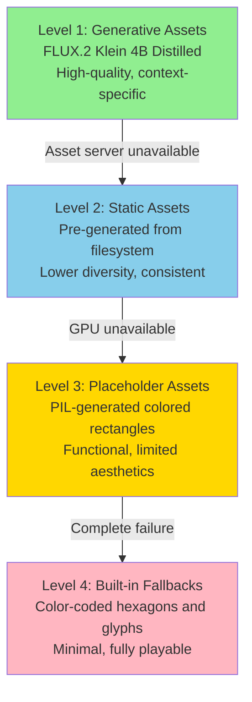

```mermaid
gantt
    title AI Civilization Behavior Patterns (20 Turns)
    dateFormat X
    axisFormat Turn %s
    
    section Genghis Khan
    Found cities (2)        :0, 5
    Build warriors          :0, 10
    Declare war on Egypt    :6, 7
    Attack Egyptian cities  :7, 15
    
    section Cleopatra
    Found city (1)          :0, 5
    Build settlers, workers :0, 10
    Propose alliance        :6, 7
    Form coalition w/ Gandhi:8, 10
    
    section Gandhi
    Found city (1)          :0, 5
    Build library, monument :0, 10
    Research technologies   :5, 15
    Accept alliance         :8, 9
```

# Figures Recommendation for StrategAI Academic Report

**Date**: May 31, 2026  
**Purpose**: Critical evaluation of which figures are essential for a strong academic presentation  
**Context**: INF-3600 Generative AI course project, IEEE report format, oral exam defense

---

## Executive Summary

After analyzing the 12 proposed figures in `FIGURE_DESCRIPTIONS.md`, the report structure, and the project's AI contributions, I recommend a **minimal set of 7 critical figures** that effectively communicate the core innovations while remaining defensible in an oral exam.

**Critical Figures (Must-Have)**: 1, 2, 3, 4, 5, 6, 11  
**Remove**: 7, 8, 9, 10, 12  
**Consider Adding**: Actual generated asset examples, AI decision logs

**Rationale**: Focus on figures that (1) demonstrate novel AI/ML contributions, (2) cannot be adequately conveyed in text, (3) can be created with available evidence, and (4) strengthen oral exam defense.

---

## 1. Analysis of Each Proposed Figure

### Fig. 1: System Architecture Overview
**Status**: ✅ Already created (Mermaid)  
**Essential?**: **YES - Critical**  
**Value Beyond Text?**: **YES** - Complex multi-service architecture is much clearer visually  
**Can Create?**: **YES** - Already exists  
**Priority**: **Critical**

**Justification**: 
- Establishes the foundation for understanding the entire system
- Shows the relationship between four major components (backend, frontend, asset server, training)
- Essential for oral exam: "Walk me through your system architecture"
- Cannot be replaced by text without losing clarity

**Recommendation**: **KEEP** - This is non-negotiable for any systems paper.

---

### Fig. 2: Intent-Based LLM Abstraction Layer
**Status**: ✅ Already created (Mermaid)  
**Essential?**: **YES - Critical**  
**Value Beyond Text?**: **YES** - The two-layer separation is the core novelty  
**Can Create?**: **YES** - Already exists  
**Priority**: **Critical**

**Justification**:
- Demonstrates the **primary AI contribution**: separating strategic LLM reasoning from deterministic execution
- Shows the 9 intent types and resolution process
- Directly addresses the course theme: "How do you integrate LLMs into a production system?"
- Defensible: Can point to specific code (`backend/app/engine/openai_goals.py`, `intents.py`, `operations.py`)

**Recommendation**: **KEEP** - This is your signature contribution.

---

### Fig. 3: Four-Layer Prompt Architecture
**Status**: ✅ Already created (Mermaid)  
**Essential?**: **YES - Critical**  
**Value Beyond Text?**: **YES** - Shows systematic approach to prompt engineering  
**Can Create?**: **YES** - Already exists  
**Priority**: **Critical**

**Justification**:
- Demonstrates **prompt engineering methodology** (key course concept)
- Shows separation of concerns: workflow config → style templates → semantic descriptions → assembly
- Defensible: Can show actual files (`workflows/txt2img.json`, `config/prompt_templates.json`, `src/*/prompts.py`)
- Answers exam question: "How do you ensure consistent asset generation?"

**Recommendation**: **KEEP** - Shows engineering rigor in prompt design.

---

### Fig. 4: Three-Stage Leader Portrait Pipeline
**Status**: ✅ Already created (Mermaid)  
**Essential?**: **YES - Critical**  
**Value Beyond Text?**: **YES** - Identity preservation through img2img is visually intuitive  
**Can Create?**: **YES** - Already exists  
**Priority**: **Critical**

**Justification**:
- Demonstrates **advanced diffusion model techniques**: img2img, denoising parameter tuning
- Shows practical solution to identity preservation problem
- Defensible: Can explain denoise parameter trade-offs (0.85-0.90 sweet spot)
- Answers exam question: "How do you maintain character consistency across different views?"

**Recommendation**: **KEEP** - Shows deep understanding of diffusion models.

---

### Fig. 5: LoRA Fine-Tuning Experiment Matrix
**Status**: ✅ Already created (Mermaid)  
**Essential?**: **YES - Critical**  
**Value Beyond Text?**: **YES** - 3×2 matrix is clearer visually  
**Can Create?**: **YES** - Already exists  
**Priority**: **Critical**

**Justification**:
- Demonstrates **systematic evaluation methodology** (scientific rigor)
- Shows key insight: "Less detailed captions force abstract concept learning"
- Defensible: Can discuss overfitting vs. generalization trade-offs
- Answers exam question: "How did you evaluate your fine-tuning approach?"

**Recommendation**: **KEEP** - Shows experimental methodology.

---

### Fig. 6: Asset Generation Modes and Fallback Strategy
**Status**: ❌ Not yet created  
**Essential?**: **YES - Critical**  
**Value Beyond Text?**: **YES** - Four-level degradation is clearer as a stack diagram  
**Can Create?**: **YES** - Can create with Mermaid or draw.io  
**Priority**: **Critical**

**Justification**:
- Demonstrates **production engineering**: graceful degradation, error handling
- Shows system remains functional even when AI services fail
- Defensible: Can point to actual fallback code in `frontend/lib/assetManifest.ts`
- Answers exam question: "What happens when the GPU is unavailable?"
- **Missing from current figures but essential for demonstrating robustness**

**Recommendation**: **CREATE** - Shows production-readiness thinking.

**Creation Strategy**:
- **Tool**: Mermaid (vertical stack diagram)
- **Data Needed**: None (conceptual diagram)
- **Effort**: 2-3 hours
- **Report Section**: V.C (Asset Families and Generation Modes)

---

### Fig. 7: Game State Serialization and Fog of War
**Status**: ❌ Not yet created  
**Essential?**: **NO - Remove**  
**Value Beyond Text?**: **MARGINAL** - Can be explained in text with code snippet  
**Can Create?**: **YES** - But requires hex grid visualization  
**Priority**: **Remove**

**Justification**:
- Important concept (preventing AI cheating) but **not a core AI contribution**
- Can be explained in 1-2 paragraphs with a code snippet
- Hex grid visualization is complex to create and may not add much value
- **Better use of space**: Expand text description with code example

**Recommendation**: **REMOVE** - Replace with enhanced text description.

**Alternative**: Add a code snippet to the report showing `local_view()` function with comments explaining fog-of-war filtering.

---

### Fig. 8: ComfyUI Workflow Node Graph
**Status**: ❌ Not yet created  
**Essential?**: **NO - Remove**  
**Value Beyond Text?**: **NO** - Too detailed for academic report  
**Can Create?**: **DIFFICULT** - 22-node graph is complex to render clearly  
**Priority**: **Remove**

**Justification**:
- **Too implementation-specific** for an academic paper
- ComfyUI is a tool choice, not a novel contribution
- 22-node graph would be unreadable in IEEE two-column format
- **Better approach**: Describe the workflow conceptually in text (already done in Section V.E)

**Recommendation**: **REMOVE** - Keep the conceptual description in text.

**Alternative**: If you want to show ComfyUI integration, add a screenshot of the actual ComfyUI interface to the presentation slides (not the report).

---

### Fig. 9: Diplomatic Relationship System
**Status**: ❌ Not yet created  
**Essential?**: **NO - Remove**  
**Value Beyond Text?**: **MARGINAL** - Can be explained with a table  
**Can Create?**: **YES** - But adds limited value  
**Priority**: **Remove**

**Justification**:
- Diplomacy is a **game mechanic**, not an AI contribution
- Relationship scoring system is straightforward and can be described in text
- **Better use of space**: Focus on LLM-driven diplomatic behavior (which is already covered in Fig. 11)

**Recommendation**: **REMOVE** - Replace with a simple table in the report text.

**Alternative**: Add a table to Section IV showing message types and relationship deltas (already described in text).

---

### Fig. 10: Test Coverage and Quality Metrics
**Status**: ❌ Not yet created  
**Essential?**: **NO - Remove**  
**Value Beyond Text?**: **NO** - Numbers can be stated in text  
**Can Create?**: **YES** - But requires actual coverage data  
**Priority**: **Remove**

**Justification**:
- Test coverage is **engineering practice**, not an AI contribution
- Numbers (886 tests, 80% coverage) can be stated in one sentence
- **Better use of space**: Focus on AI/ML innovations
- **Risk**: If coverage numbers are not accurate, this becomes indefensible

**Recommendation**: **REMOVE** - State test counts in Section VIII text.

**Alternative**: Add a sentence to Section VIII: "The system includes 886 tests across all components, achieving approximately 80% code coverage."

---

### Fig. 11: AI Civilization Behavior Patterns
**Status**: ❌ Not yet created  
**Essential?**: **YES - Critical**  
**Value Beyond Text?**: **YES** - Shows emergent behavior from persona-based prompting  
**Can Create?**: **YES** - But requires actual gameplay data  
**Priority**: **Critical**

**Justification**:
- Demonstrates **emergent AI behavior** (key course concept)
- Shows that persona-based prompting produces diverse strategic patterns
- Defensible: Can show actual AI decision logs from playthroughs
- Answers exam question: "Do the AI civilizations actually behave differently?"
- **Missing from current figures but essential for demonstrating LLM integration success**

**Recommendation**: **CREATE** - Shows that your LLM integration actually works.

**Creation Strategy**:
- **Tool**: Mermaid (timeline diagram) or draw.io (three-panel layout)
- **Data Needed**: Actual gameplay logs from 15-20 turn playthrough
- **Effort**: 4-6 hours (run playthrough, extract data, create diagram)
- **Report Section**: IV.F (Error Handling and Graceful Degradation) or new Section IV.G

**Data Collection**:
```bash
cd backend
python scripts/run_playthrough.py --turns 20 --output logs/playthrough_example.json
```

Then extract:
- Turn-by-turn intents for each civilization
- Diplomatic messages exchanged
- Key decisions (war declarations, alliance proposals)

---

### Fig. 12: Asset Generation Performance
**Status**: ❌ Not yet created  
**Essential?**: **NO - Remove**  
**Value Beyond Text?**: **MARGINAL** - Performance numbers can be stated in text  
**Can Create?**: **DIFFICULT** - Requires actual benchmarking data  
**Priority**: **Remove**

**Justification**:
- Performance metrics are **implementation details**, not AI contributions
- Numbers (1.2-4.0s generation time) can be stated in text
- **Risk**: If you don't have actual benchmarking data, this becomes indefensible
- **Better use of space**: Focus on AI/ML innovations

**Recommendation**: **REMOVE** - State performance numbers in Section VIII text.

**Alternative**: Add a table to Section VIII:

| Asset Type | Generation Time | Cache Hit Rate |
|------------|----------------|----------------|
| Structure  | 1.2s           | 80%            |
| Leader     | 2.8-4.0s       | 60%            |

---

## 2. Recommended Minimal Set (7 Figures)

### Critical Figures (Must Create/Keep)

| # | Figure | Status | Purpose | Report Section |
|---|--------|--------|---------|----------------|
| 1 | System Architecture Overview | ✅ Exists | Establish multi-service architecture | III.A |
| 2 | Intent-Based LLM Abstraction | ✅ Exists | Show core AI contribution | IV.A |
| 3 | Four-Layer Prompt Architecture | ✅ Exists | Demonstrate prompt engineering | V.B |
| 4 | Three-Stage Leader Pipeline | ✅ Exists | Show diffusion model techniques | V.D |
| 5 | LoRA Experiment Matrix | ✅ Exists | Demonstrate evaluation methodology | VI.D |
| 6 | Asset Fallback Strategy | ❌ Create | Show production robustness | V.C |
| 11 | AI Behavior Patterns | ❌ Create | Demonstrate LLM integration success | IV.G (new) |

### Removed Figures (Replace with Text)

| # | Figure | Reason for Removal | Alternative |
|---|--------|-------------------|-------------|
| 7 | Fog of War Serialization | Not core AI contribution | Code snippet in text |
| 8 | ComfyUI Node Graph | Too implementation-specific | Conceptual description in text |
| 9 | Diplomatic Relationship System | Game mechanic, not AI | Table in text |
| 10 | Test Coverage Metrics | Engineering practice, not AI | One sentence in text |
| 12 | Asset Generation Performance | Implementation detail | Table in text |

---

## 3. What's Missing? (Consider Adding)

### A. Actual Generated Asset Examples
**Priority**: **Important**  
**Value**: **HIGH** - Shows that your system actually produces assets  
**Can Create?**: **YES** - Run asset server and capture screenshots

**Recommendation**: Add a **figure showing 6-8 generated assets** (one from each family):
- Structure (e.g., medieval granary)
- Object (e.g., tree, rock)
- Terrain (e.g., grass, stone)
- Unit (e.g., warrior, archer)
- Background tile (e.g., water, grass)
- Leader portrait (splash, profile, action)

**Why This Matters**:
- Proves your system actually works
- Shows visual quality of generated assets
- Defensible: "Here are actual outputs from our system"
- **Powerful in oral exam**: "Show me what your system produces"

**Creation Strategy**:
- **Tool**: Screenshot or image grid (PIL/ImageMagick)
- **Data Needed**: Run asset server, generate 6-8 assets
- **Effort**: 2-3 hours
- **Report Section**: V.C (Asset Families) or new Section V.G

**Example Layout**:
```
┌─────────┬─────────┬─────────┐
│Structure│ Object  │ Terrain │
│ [image] │ [image] │ [image] │
├─────────┼─────────┼─────────┤
│  Unit   │  Tile   │ Leader  │
│ [image] │ [image] │ [image] │
└─────────┴─────────┴─────────┘
```

**Caption**: "Sample generated assets from six asset families. All assets generated on-demand using FLUX.2 Klein 4B Distilled with LoRA fine-tuning for top-down perspective."

---

### B. AI Decision Logs (Optional)
**Priority**: **Nice-to-Have**  
**Value**: **MEDIUM** - Shows actual LLM reasoning  
**Can Create?**: **YES** - Extract from playthrough logs

**Recommendation**: Add a **table or code snippet** showing actual AI decision-making:

**Example**:
```
Turn 5: Genghis Khan (Mongolia)
--------------------------------
Game State Summary:
- 2 cities, 3 warriors, 1 settler
- Resources: 120 gold, 15 food, 8 production
- Visible enemy: Cleopatra's warrior at hex (3,4)
- Relationship with Cleopatra: -15 (neutral)

LLM Reasoning:
"The Egyptian civilization is weak and vulnerable. Their single warrior 
is positioned near our border. We should strike now before they can 
build defenses. Conquest is the only true measure of a civilization."

Emitted Intents:
1. Engage(target_civ_id=2)  # Attack Egypt
2. Build(unit_type=warrior)  # Continue military buildup

Resolved Actions:
- DeclareWar(civ_id=2)
- MoveTo(unit_id=5, target=Hex(3,4))
- QueueProduction(city_id=1, unit_type=warrior)
```

**Why This Matters**:
- Shows actual LLM reasoning process
- Demonstrates persona-based behavior ("Conquest is the only true measure...")
- Defensible: "Here's what the LLM actually decided"

**Creation Strategy**:
- **Tool**: Code block or table in LaTeX
- **Data Needed**: Extract from playthrough logs
- **Effort**: 1-2 hours
- **Report Section**: IV.D (Memory and Context Management)

---

## 4. Creation Strategy and Prioritization

### Priority 1: Already Exist (No Work Needed)
**Figures**: 1, 2, 3, 4, 5  
**Action**: Verify they render correctly, export to PNG/PDF for LaTeX  
**Effort**: 1 hour (batch export)

```bash
cd docs/figures
for f in fig*.md; do
    mmdc -i "$f" -o "${f%.md}.png" --scale 3
done
```

---

### Priority 2: Critical to Create
**Figures**: 6, 11  
**Action**: Create these next  
**Effort**: 6-9 hours total

#### Fig. 6: Asset Fallback Strategy
**Tool**: Mermaid (vertical stack diagram)  
**Effort**: 2-3 hours  
**Steps**:
1. Create `docs/figures/fig6_asset_fallback.md`
2. Design vertical stack with 4 levels (generative → static → placeholder → built-in)
3. Add annotations showing when each level activates
4. Export to PNG

**Mermaid Template**:


---

#### Fig. 11: AI Behavior Patterns
**Tool**: Mermaid (timeline) or draw.io (three-panel)  
**Effort**: 4-6 hours  
**Steps**:
1. Run a 20-turn playthrough: `python scripts/run_playthrough.py --turns 20`
2. Extract turn-by-turn intents for each civilization
3. Identify key decisions (war, alliances, expansion)
4. Create timeline diagram showing behavior patterns
5. Add quotes from LLM reasoning

**Data Extraction**:
```python
import json

with open('logs/playthrough_example.json') as f:
    data = json.load(f)

for civ in data['civilizations']:
    print(f"\n{civ['name']} ({civ['leader']}):")
    for turn in civ['turns']:
        print(f"  Turn {turn['number']}: {turn['intents']}")
```

**Mermaid Template**:


---

### Priority 3: Important to Create (If Time Permits)
**Figure**: Generated Asset Examples  
**Effort**: 2-3 hours  
**Steps**:
1. Start asset server: `cd assetserver && python -m uvicorn src.main:app --port 8001`
2. Generate 6 assets (one per family) using API
3. Create image grid using PIL or ImageMagick
4. Add to report as Fig. 7 (renumber others)

**API Calls**:
```bash
# Structure
curl -X POST http://localhost:8001/structure \
  -H "Content-Type: application/json" \
  -d '{"category":"economic","style":"medieval","condition":"good","scale":"medium"}' \
  -o structure.png

# Repeat for object, terrain, unit, tile, leader
```

**Image Grid (PIL)**:
```python
from PIL import Image

assets = [
    Image.open('structure.png'),
    Image.open('object.png'),
    Image.open('terrain.png'),
    Image.open('unit.png'),
    Image.open('tile.png'),
    Image.open('leader.png'),
]

grid = Image.new('RGB', (768, 512))
for i, img in enumerate(assets):
    x = (i % 3) * 256
    y = (i // 3) * 256
    grid.paste(img, (x, y))

grid.save('asset_examples.png')
```

---

## 5. Prioritization by Impact

### Ranking Criteria
- **Academic Value**: Does it demonstrate a novel AI/ML contribution?
- **Defensibility**: Can you explain it in an oral exam?
- **Creation Effort**: How long does it take to create?

### Final Ranking

| Rank | Figure | Academic Value | Defensibility | Effort | Priority |
|------|--------|----------------|---------------|--------|----------|
| 1 | Fig. 2: Intent-Based Abstraction | ⭐⭐⭐⭐⭐ | ⭐⭐⭐⭐⭐ | ✅ Exists | **Critical** |
| 2 | Fig. 3: Prompt Architecture | ⭐⭐⭐⭐⭐ | ⭐⭐⭐⭐⭐ | ✅ Exists | **Critical** |
| 3 | Fig. 4: Leader Pipeline | ⭐⭐⭐⭐⭐ | ⭐⭐⭐⭐⭐ | ✅ Exists | **Critical** |
| 4 | Fig. 5: LoRA Matrix | ⭐⭐⭐⭐⭐ | ⭐⭐⭐⭐⭐ | ✅ Exists | **Critical** |
| 5 | Fig. 1: System Architecture | ⭐⭐⭐⭐ | ⭐⭐⭐⭐⭐ | ✅ Exists | **Critical** |
| 6 | Fig. 11: AI Behavior Patterns | ⭐⭐⭐⭐⭐ | ⭐⭐⭐⭐ | 4-6 hours | **Critical** |
| 7 | Fig. 6: Asset Fallback | ⭐⭐⭐⭐ | ⭐⭐⭐⭐ | 2-3 hours | **Critical** |
| 8 | Generated Asset Examples | ⭐⭐⭐⭐ | ⭐⭐⭐⭐⭐ | 2-3 hours | **Important** |
| 9 | AI Decision Logs | ⭐⭐⭐ | ⭐⭐⭐⭐ | 1-2 hours | **Nice-to-Have** |

---

## 6. Time-Constrained Strategy

### If You Have 10 Hours
**Create**: Fig. 6 (Asset Fallback) + Fig. 11 (AI Behavior)  
**Result**: 7 critical figures complete

### If You Have 15 Hours
**Create**: Fig. 6 + Fig. 11 + Generated Asset Examples  
**Result**: 8 figures, strong visual evidence

### If You Have 20+ Hours
**Create**: Fig. 6 + Fig. 11 + Asset Examples + AI Decision Logs  
**Result**: 9 figures, comprehensive documentation

---

## 7. Final Recommendations

### Do This Now (1 hour)
1. Export existing Mermaid diagrams to PNG:
   ```bash
   cd docs/figures
   for f in fig*.md; do
       mmdc -i "$f" -o "${f%.md}.png" --scale 3
   done
   ```
2. Verify all 5 diagrams render correctly
3. Add to LaTeX report

### Do This Next (6-9 hours)
1. Create Fig. 6: Asset Fallback Strategy (2-3 hours)
2. Run playthrough and create Fig. 11: AI Behavior Patterns (4-6 hours)

### Do This If Time Permits (2-3 hours)
1. Generate asset examples and add to report
2. Extract AI decision logs for Section IV

### Don't Do This
- ❌ Fig. 7: Fog of War (replace with code snippet)
- ❌ Fig. 8: ComfyUI Node Graph (too detailed)
- ❌ Fig. 9: Diplomatic System (replace with table)
- ❌ Fig. 10: Test Coverage (state in text)
- ❌ Fig. 12: Performance Metrics (state in text)

---

## 8. Oral Exam Defense Strategy

### Figures You Must Be Able to Explain

**Fig. 1: System Architecture**
- **Question**: "Walk me through your system architecture"
- **Answer**: Point to each component, explain data flow, emphasize microservices design

**Fig. 2: Intent-Based Abstraction**
- **Question**: "How do you integrate LLMs into your game?"
- **Answer**: Explain two-layer separation, 9 intent types, deterministic execution

**Fig. 3: Prompt Architecture**
- **Question**: "How do you ensure consistent asset generation?"
- **Answer**: Explain four-layer separation, show actual files

**Fig. 4: Leader Pipeline**
- **Question**: "How do you maintain character identity across different views?"
- **Answer**: Explain img2img, denoise parameter trade-offs

**Fig. 5: LoRA Matrix**
- **Question**: "How did you evaluate your fine-tuning approach?"
- **Answer**: Explain 3×2 matrix, key insight about caption design

**Fig. 6: Asset Fallback**
- **Question**: "What happens when the GPU is unavailable?"
- **Answer**: Explain four-level degradation, show fallback code

**Fig. 11: AI Behavior**
- **Question**: "Do the AI civilizations actually behave differently?"
- **Answer**: Show timeline, explain persona-based prompting, point to emergent behavior

---

## 9. Summary

### Minimal Set (7 Figures)
1. ✅ System Architecture Overview
2. ✅ Intent-Based LLM Abstraction
3. ✅ Four-Layer Prompt Architecture
4. ✅ Three-Stage Leader Pipeline
5. ✅ LoRA Experiment Matrix
6. ❌ Asset Fallback Strategy (CREATE)
7. ❌ AI Behavior Patterns (CREATE)

### Removed (5 Figures)
- Fig. 7: Fog of War → Code snippet
- Fig. 8: ComfyUI Graph → Text description
- Fig. 9: Diplomatic System → Table
- Fig. 10: Test Coverage → One sentence
- Fig. 12: Performance → Table

### Optional Additions (If Time)
- Generated Asset Examples (2-3 hours)
- AI Decision Logs (1-2 hours)

### Total Effort
- **Minimum**: 6-9 hours (create Fig. 6 + Fig. 11)
- **Recommended**: 8-12 hours (add asset examples)
- **Comprehensive**: 10-15 hours (add decision logs)

---

## 10. Next Steps

1. **Immediate** (1 hour): Export existing Mermaid diagrams
2. **This Week** (6-9 hours): Create Fig. 6 and Fig. 11
3. **If Time** (2-3 hours): Generate asset examples
4. **Final** (1 hour): Add all figures to LaTeX report, verify references

---

**Document Version**: 1.0  
**Last Updated**: May 31, 2026  
**Author**: AI Analysis for StrategAI Team
