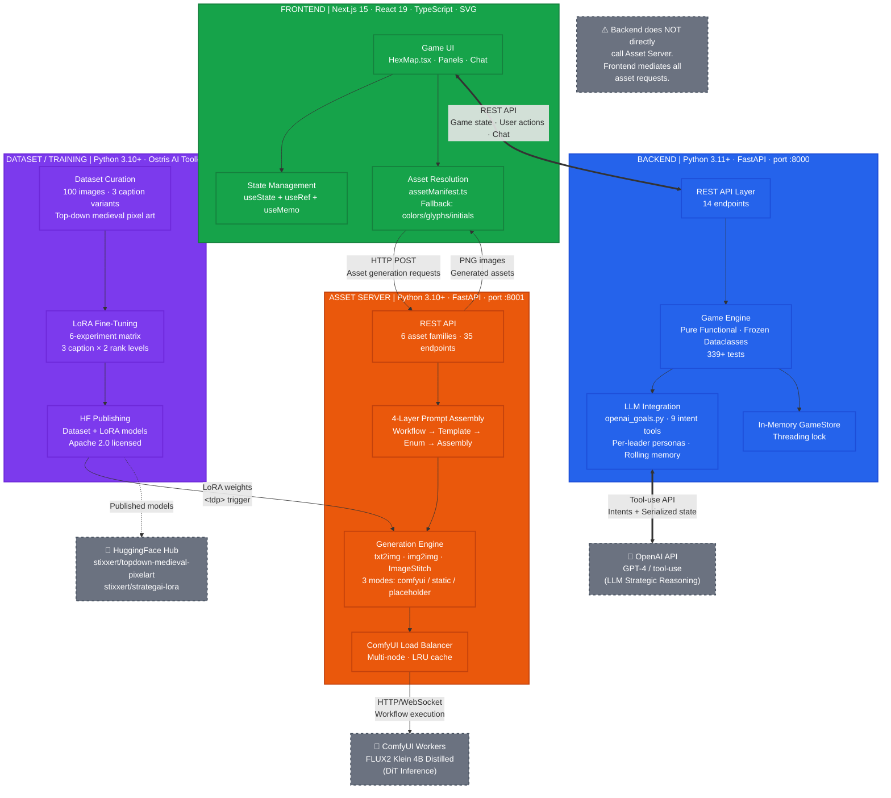

# Figure 1: System Architecture Overview

**Caption**: System architecture showing four primary components and data flow between backend game engine, frontend UI, asset generation server, and LoRA training pipeline.

## Key Points

| Component | Tech Stack | Role |
|-----------|-----------|------|
| **Backend** | Python 3.11+, FastAPI, OpenAI API | Game engine, LLM-driven AI civs, REST API |
| **Frontend** | Next.js 15, React 19, TypeScript, SVG | Game UI, hex map rendering, asset integration |
| **Asset Server** | Python 3.10+, FastAPI, ComfyUI, FLUX2 Klein 4B Distilled | On-demand generative pixel art |
| **Training Pipeline** | Python 3.10+, Ostris AI Toolkit | LoRA fine-tuning for top-down medieval style |

## Data Flow Summary

1. **Frontend ↔ Backend**: Bidirectional REST API — game state queries, user actions, diplomacy chat
2. **Frontend → Asset Server**: HTTP POST requests for asset generation (leader, unit, structure, terrain, background tile)
3. **Asset Server → Frontend**: PNG image responses (generated sprites, portraits, tiles)
4. **Backend → OpenAI**: Tool-use API calls — LLM receives serialized game state, emits intents
5. **Asset Server → ComfyUI**: HTTP/WebSocket workflow execution requests
6. **Training → Asset Server**: LoRA weights (`.safetensors`) consumed by ComfyUI at inference time

## Critical Design Decision

The **backend never directly calls the asset server**. The frontend mediates all asset requests. This separation keeps the game engine pure (no I/O to image generation services) and allows the frontend to implement graceful degradation (comfyui → static → placeholder → built-in fallbacks) independently.
