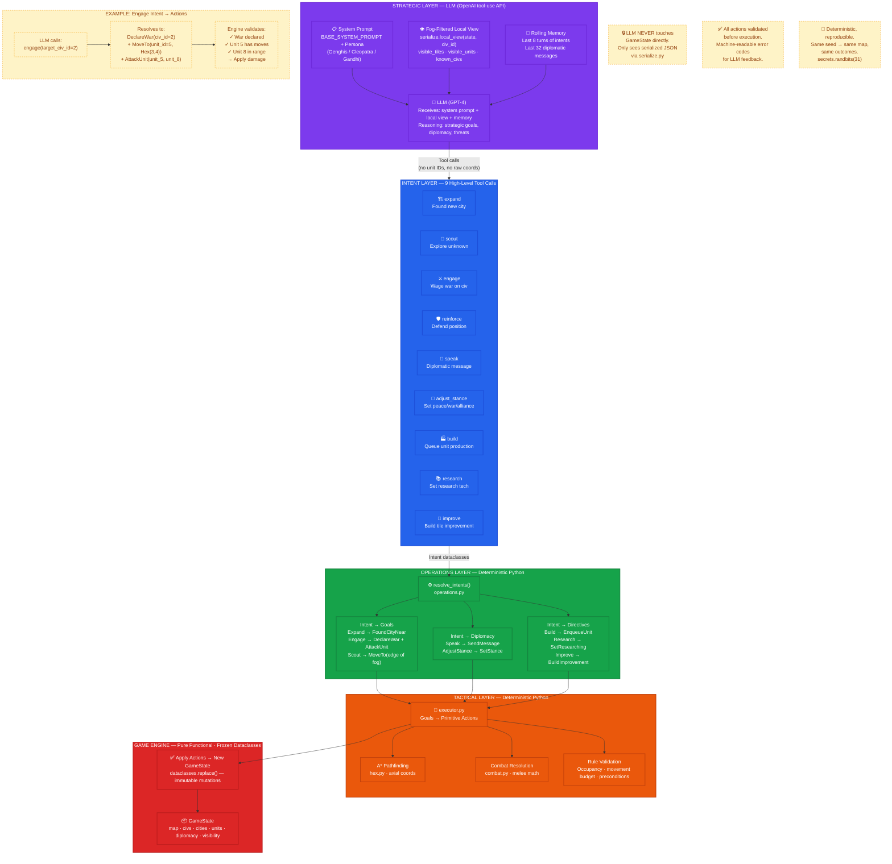

# Figure 2: Intent-Based LLM Abstraction Layer

**Caption**: Two-layer architecture separating strategic LLM reasoning from deterministic tactical execution through intent-based abstraction.

## Architecture Principles

### Intent Abstraction
The LLM operates at the **strategic** level — it declares *what* it wants to do, never *how* to do it. Intents are semantic and high-level:
- `Expand` — "I want a new city" (engine picks settler + site)
- `Engage` — "Attack Egypt" (engine auto-declares war, picks closest unit + target)
- `Scout` — "Explore unknown territory" (engine picks scout unit + fog edge)

### Why This Decoupling Matters

| Problem | Without Abstraction | With Intent Abstraction |
|---------|-------------------|------------------------|
| **Hallucinated unit IDs** | LLM invents non-existent `unit_id=42` | LLM calls `engage(target_civ_id=2)`, engine finds valid units |
| **War precondition** | LLM forgets to declare war, attacks illegally | `Engage` auto-declares war if needed |
| **Self-targeting** | LLM declares war on itself | Tools reject `target_civ_id == self` |
| **State corruption** | LLM writes directly to GameState | LLM never touches GameState — only reads serialized JSON view |
| **Reproducibility** | Non-deterministic LLM outputs | Deterministic resolution layer ensures same intents → same outcomes |

### Graceful Degradation

If `OPENAI_API_KEY` is missing or API calls fail, the system falls back to `RandomGoalSource` — a deterministic random agent that keeps the game playable. This is implemented in `backend/app/engine/playthrough.py` via the `GoalSource` protocol.

### Key Source Files

| File | Purpose |
|------|---------|
| `backend/app/engine/openai_goals.py` | OpenAI tool-use GoalSource, 9 tool definitions, system prompt builder |
| `backend/app/engine/intents.py` | 9 frozen dataclass Intent types (Expand, Scout, Engage, etc.) |
| `backend/app/engine/operations.py` | `resolve_intents()` — Intent → Goal + DiplomaticAction + Directive |
| `backend/app/engine/serialize.py` | `local_view()` — fog-filtered JSON for LLM consumption |
| `backend/app/engine/executor.py` | Goal → primitive Action resolution with A* pathfinding |
| `backend/app/engine/playthrough.py` | `GoalSource` protocol, `run_playthrough()` headless loop |
