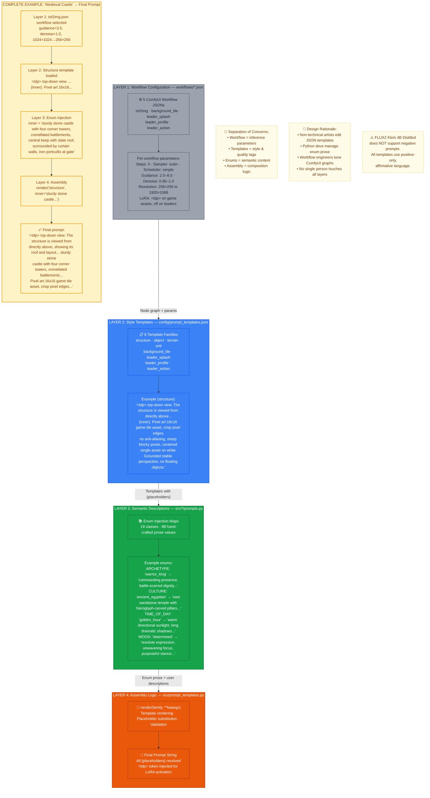

# Figure 3: Four-Layer Prompt Architecture

**Caption**: Systematic prompt construction through four layers separating workflow configuration, style templates, semantic descriptions, and assembly logic.

## Prompt Assembly Pipeline

### Layer 1: Workflow Configuration (`workflows/*.json`)
Self-contained ComfyUI node graphs that define the inference pipeline. Each workflow specifies:
- Model loading (UNET, CLIP, VAE, LoRA — split loading architecture)
- Sampler parameters (euler, simple scheduler, 4 steps)
- Guidance scale and denoise strength
- Post-processing (rembg, ImageSharpen for game sprites)
- Reference image inputs (for img2img leader stages)

### Layer 2: Style Templates (`config/prompt_templates.json`)
Jinja2-style templates with `{placeholder}` variables. Contains:
- Camera framing directives (`top-down view`)
- Quality/style tags (`Pixel art 16x16 game tile asset, crisp pixel edges`)
- LoRA trigger token (`<tdp>` for game assets; omitted for leaders/backgrounds)
- Structural constraints (`centered single asset on white`, `no floating objects`)

### Layer 3: Semantic Descriptions (`src/*/prompts.py`)
Hand-crafted enum injection maps providing rich prose per semantic value:
- **19 enums** across 6 asset families: `ARCHETYPE`, `CULTURE`, `TIME_OF_DAY`, `MOOD`, `ACTION_CATEGORY` (leaders); `STRUCTURE_TYPE`, `TERRAIN_TYPE`, etc. (tiles)
- **88 values** total, each with 20–40 words of evocative prose
- Example: `ARCHETYPE['warrior_king']` → `"commanding presence, battle-scarred dignity, weapon in hand, military authority"`

### Layer 4: Assembly Logic (`src/prompt_templates.py`)
Pure composition layer:
- `render(family, **kwargs)` substitutes placeholder values
- `get_placeholders(family)` introspects template expectations (for validation)
- Thread-safe caching of template JSON
- Regex-based placeholder extraction for validation

## Design Rationale

| Principle | Implementation |
|-----------|---------------|
| **Separation of concerns** | Workflow engineers, prompt designers, domain experts, and developers work independently |
| **Consistency across assets** | Same style tags enforced by templates; semantic variation via enums |
| **No hardcoded prompts** | All prompt text lives in JSON; Python contains only assembly logic |
| **Positive-only prompts** | FLUX2 Klein 4B Distilled does not support negative prompts — all language is affirmative |
