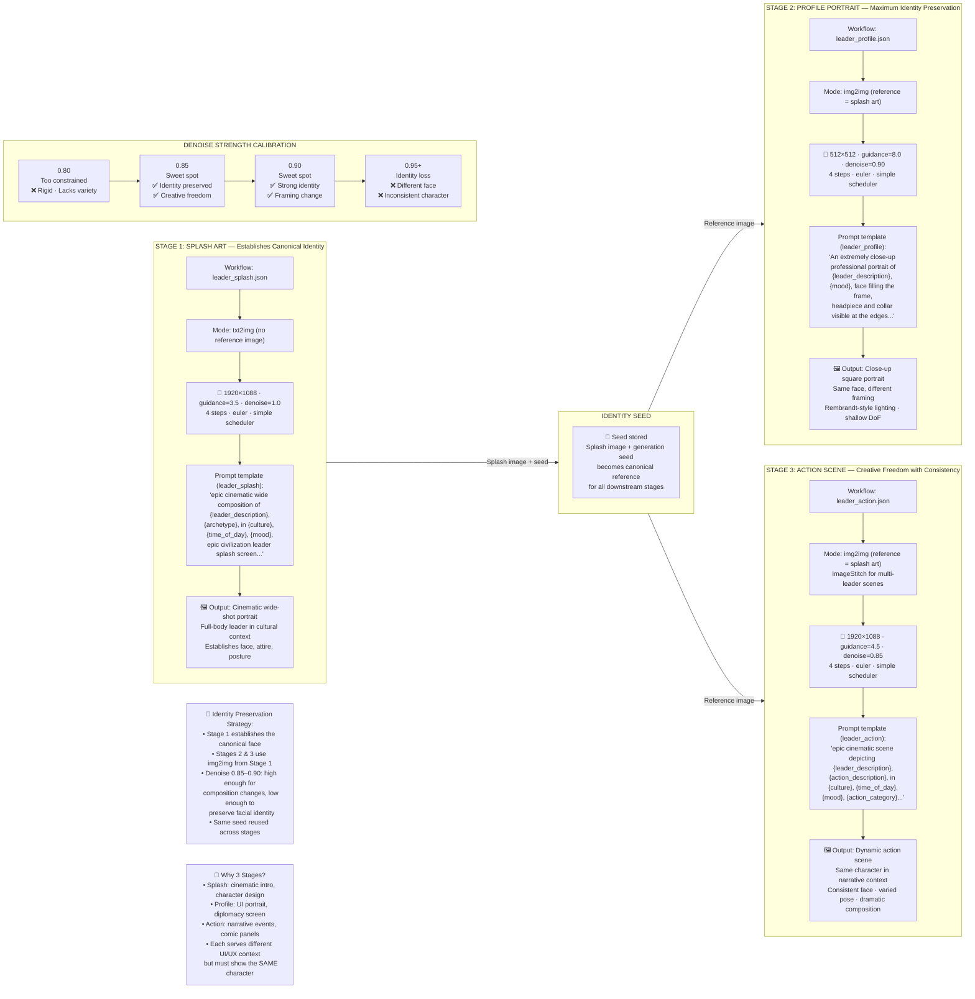

# Figure 4: Three-Stage Leader Portrait Pipeline

**Caption**: Identity-preserving leader portrait generation through three stages with calibrated denoising parameters.

## Identity Preservation Mechanism

### The Core Challenge
Generating three different compositions of the same fictional character while maintaining consistent facial identity is non-trivial. Each generation is a stochastic process — without constraints, each stage would produce a different-looking person.

### The Solution: Calibrated img2img
Stages 2 and 3 use **image-to-image (img2img)** generation seeded from the Stage 1 splash art output:

1. **Stage 1 (txt2img, denoise=1.0)**: Full creative freedom. The model generates a novel character from pure noise, guided only by the text prompt. This establishes the **canonical identity**.

2. **Stage 2 (img2img, denoise=0.90)**: The splash art is partially noised then denoised with a new prompt (close-up portrait framing). At denoise=0.90, ~90% of the latent is replaced — enough to change composition from wide-shot to close-up — but ~10% of the original structure persists, preserving facial features.

3. **Stage 3 (img2img, denoise=0.85)**: Similar approach for action scenes. Slightly lower denoise (0.85) provides more structural preservation while still allowing dynamic pose and scene changes.

### Denoise Trade-off

| Denoise | Effect |
|---------|--------|
| **0.80** | Too constrained — output nearly identical to reference; cannot change composition |
| **0.85–0.90** | **Sweet spot** — sufficient structural change for new composition while preserving face |
| **0.95+** | Too much freedom — effectively a new generation; facial identity lost |

### Why Guidance Varies by Stage

| Stage | Guidance | Rationale |
|-------|----------|-----------|
| Splash | 3.5 | Moderate — balances creative expression with prompt adherence |
| Profile | 8.0 | High — strong prompt adherence needed for close-up framing and Rembrandt lighting |
| Action | 4.5 | Moderate-high — allows dynamic composition while maintaining character consistency |

### Multi-Leader Scenes (ImageStitch)
For action scenes featuring two leaders, two separate splash references are fed into the `ImageStitch` node, compositing both characters into a single coherent scene while preserving both identities.

### Key Source Files

| File | Purpose |
|------|---------|
| `assetserver/workflows/leader_splash.json` | txt2img workflow, 1920×1088 cinematic portrait |
| `assetserver/workflows/leader_profile.json` | img2img workflow, 512×512 close-up from splash |
| `assetserver/workflows/leader_action.json` | img2img workflow, 1920×1088 action from splash + ImageStitch |
| `assetserver/config/prompt_templates.json` | `leader_splash`, `leader_profile`, `leader_action` templates |
| `assetserver/src/leader/prompts.py` | Enum injection maps: ARCHETYPE, CULTURE, TIME_OF_DAY, MOOD, ACTION_CATEGORY |
| `assetserver/src/leader/models.py` | `LeaderRequest` Pydantic model with all enum fields |
