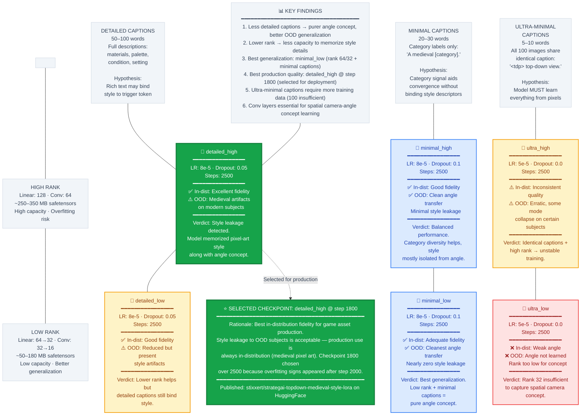

# Figure 5: LoRA Fine-Tuning Experiment Matrix

**Caption**: Six-experiment matrix evaluating interaction between caption detail level and LoRA rank on model generalization.

## Experiment Design Summary

### The 3×2 Matrix

| | High Rank (128/64) | Low Rank (64/32 or 32/16) |
|---|---|---|
| **Detailed** (50–100 words) | `detailed_high` — Best fidelity, style leakage | `detailed_low` — Good fidelity, reduced leakage |
| **Minimal** (20–30 words) | `minimal_high` — Balanced, good transfer | `minimal_low` — **Best generalization** |
| **Ultra-Minimal** (5–10 words) | `ultra_high` — Unstable, inconsistent | `ultra_low` — Rank too low, concept not learned |

### Caption Detail Levels

| Level | Format | Token Count | Hypothesis |
|-------|--------|-------------|------------|
| **Detailed** | `<tdp> top-down view. [full description — building type, materials, palette, condition, setting]` | 50–100 words | Rich text gives more conditioning signal but risks binding style descriptors |
| **Minimal** | `<tdp> top-down view. A medieval [category].` | 20–30 words | Category labels aid convergence without style binding |
| **Ultra-Minimal** | `<tdp> top-down view.` | 5–10 words | All 100 images identical caption — model must learn from pixels alone |

### Rank Levels

| Level | Linear Rank | Conv Rank | Safetensors Size | Capacity |
|-------|-------------|-----------|-----------------|----------|
| **High** | 128 | 64 | ~250–350 MB | Higher capacity, risk of style memorization |
| **Low** (minimal/detailed) | 64 | 32 | ~120–180 MB | Balanced |
| **Low** (ultra-minimal) | 32 | 16 | ~50–80 MB | May not capture spatial concept |

### Why `detailed_high` @ Step 1800 Was Selected

Despite not having the best OOD generalization, `detailed_high` was selected for production because:

1. **Production use is always in-distribution** — all game assets are medieval pixel art; OOD generalization to cars and spaceships is irrelevant for the game asset pipeline
2. **Best in-distribution fidelity** — detailed captions produce the highest-quality medieval pixel art sprites
3. **Step 1800, not 2500** — overfitting (memorization of individual training assets) became detectable after step ~2000, so the checkpoint before degradation was chosen
4. **Published on HuggingFace** as `stixxert/strategai-topdown-medieval-style-lora`

### Training Infrastructure

| Parameter | Value |
|-----------|-------|
| **Base model** | FLUX2 Klein 4B Distilled (fp8) |
| **Training toolkit** | Ostris AI Toolkit |
| **Optimizer** | AdamW 8-bit |
| **Timestep sampling** | Weighted (flow-matching) |
| **Gradient checkpointing** | Enabled (VRAM optimization) |
| **Checkpoint interval** | Every 200 steps |
| **Total storage** | ~13–14 GB across 6 experiments × 13 checkpoints |
| **VRAM per experiment** | ~15–18 GB |

### Key Source Files

| File | Purpose |
|------|---------|
| `dataset-gen-train/docs/experiment-design.md` | Complete experiment rationale and methodology |
| `dataset-gen-train/config/training/*.yaml` | 6 training experiment configuration files |
| `dataset-gen-train/src/training/derive_captions.py` | Caption variant generation (detailed/minimal/ultra-minimal) |
| `dataset-gen-train/src/generation/prepare_dataset.py` | Dataset card auto-generation with live statistics |
| `dataset-gen-train/src/training/extract_training_set.py` | Training set extraction with trigger token injection |
