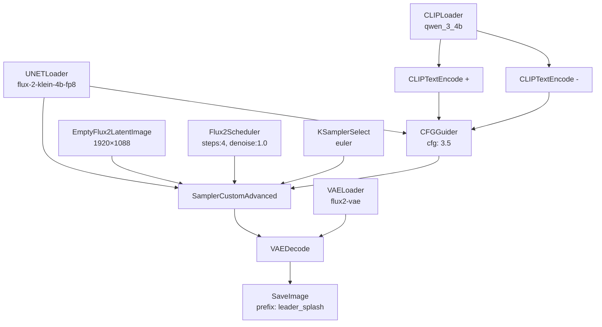
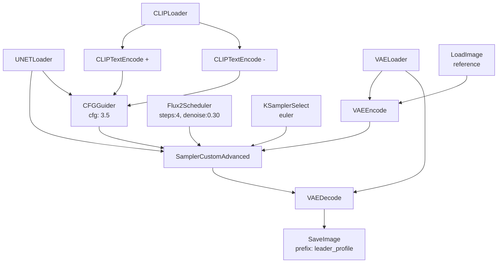

# Flux2 Klein 4B Distilled — Leader Pipeline Migration Plan

> **Status:** Draft  
> **Date:** May 2026  
> **Target Model:** `flux-2-klein-4b-fp8.safetensors` (distilled, 4-step, Apache 2.0)  
> **VRAM Budget:** ~8.4 GB  

---

## Table of Contents

1. [Executive Summary](#1-executive-summary)
2. [Why Flux2 Klein 4B](#2-why-flux2-klein-4b)
3. [Architecture Delta: SDXL Turbo → Flux2 Klein 4B](#3-architecture-delta-sdxl-turbo--flux2-klein-4b)
4. [What Already Works (No Changes Needed)](#4-what-already-works-no-changes-needed)
5. [Phase 1: Model Files & ComfyUI Setup](#5-phase-1-model-files--comfyui-setup)
6. [Phase 2: Workflow JSON Templates (3 new files)](#6-phase-2-workflow-json-templates-3-new-files)
7. [Phase 3: Prompt Adaptation](#7-phase-3-prompt-adaptation)
8. [Phase 4: Workflow Patching Layer (comfyui_client.py)](#8-phase-4-workflow-patching-layer-comfyui_clientpy)
9. [Phase 5: Leader Engine Adaptation](#9-phase-5-leader-engine-adaptation)
10. [Phase 6: Config & Model Selection](#10-phase-6-config--model-selection)
11. [Phase 7: Testing Plan](#11-phase-7-testing-plan)
12. [Phase 8: Rollout Strategy](#12-phase-8-rollout-strategy)
13. [Risk Register](#13-risk-register)
14. [File Change Inventory](#14-file-change-inventory)

---

## 1. Executive Summary

The current leader pipeline (`leader_splash.json`, `leader_profile.json`, `leader_action.json`) is built for **SDXL Turbo** (`sd_xl_turbo_1.0.safetensors`) using the classic `CheckpointLoaderSimple → CLIPTextEncode → KSampler` graph. Flux2 Klein 4B uses a fundamentally different node architecture:

- **Split model loading**: `UNETLoader` + `CLIPLoader` + `VAELoader` instead of `CheckpointLoaderSimple`
- **Flux-specific sampling**: `CFGGuider → Flux2Scheduler → KSamplerSelect → SamplerCustomAdvanced` instead of `KSampler`
- **Qwen 3 4B text encoder** instead of SDXL's CLIP
- **`EmptyFlux2LatentImage`** instead of `EmptyLatentImage`

The Python layer (`leader_engine.py`, `leader_prompts.py`, `comfyui_client.py`) is well-architected and model-agnostic. **~70% of the codebase requires no changes.** The work is concentrated in: new workflow JSONs, `_patch_workflow()` extensions, prompt style-tail updates, and a model-selection mechanism.

**Estimated effort**: 3–5 days for a working pipeline, 1–2 additional days for polish and testing.

---

## 2. Why Flux2 Klein 4B

| Dimension | SDXL Turbo (current) | Flux2 Klein 4B Distilled | Improvement |
|-----------|---------------------|--------------------------|-------------|
| Steps | 8 | 4 | 2× faster |
| VRAM | ~8 GB | ~8.4 GB | Comparable |
| Prompt adherence | Moderate | Strong (Qwen 3 4B encoder) | Significantly better |
| Text rendering | Poor | Professional-grade | Game-changer for UI |
| Image editing | Manual VAEEncode img2img | Native single/multi-reference editing | Better consistency |
| License | OpenRAIL-M | Apache 2.0 | More permissive |
| Inference time | ~3–5s (typical) | ~1.2s (5090) / ~3–5s (consumer) | 30–50% faster |
| Face quality | Acceptable | Superior (Klein's unified architecture) | Critical for leaders |

---

## 3. Architecture Delta: SDXL Turbo → Flux2 Klein 4B

### 3.1 Node Graph Comparison

```
SDXL TURBO (CURRENT):
┌─────────────────────┐
│ CheckpointLoaderSimple │ → MODEL, CLIP, VAE
└──────┬────────┬─────┘
       │        │
  ┌────▼───┐ ┌──▼──────────┐
  │CLIPText│ │CLIPText     │
  │Encode +│ │Encode −     │
  └────┬───┘ └──┬──────────┘
       │        │
  ┌────▼────────▼─────┐    ┌─────────────┐
  │     KSampler      │ ←──│EmptyLatent  │
  │  (seed,steps,cfg, │    │Image        │
  │   sampler,sched)  │    │(w×h)        │
  └────────┬──────────┘    └─────────────┘
           │
      ┌────▼─────┐
      │VAEDecode │
      └────┬─────┘
           │
      ┌────▼─────┐
      │SaveImage │
      └──────────┘

FLUX2 KLEIN 4B (TARGET):
┌──────────┐  ┌──────────┐  ┌──────────┐
│UNETLoader│  │CLIPLoader│  │VAELoader │
│(diffusion│  │(qwen_3_4b│  │(flux2-   │
│ model)   │  │ .safe-   │  │vae)      │
└────┬─────┘  │tensors)  │  └────┬─────┘
     │        └────┬─────┘       │
     │         ┌───▼──────┐      │
     │         │CLIPText  │      │
     │         │Encode +  │      │
     │         └────┬─────┘      │
     │         ┌───▼──────┐      │
     │         │CLIPText  │      │
     │         │Encode −  │      │
     │         └────┬─────┘      │
     │    ┌─────────▼───────┐    │
     │    │   CFGGuider     │    │
     │    │ (cfg: 3.5–4.0)  │    │
     │    └────────┬────────┘    │
     │         ┌───▼───────┐     │
     └─────────► Sampler   │     │
          ┌───► Custom     │◄────┘  ┌──────────────────┐
          │    │ Advanced   │        │EmptyFlux2Latent  │
          │    └─────┬──────┘        │Image (w×h)       │
          │          │               └──────────────────┘
     ┌────▼────┐┌────▼─────┐
     │KSampler ││Flux2     │
     │Select   ││Scheduler │
     │(euler)  ││          │
     └─────────┘└──────────┘
```

### 3.2 Node Type Mapping

| Purpose | SDXL Turbo Node | Flux2 Klein 4B Node |
|---------|----------------|---------------------|
| Load model | `CheckpointLoaderSimple` | `UNETLoader` |
| Load text encoder | *(embedded in checkpoint)* | `CLIPLoader` |
| Load VAE | *(embedded in checkpoint)* | `VAELoader` |
| Positive prompt | `CLIPTextEncode` | `CLIPTextEncode` (same, but CLIP from `CLIPLoader`) |
| Negative prompt | `CLIPTextEncode` | `CLIPTextEncode` (same) |
| Guidance | *(cfg param on KSampler)* | `CFGGuider` (separate node) |
| Latent image | `EmptyLatentImage` | `EmptyFlux2LatentImage` |
| Scheduler | *(scheduler param on KSampler)* | `Flux2Scheduler` (separate node) |
| Sampler | *(sampler_name param on KSampler)* | `KSamplerSelect` (separate node) |
| Sampling | `KSampler` | `SamplerCustomAdvanced` |
| Decode | `VAEDecode` | `VAEDecode` (same) |
| Save | `SaveImage` | `SaveImage` (same) |
| Load image | `LoadImage` | `LoadImage` (same) |

### 3.3 Key Parameter Changes

| Parameter | SDXL Turbo (current) | Flux2 Klein 4B (target) |
|-----------|---------------------|--------------------------|
| Steps | 8 | 4 (distilled) |
| CFG / Guidance | 1.8 (on KSampler) | 3.5–4.0 (on `CFGGuider`) |
| Denoise (img2img) | 0.30 (profile), 0.60 (action) | N/A — handled differently by Flux2's image edit path |
| Sampler | `euler` | `euler` (via `KSamplerSelect`) |
| Scheduler | `beta` | Managed by `Flux2Scheduler` |
| Resolution (splash) | 1920×1088 | 1920×1088 (or 1280×720 for speed) |
| Resolution (profile) | (from ref image) | 1024×1024 (square for profile) |
| Resolution (action) | (from ref image) | 1920×1088 |

---

## 4. What Already Works (No Changes Needed)

These components are model-agnostic and require **zero** modification:

| Component | File(s) | Why safe |
|-----------|---------|----------|
| LeaderRequest/Response models | `leader_models.py` | Pure data schemas, no model coupling |
| Enum definitions | `leader_models.py` | Archetype/Culture/TimeOfDay/Mood enums are model-independent |
| LeaderRegistry | `leader_registry.py` | SQLite CRUD — stores metadata, not model config |
| AssetStore | `storage.py` | Just saves/retrieves PNG files |
| Database layer | `database.py` | AssetRecord, LeaderRecord — schema is model-agnostic |
| Prompt builder routing | `leader_prompts.py` → `build_prompt()` | Routes by `asset_type`, returns strings |
| Enum injection maps | `leader_prompts.py` → `ARCHETYPE`, `CULTURE`, etc. | Prose is model-independent (but style tails need updating — see Phase 3) |
| Config file format | `config.yaml` | Additive changes only |
| Config model | `config.py` → `Settings` | Additive changes only |
| LeaderEngine orchestration logic | `leader_engine.py` | Flow is identical: splash→profile→action |
| ComfyUI HTTP/WS transport | `comfyui_client.py` → `generate()`, `queue_workflow()`, etc. | HTTP layer is model-agnostic |
| FastAPI endpoints | `main.py` | Routes don't change |

---

## 5. Phase 1: Model Files & ComfyUI Setup

### 5.1 Required Files

Download into ComfyUI's model directories:

```
📂 ComfyUI/models/
├── 📂 diffusion_models/
│   └── flux-2-klein-4b-fp8.safetensors       (~9 GB)
├── 📂 text_encoders/
│   └── qwen_3_4b.safetensors                  (~7 GB)
└── 📂 vae/
    └── flux2-vae.safetensors                   (~335 MB)
```

**Sources:**
- Diffusion model: `https://huggingface.co/black-forest-labs/FLUX.2-klein-4B`
- Text encoder + VAE: `https://huggingface.co/Comfy-Org/flux2-klein-4B`

### 5.2 ComfyUI Version Requirement

Flux2 Klein requires **ComfyUI ≥ 0.8.2** (for `Flux2Scheduler`, `EmptyFlux2LatentImage`, and `SamplerCustomAdvanced` support).

### 5.3 Verification

Run the official text-to-image workflow from Comfy-Org's template gallery to verify:
1. All models load without errors
2. Text-to-image generation completes in ~4 steps
3. Output quality is acceptable at 1024×1024

---

## 6. Phase 2: Workflow JSON Templates (3 new files)

### 6.1 Design Principle

**Follow the existing design philosophy from `leader-pipeline-reference.md`**: Workflow JSONs are the source of truth for all ComfyUI node parameters. The engine only injects what changes per request: prompts, seed, reference image filename.

### 6.2 File: `workflows/leader/leader_splash_flux2.json` (Text-to-Image)



**Key parameters baked into JSON:**
- `UNETLoader.unet_name`: `"flux-2-klein-4b-fp8.safetensors"`
- `CLIPLoader.clip_name`: `"qwen_3_4b.safetensors"`, `type`: `"flux2"`
- `VAELoader.vae_name`: `"flux2-vae.safetensors"`
- `EmptyFlux2LatentImage.width`: `1920`, `height`: `1088`
- `Flux2Scheduler.steps`: `4`, `denoise`: `1.0`
- `CFGGuider.cfg`: `3.5`
- `KSamplerSelect.sampler_name`: `"euler"`
- `SaveImage.filename_prefix`: `"leader_splash"`

**Placeholders for engine injection:**
- `CLIPTextEncode` (positive): `PLACEHOLDER_POSITIVE`
- `CLIPTextEncode` (negative): `PLACEHOLDER_NEGATIVE`
- `SamplerCustomAdvanced.noise_seed`: `0` (overridden by engine)
- `EmptyFlux2LatentImage.width`/`height`: kept as-is (baked) unless overridden

### 6.3 File: `workflows/leader/leader_profile_flux2.json` (Image-to-Image via reference)

Flux2 Klein has two approaches for image editing:

**Option A: Native Image Edit node** — The "clean" Flux2 way, uses `Flux2ImageEdit` nodes:
```
LoadImage (reference) → Flux2ImageEdit → SamplerCustomAdvanced → VAEDecode → SaveImage
```

**Option B: VAEEncode img2img (SDXL-style, works with Klein)** — More familiar, easier to understand:
```
LoadImage (reference) → VAEEncode → SamplerCustomAdvanced (denoise<1.0) → VAEDecode → SaveImage
```

**Recommendation: Start with Option B** (VAEEncode img2img) for simplicity and consistency with the existing codebase, then evaluate Option A for quality improvements.



**Key parameters:**
- `Flux2Scheduler.denoise`: `0.30` (same as current SDXL profile)
- `EmptyFlux2LatentImage` removed — latent comes from VAEEncode of reference image
- `LoadImage._meta.title`: `"Load Reference Image"` (for engine detection)

### 6.4 File: `workflows/leader/leader_action_flux2.json` (Image-to-Image via reference)

Identical structure to `leader_profile_flux2.json` but with:
- `Flux2Scheduler.denoise`: `0.60` (same as current SDXL action)
- `SaveImage.filename_prefix`: `"leader_action"`

### 6.5 Workflow JSON Validation Checklist

For each of the 3 workflows, before integrating with Python:
- [ ] Load in ComfyUI UI — no red node borders
- [ ] Manually set a test prompt and seed — generates an image
- [ ] For profile/action: Load a test reference image — generates with character consistency
- [ ] Export the JSON from ComfyUI with `_meta.title` on `LoadImage` nodes set
- [ ] Verify all node IDs match what `_patch_workflow()` expects

---

## 7. Phase 3: Prompt Adaptation

### 7.1 Style Tail Rewrites

Flux2 Klein uses the Qwen 3 4B text encoder, which has a different "prompt style" than SDXL's CLIP. The current style tails reference SDXL-era artist names and conventions.

**Current → Proposed:**

| Tail | Current (SDXL) | Proposed (Flux2 Klein) |
|------|---------------|------------------------|
| `SPLASH_TAIL` | `"civilization leader splash screen art, rich painterly oil style, masterpiece composition, dramatic lighting, by Craig Mullins and Greg Rutkowski, 8K, highly detailed, 16:9 cinematic aspect ratio"` | `"epic civilization leader splash screen, cinematic composition with dramatic chiaroscuro lighting, painterly oil style, masterpiece quality, widescreen 16:9 format"` |
| `PROFILE_TAIL` | `"civilization leader profile picture, sharp focus on eyes, Rembrandt lighting, portrait lens 85mm f/1.4, very shallow depth of field, bokeh background, highly detailed skin texture and pores, 8K, square format"` | `"professional character profile portrait, sharp eye focus with dramatic Rembrandt-style lighting, shallow depth of field with smooth bokeh background, detailed facial features, square 1:1 format"` |
| `ACTION_TAIL` | `"civilization game event art, rich painterly oil style, dramatic composition, consistent character design, highly detailed, 8K, 16:9 cinematic aspect ratio"` | `"dramatic civilization event scene, painterly oil style with dynamic composition, consistent character rendering, widescreen 16:9 cinematic format"` |

**Key changes:**
1. Remove "8K", "highly detailed" — Flux2 doesn't benefit from resolution keywords
2. Remove specific artist names (Craig Mullins, Greg Rutkowski) — Qwen encoder doesn't have the same artist associations
3. Keep structural cues: aspect ratio, lighting style, composition type
4. Keep "painterly oil style" — this is an important stylistic anchor

### 7.2 Negative Prompt Adaptation

Flux2 Klein is less prone to anatomy errors than SDXL. The negative prompt can be shortened:

```yaml
# config.yaml
leader:
  negative_prompt: >
    blurry, low quality, distorted, ugly, deformed face, bad hands,
    missing fingers, text, watermark, signature, logo, cartoon, 3D render,
    photograph, selfie, modern clothing, jeans, t-shirt, plastic,
    oversaturated colors, bad anatomy, extra limbs, cloned face, disfigured,
    jpeg artifacts
```

Can be reduced to:
```yaml
leader:
  negative_prompt_flux2: >
    blurry, low quality, distorted, ugly, deformed face,
    text, watermark, signature, logo, cartoon, 3D render,
    photograph, selfie, modern clothing, jeans, t-shirt,
    jpeg artifacts, oversaturated colors
```

Note: Keep both negative prompts (`negative_prompt` for SDXL, `negative_prompt_flux2` for Flux2) until migration is complete.

### 7.3 Implementation

```python
# leader_prompts.py — add alongside existing tails

SPLASH_TAIL_FLUX2 = (
    "epic civilization leader splash screen, cinematic composition with "
    "dramatic chiaroscuro lighting, painterly oil style, masterpiece quality, "
    "widescreen 16:9 format"
)

PROFILE_TAIL_FLUX2 = (
    "professional character profile portrait, sharp eye focus with dramatic "
    "Rembrandt-style lighting, shallow depth of field with smooth bokeh "
    "background, detailed facial features, square 1:1 format"
)

ACTION_TAIL_FLUX2 = (
    "dramatic civilization event scene, painterly oil style with dynamic "
    "composition, consistent character rendering, widescreen 16:9 cinematic format"
)

# Toggle based on model
def build_splash_prompt(req: LeaderRequest, model: str = "sdxl") -> str:
    tail = SPLASH_TAIL_FLUX2 if model == "flux2" else SPLASH_TAIL
    parts = [
        f"epic cinematic wide composition of {req.leader_description.strip()},",
        ARCHETYPE[req.archetype],
        f"in {CULTURE[req.culture]}",
        TIME_OF_DAY[req.time_of_day],
        MOOD[req.mood],
        tail,
    ]
    return ", ".join(parts)
```

---

## 8. Phase 4: Workflow Patching Layer (`comfyui_client.py`)

### 8.1 Current `_patch_workflow()` Capabilities

The current function handles:
- `CLIPTextEncode` → inject positive/negative prompts (via `_meta.title`)
- `KSampler` → inject `seed`
- `EmptyLatentImage` → inject `width`/`height`
- `LoadImage` → inject filename from `uploaded_filenames` or `ref_image_filename`

### 8.2 Required Extensions for Flux2 Klein

```python
def _patch_workflow(
    workflow: dict,
    *,
    positive_prompt: str | None = None,
    negative_prompt: str | None = None,
    seed: int | None = None,
    width: int | None = None,
    height: int | None = None,
    uploaded_filenames: dict[str, str] | None = None,
    extra_overrides: dict[str, Any] | None = None,
    ref_image_filename: str | None = None,
    # NEW: Flux2-specific
    cfg_guidance: float | None = None,
    steps: int | None = None,
    denoise: float | None = None,
) -> dict:
    # ... existing logic ...

    for node_id, node in workflow.items():
        ct = node.get("class_type", "")
        inputs = node.get("inputs", {})

        # --- Existing: CLIPTextEncode, LoadImage ---
        # (unchanged)

        # --- NEW: CFGGuider (Flux2 guidance scale) ---
        if ct == "CFGGuider":
            if cfg_guidance is not None:
                inputs["cfg"] = cfg_guidance

        # --- NEW: SamplerCustomAdvanced (Flux2 noise_seed) ---
        if ct == "SamplerCustomAdvanced":
            if seed is not None and "noise_seed" in inputs:
                inputs["noise_seed"] = seed
            # Also patch the seed on the RandomNoise node if connected
            # (may need to trace the noise input link)

        # --- NEW: EmptyFlux2LatentImage ---
        if ct == "EmptyFlux2LatentImage":
            if width is not None:
                inputs["width"] = width
            if height is not None:
                inputs["height"] = height

        # --- NEW: Flux2Scheduler ---
        if ct == "Flux2Scheduler":
            if steps is not None:
                inputs["steps"] = steps
            if denoise is not None:
                inputs["denoise"] = denoise

        # --- Existing: KSampler (SDXL path — unchanged) ---
        # ...

    return workflow
```

### 8.3 Detection: "Is this a Flux2 workflow?"

The engine needs to know which patching strategy to use. Two approaches:

**Approach A: Workflow path convention** (recommended)
```python
# leader_engine.py
def _is_flux2_workflow(self, wf_path: str) -> bool:
    return "_flux2" in wf_path
```
Files named `*_flux2.json` get Flux2 patching; files without get SDXL patching.

**Approach B: Workflow introspection**
```python
def _detect_workflow_type(workflow: dict) -> str:
    for node in workflow.values():
        if node.get("class_type") == "Flux2Scheduler":
            return "flux2"
        if node.get("class_type") == "CheckpointLoaderSimple":
            return "sdxl"
    return "unknown"
```

**Recommendation:** Use both. Convention for routing, introspection for safety validation.

### 8.4 Seed Patching Nuance

Flux2's `SamplerCustomAdvanced` takes a `noise` input (typically from a `RandomNoise` node), not a `seed` parameter. The `RandomNoise` node has the `noise_seed` field. Our `_patch_workflow` must:

1. Find the `RandomNoise` node connected to `SamplerCustomAdvanced.noise`
2. Set `RandomNoise.noise_seed` to our seed

Alternatively, we can design our workflow JSONs so the `noise_seed` field on `SamplerCustomAdvanced` is directly exposed (some versions of the node have it as a widget).

---

## 9. Phase 5: Leader Engine Adaptation

### 9.1 Changes Needed

The engine's `_generate_splash`, `_generate_profile`, and `_generate_action` methods are currently hardcoded to use `leader_splash.json`, `leader_profile.json`, `leader_action.json`. They need to select the Flux2 variant based on configuration.

```python
# leader_engine.py — proposed changes

class LeaderEngine:
    def __init__(self, client: ComfyUIClient, model: str = "sdxl") -> None:
        self._client = client
        self._model = model  # "sdxl" or "flux2"

    def _wf(self, base_name: str) -> str:
        """Return the correct workflow filename for the current model."""
        suffix = "_flux2" if self._model == "flux2" else ""
        return str(Path(settings.leader_workflow_dir) / f"{base_name}{suffix}.json")

    async def _generate_splash(self, req: LeaderRequest) -> LeaderResponse:
        # ...
        wf_path = self._wf("leader_splash")
        negative_prompt = (
            settings.leader.negative_prompt_flux2 if self._model == "flux2"
            else settings.leader.negative_prompt
        )
        img = await self._client.generate(
            wf_path,
            positive_prompt=prompt,
            negative_prompt=negative_prompt,
            seed=seed,
            model=self._model,  # passed to _patch_workflow for routing
        )
        # ...
```

### 9.2 Reference Image Handling

For profile and action generation, the current engine:
1. Loads the reference image from `leader_references/`
2. Uploads it to ComfyUI's `input/` folder via `upload_reference_image()`
3. Passes `ref_image_filename` to `generate()`, which `_patch_workflow` injects into `LoadImage` nodes

**This flow is identical for Flux2.** The `LoadImage` → `VAEEncode` path in the workflow JSON handles the rest. No Python changes needed for reference image handling.

### 9.3 Multi-Leader Action Scenes

The `generate_multi_action()` method uses txt2img (no reference image) because multiple leaders can't share one reference. This path works identically with Flux2 — just point it at `leader_splash_flux2.json` with the composite prompt.

---

## 10. Phase 6: Config & Model Selection

### 10.1 `config.yaml` Additions

```yaml
# ---- Leader pipeline --------------------------------------------------
leader:
  # ... existing settings ...
  model: "flux2"  # NEW: "sdxl" or "flux2" — which model to use for leaders
  negative_prompt: >
    blurry, low quality, distorted, ugly, deformed face, bad hands,
    missing fingers, text, watermark, signature, logo, cartoon, 3D render,
    photograph, selfie, modern clothing, jeans, t-shirt, plastic,
    oversaturated colors, bad anatomy, extra limbs, cloned face, disfigured,
    jpeg artifacts
  negative_prompt_flux2: >  # NEW: Flux2-optimized negative prompt
    blurry, low quality, distorted, ugly, deformed face,
    text, watermark, signature, logo, cartoon, 3D render,
    photograph, selfie, modern clothing, jeans, t-shirt,
    jpeg artifacts, oversaturated colors
  
  # Flux2-specific generation parameters
  flux2:
    steps: 4
    guidance: 3.5
    sampler: "euler"
```

### 10.2 `config.py` Additions

```python
class LeaderFlux2Settings(BaseModel):
    steps: int = 4
    guidance: float = 3.5
    sampler: str = "euler"

class LeaderSettings(BaseModel):
    model: str = "sdxl"  # NEW
    negative_prompt: str = "..."
    negative_prompt_flux2: str = "..."  # NEW
    flux2: LeaderFlux2Settings = Field(default_factory=LeaderFlux2Settings)  # NEW
```

### 10.3 Model Selection in Engine

The engine reads `settings.leader.model` at init time. This can also be overridden per-request via an optional `model` field in `LeaderRequest`:

```python
class LeaderRequest(BaseModel):
    # ... existing fields ...
    model: Optional[Literal["sdxl", "flux2"]] = None  # NEW: per-request override
```

---

## 11. Phase 7: Testing Plan

### 11.1 Unit Tests (No ComfyUI Required)

| Test | File | What it verifies |
|------|------|------------------|
| `test_patch_workflow_flux2_splash` | `test_comfyui_client.py` | `_patch_workflow` correctly injects prompt/seed into Flux2 nodes |
| `test_patch_workflow_flux2_profile` | `test_comfyui_client.py` | `_patch_workflow` injects ref_image_filename into LoadImage |
| `test_patch_workflow_backward_compat` | `test_comfyui_client.py` | SDXL workflows still patch correctly |
| `test_build_prompt_flux2` | `test_leader_prompts.py` | Flux2 style tails are used when model="flux2" |
| `test_workflow_selection` | `test_leader_engine.py` | `_wf("leader_splash")` returns correct path for each model |
| `test_flux2_config_defaults` | `test_config.py` | `LeaderFlux2Settings` has correct defaults |
| `test_negative_prompt_selection` | `test_leader_engine.py` | Correct negative prompt used per model |

### 11.2 Integration Tests (Require ComfyUI)

| Test | What it verifies |
|------|------------------|
| Flux2 splash generation | Full pipeline: workflow loads, generates 1920×1088 image |
| Flux2 profile generation | img2img with reference preserves character identity |
| Flux2 action generation | img2img with higher denoise creates new scene, same character |
| Flux2 multi-leader action | Composite prompt generates scene with multiple leaders |
| SDXL backward compat | Existing workflows still work with model="sdxl" |
| Model switching | Same leader, run splash with both models, compare results |

### 11.3 Manual Quality Gates

Before considering the migration "done":

- [ ] Splash art is at parity or better than SDXL in composition, lighting, and detail
- [ ] Profile icon preserves the leader's identifying features (scar, hairstyle, armor) from splash
- [ ] Action scene places the leader in a new context while maintaining visual identity
- [ ] Multi-leader action scene depicts all leaders recognizably
- [ ] Generation time ≤ 2× SDXL (target: ≤5s on consumer GPU)
- [ ] No ComfyUI OOM errors on a 12 GB GPU

---

## 12. Phase 8: Rollout Strategy

### 12.1 Parallel Deployment (Recommended)

Keep both SDXL and Flux2 workflows side-by-side:

```
workflows/leader/
├── leader_splash.json          # SDXL (unchanged)
├── leader_profile.json         # SDXL (unchanged)
├── leader_action.json          # SDXL (unchanged)
├── leader_splash_flux2.json    # NEW: Flux2
├── leader_profile_flux2.json   # NEW: Flux2
└── leader_action_flux2.json    # NEW: Flux2
```

### 12.2 Feature Flag

```yaml
# config.yaml
leader:
  model: "flux2"  # Switch between "sdxl" and "flux2"
```

### 12.3 Rollout Steps

1. **Week 1**: Deploy Flux2 workflows + code changes behind `model: "sdxl"` (no behavior change)
2. **Week 1–2**: QA team tests Flux2 by setting `model: "flux2"` in their `.env`
3. **Week 2**: If quality gates pass, switch default to `model: "flux2"` in `config.yaml`
4. **Week 3+**: Monitor production. SDXL workflows kept as fallback for 30 days
5. **Week 5+**: Remove SDXL workflows and clean up code if no issues

### 12.4 Rollback

Single-line rollback: change `leader.model` back to `"sdxl"` in `config.yaml`. No code deployment needed.

---

## 13. Risk Register

| Risk | Likelihood | Impact | Mitigation |
|------|-----------|--------|------------|
| Flux2 Klein 4B face quality insufficient for consistent character identity | Medium | High | Test with 5 diverse leader descriptions before committing. Fall back to SDXL if identity preservation fails. Consider 9B model if quality is the issue. |
| VAEEncode img2img approach doesn't preserve identity well on Klein | Medium | High | Evaluate native `Flux2ImageEdit` node as alternative. Test both approaches side-by-side. |
| Qwen 3 4B encoder doesn't understand our enum prose style | Low | Medium | Test prompts in isolation first. Iterate on prompt wording. Qwen 3 is strong at natural language — our prose-heavy approach should work well. |
| `RandomNoise` seed patching doesn't work as expected | Low | Medium | Test in ComfyUI UI first. Verify seed changes produce different outputs. |
| VRAM spikes cause OOM on 12 GB GPUs during profile/action (img2img path may use more memory) | Medium | Medium | Profile with `nvidia-smi`. Use FP8 model variant. Reduce batch sizes. |
| `CFGGuider.cfg` needs different values per asset type | Low | Low | Easy to tune — just change the value in the workflow JSON. |
| Existing SDXL tests break from `_patch_workflow` changes | Low | Low | Backward compat is a non-negotiable gate. Run full test suite before merging. |

---

## 14. File Change Inventory

| File | Change | Effort |
|------|--------|--------|
| `workflows/leader/leader_splash_flux2.json` | **NEW** — Flux2 txt2img workflow | Medium |
| `workflows/leader/leader_profile_flux2.json` | **NEW** — Flux2 img2img (profile) workflow | Medium |
| `workflows/leader/leader_action_flux2.json` | **NEW** — Flux2 img2img (action) workflow | Low (copy of profile, change denoise + prefix) |
| `src/comfyui_client.py` | Modify `_patch_workflow()` to handle `CFGGuider`, `SamplerCustomAdvanced`, `EmptyFlux2LatentImage`, `Flux2Scheduler`, `RandomNoise` | Medium |
| `src/leader_prompts.py` | Add `*_TAIL_FLUX2` variants; add `model` parameter to builders | Low |
| `src/leader_engine.py` | Add `_model` field, `_wf()` helper, model-aware negative prompt selection | Low |
| `src/leader_models.py` | Add optional `model` field to `LeaderRequest` | Low |
| `src/config.py` | Add `LeaderFlux2Settings`, `model`, `negative_prompt_flux2` to `LeaderSettings` | Low |
| `config.yaml` | Add `leader.model`, `leader.negative_prompt_flux2`, `leader.flux2.*` | Low |
| `tests/test_comfyui_client.py` | Add Flux2 `_patch_workflow` unit tests | Medium |
| `tests/test_leader_prompts.py` | Add Flux2 prompt tests | Low |
| `tests/test_leader_engine.py` | Add workflow selection tests | Low |
| `tests/test_config.py` | Add Flux2 config default tests | Low |
| `docs/` | Update `leader-pipeline-reference.md` with Flux2 notes | Low |

**Total new files:** 3 workflow JSONs  
**Total modified files:** 10  
**Estimated effort:** 3–5 days for working pipeline, +1–2 days for polish and testing

---

## Appendix A: Reference Workflow Structure (from Comfy-Org Templates)

The official Comfy-Org Flux2 Klein 4B text-to-image workflow uses these exact nodes:

| Node ID | Type | Purpose |
|---------|------|---------|
| 38 | `UNETLoader` | Load `flux-2-klein-4b-fp8.safetensors` |
| 39 | `CLIPLoader` | Load `qwen_3_4b.safetensors` (type: `flux2`) |
| 48 | `VAELoader` | Load `flux2-vae.safetensors` |
| 41 | `CLIPTextEncode` | Positive prompt |
| 42 | `CLIPTextEncode` | Negative prompt |
| 44 | `CFGGuider` | Guidance scale (3.5 default) |
| 47 | `EmptyFlux2LatentImage` | Latent dimensions |
| 45 | `Flux2Scheduler` | Steps (4), denoise (1.0) |
| 46 | `KSamplerSelect` | Sampler (euler) |
| 43 | `SamplerCustomAdvanced` | Sampling (takes noise, guider, sampler, sigmas, latent) |
| 48 | `VAEDecode` | Latent → image |
| 49 | `SaveImage` | Output |

For image editing (profile/action), the official workflow adds:
- `LoadImage` → `VAEEncode` feeding into `SamplerCustomAdvanced.latent_image`

## Appendix B: Key Design Decisions to Validate

1. **SDXL denoise strategy (0.30 profile, 0.60 action) vs. Flux2** — Does `Flux2Scheduler.denoise` work the same way? May need different values.
2. **Resolution compatibility** — `EmptyFlux2LatentImage` may require specific aspect ratios. 1920×1088 may need to become 1920×1088 or 1280×720.
3. **Seed determinism** — Verify that same seed + same prompt produces identical output (important for the registry's `splash_seed`).
4. **Prompt length** — Qwen 3 4B can handle long prompts well, but test the upper limit with our full enum prose.

---

> **Next Steps:**
> 1. Set up model files on the ComfyUI server (Phase 1)
> 2. Build and validate the 3 workflow JSONs manually in ComfyUI UI (Phase 2)
> 3. Once workflows validate, implement code changes (Phases 3–6)
> 4. Run test suite + manual quality gates (Phase 7)
