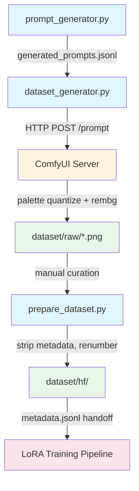

# Dataset Generation Guide

How to generate, curate, and publish top-down medieval pixel-art datasets using ComfyUI.

## Prerequisites

- **ComfyUI server** running and reachable (default: `http://127.0.0.1:8188`)
- **Custom nodes** installed in `ComfyUI/custom_nodes/`:
  - [ComfyUI-PixelArt-Detector](https://github.com/dimtoneff/ComfyUI-PixelArt-Detector) — palette quantization
  - [rembg-comfyui-node-better](https://github.com/Loewen-Hob/rembg-comfyui-node-better) — background removal
- **LoRA** in `ComfyUI/models/loras/`:
  - [Flux-2-Multi-Angles-LoRA-v2](https://huggingface.co/lovis93/Flux-2-Multi-Angles-LoRA-v2) — camera angle enforcement
- **Workflow JSONs** in `config/comfyui/` (already provided)

## Pipeline Flow



## Pipeline Steps

### 1. Generate Prompt Data

Creates a JSONL file with captions and ComfyUI positive prompts for all asset types.

```bash
python3 -m src.generation.prompt_generator \
  --out-dir ./dataset/prompts \
  --seed 2026 \
  --total-target 28000 \
  --ratio-structure 0.50 \
  --ratio-object 0.20 \
  --ratio-terrain 0.10
```

Output: `dataset/prompts/generated_prompts.jsonl`

Each row contains:
- `id` — unique identifier
- `asset_type` — `structure`, `object`, or `terrain`
- `caption` — clean, template-free natural language description
- `positive_prompt` — full ComfyUI prompt with trigger and style tokens
- `palette` — palette name (e.g., `earthy palette`)

### 2. Generate Images

Calls ComfyUI workflows to produce PNGs with embedded metadata.

```bash
# Use the preset wrapper (recommended — captures complex ComfyUI args):
bash scripts/generate_images.sh

# Or run directly with custom args:
python3 -m src.generation.dataset_generator \
  --comfy-url http://127.0.0.1:8188 \
  --base-dir ./dataset \
  --workflow-api-json ./config/comfyui/structure_workflow.json \
  --prompt-data ./dataset/prompts/generated_prompts.jsonl \
  --limit 2000
```

What happens per image:
1. Routes by asset type to the appropriate ComfyUI workflow
2. Injects prompt, seed, and guidance values into the workflow
3. Posts to ComfyUI API, polls for completion
4. Downloads output PNG
5. Embeds metadata (`asset_type`, `caption`, `palette`) into PNG `generation_metadata` tEXt chunk

Output:
- `dataset/raw/*.png` — generated images with embedded metadata
- `dataset/raw/run_report.json` — generation statistics
- `dataset/raw/errors.jsonl` — any failures

### 3. Curate

**Manual step.** Delete bad PNGs from `dataset/raw/` by visual review. Only assets whose PNGs still exist after curation will be included in the final dataset.

### 4. Prepare HF Dataset

Scans curated PNGs, reads embedded metadata, strips to clean PNGs, renumbers sequentially, and produces a HuggingFace-compatible `metadata.jsonl`.

```bash
python3 -m src.generation.prepare_dataset ./dataset/raw --out-dir ./dataset/hf
```

Output:
- `dataset/hf/0000001.png`, `0000002.png`, ... — clean PNGs (no embedded metadata)
- `dataset/hf/metadata.jsonl` — HF `imagefolder` format:
  ```json
  {"file_name": "0000001.png", "text": "a medieval watermill in a cozy harvest season setting...", "asset_type": "structure", "palette": "earthy palette"}
  ```

## Asset Types & Ratios

| Type | Description | Default Ratio |
|------|-------------|:---:|
| `structure` | Buildings: cottages, towers, mills, keeps, workshops, outposts | 55% |
| `object` | World props: trees, boulders, stumps, brambles, wheat, reeds | 25% |
| `terrain` | Walkable hills/plateaus with wide flat tops for unit placement | 20% |

## Metadata Contract

### PNG embedded metadata (`generation_metadata` tEXt chunk)

| Field | Description |
|-------|-------------|
| `asset_type` | `structure` / `object` / `terrain` |
| `caption` | Clean caption (no triggers, no style tokens) |
| `palette` | Palette name (e.g., `earthy palette`) |

### HF metadata.jsonl

| Field | Description |
|-------|-------------|
| `file_name` | Sequential filename (`0000001.png`) |
| `text` | Clean caption |
| `asset_type` | Asset category |
| `palette` | Palette name |

## Caption Design

Captions are purely descriptive, template-free — no trigger tokens, no "pixel art 16x16", no tile-grid clauses. Trigger tokens are a fine-tuning concern injected later.

Example captions:
- **Structure**: *"a medieval watermill in a cozy harvest season setting, featuring careful repairs and patched materials, humble and practical character, medium detail, layered rooflines, oak timber and plaster, weathered, earthy palette"*
- **Object**: *"an ancient oak tree with storm-battered silhouette, layered silhouette, lush foliage and bark, healthy growth, earthy palette"*
- **Terrain**: *"a large hill with wide flat top, soft smooth side slopes, dense readable forms, packed earth and dry grass, weathered growth, earthy palette"*

## Workflow Details

See [`docs/comfyui-workflows.md`](comfyui-workflows.md) for a deep dive into the palette quantization + background removal pipeline, why the node order matters, and how the alpha isolation technique works.

## Reproducibility

- Use fixed prompt-data inputs and pinned workflow JSON files in `config/comfyui/`
- Generation controls (seed, guidance) are captured in `dataset/raw/run_report.json`
- Curate by deleting PNGs only, then regenerate the HF dataset from remaining assets

## License

**All images in this dataset were generated using third-party models and are bound by their respective licenses.**

- **Base model**: [Black Forest Labs FLUX.2 [dev]](https://huggingface.co/black-forest-labs/FLUX.2-dev) — outputs are subject to the [FLUX Non-Commercial License](https://huggingface.co/black-forest-labs/FLUX.2-dev/blob/main/LICENSE.md)
- **LoRA**: [lovis93/Flux-2-Multi-Angles-LoRA-v2](https://huggingface.co/lovis93/Flux-2-Multi-Angles-LoRA-v2) — subject to the license terms published by the LoRA author

Before using this dataset, review the current license terms of both the base model and the LoRA on Hugging Face.
