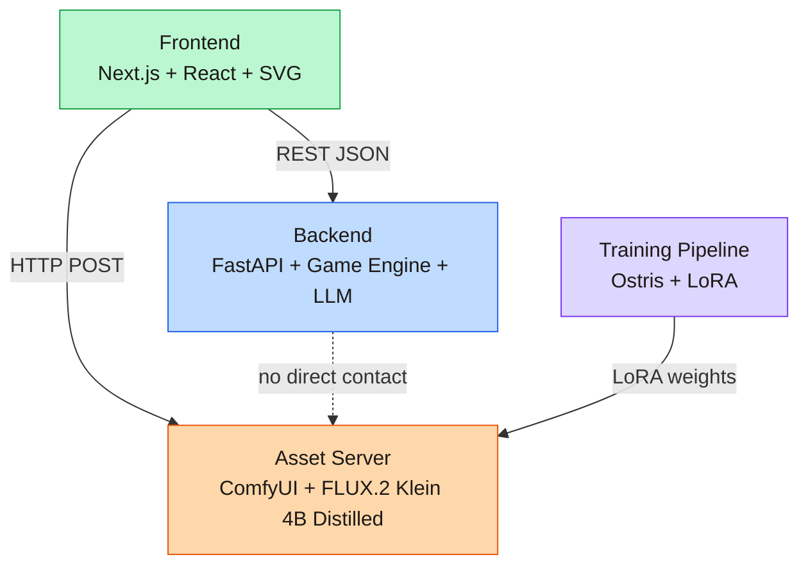

# Figure 1: System Architecture Overview

```mermaid
graph TD
    classDef fe fill:#bbf7d0,color:#1c1917,stroke:#16a34a
    classDef be fill:#bfdbfe,color:#1c1917,stroke:#2563eb
    classDef as fill:#fed7aa,color:#1c1917,stroke:#ea580c
    classDef tp fill:#ddd6fe,color:#1c1917,stroke:#7c3aed

    FE["Frontend\nNext.js + React + SVG"]:::fe
    BE["Backend\nFastAPI + Game Engine + LLM"]:::be
    AS["Asset Server\nComfyUI + FLUX.2 Klein 4B Distilled"]:::as
    TP["Training Pipeline\nOstris + LoRA"]:::tp

    FE -->|"REST JSON"| BE
    FE -->|"HTTP POST"| AS
    BE -.->|"no direct contact"| AS
    TP -->|"LoRA weights"| AS
```
