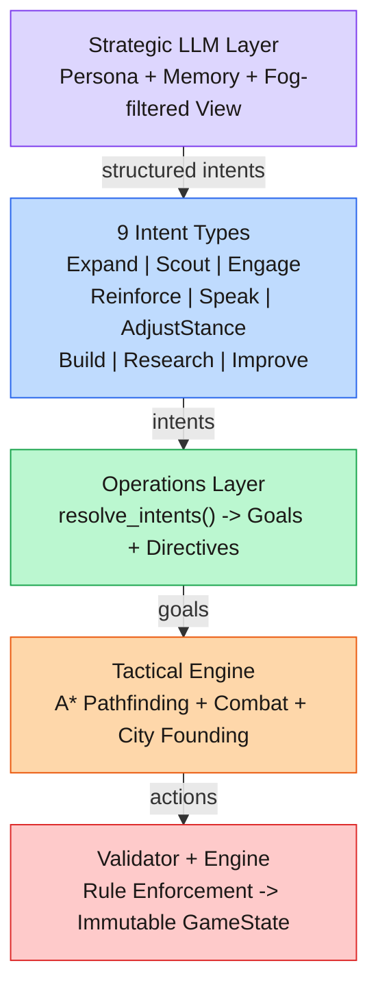

# Figure 2: Intent-Based LLM Abstraction Layer

```mermaid
%%{init: {'flowchart': {'rankSpacing': 15, 'nodeSpacing': 20}}}%%
graph TD
    classDef llm fill:#ddd6fe,color:#1c1917,stroke:#7c3aed
    classDef intent fill:#bfdbfe,color:#1c1917,stroke:#2563eb
    classDef ops fill:#bbf7d0,color:#1c1917,stroke:#16a34a
    classDef tac fill:#fed7aa,color:#1c1917,stroke:#ea580c
    classDef val fill:#fecaca,color:#1c1917,stroke:#dc2626

    L1["Strategic LLM Layer\nPersona + Memory + Fog-filtered View"]:::llm
    L2["9 Intent Types\nExpand | Scout | Engage\nReinforce | Speak | AdjustStance\nBuild | Research | Improve"]:::intent
    L3["Operations Layer\nresolve_intents() -> Goals + Directives"]:::ops
    L4["Tactical Engine\nA* Pathfinding + Combat + City Founding"]:::tac
    L5["Validator + Engine\nRule Enforcement -> Immutable GameState"]:::val

    L1 -->|"structured intents"| L2
    L2 -->|"intents"| L3
    L3 -->|"goals"| L4
    L4 -->|"actions"| L5
```
