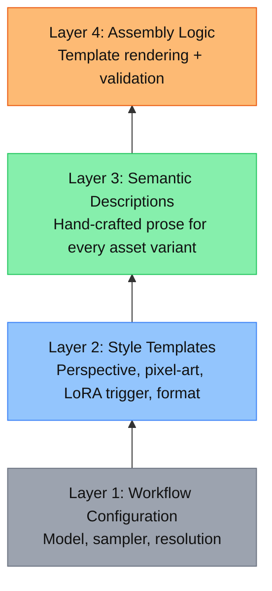

# Figure 3: Four-Layer Prompt Architecture

```mermaid
graph BT
    classDef l1 fill:#9ca3af,color:#111,stroke:#6b7280
    classDef l2 fill:#93c5fd,color:#111,stroke:#3b82f6
    classDef l3 fill:#86efac,color:#111,stroke:#22c55e
    classDef l4 fill:#fdba74,color:#111,stroke:#ea580c

    L1["Layer 1: Workflow Configuration\nModel, sampler, resolution"]:::l1
    L2["Layer 2: Style Templates\nPerspective, pixel-art, LoRA trigger, format"]:::l2
    L3["Layer 3: Semantic Descriptions\nHand-crafted prose for every asset variant"]:::l3
    L4["Layer 4: Assembly Logic\nTemplate rendering + validation"]:::l4

    L1 --> L2 --> L3 --> L4
```
