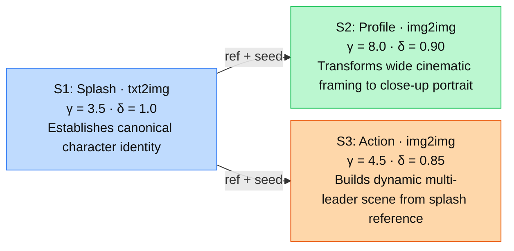

# Figure 4: Three-Stage Leader Portrait Pipeline

```mermaid
%%{init: {'flowchart': {'rankSpacing': 20, 'nodeSpacing': 15}}}%%
graph LR
    classDef s1 fill:#bfdbfe,color:#111,stroke:#3b82f6
    classDef s2 fill:#bbf7d0,color:#111,stroke:#22c55e
    classDef s3 fill:#fed7aa,color:#111,stroke:#ea580c

    S1["S1: Splash · txt2img\nγ = 3.5 · δ = 1.0\nEstablishes canonical character identity"]:::s1
    S2["S2: Profile · img2img\nγ = 8.0 · δ = 0.90\nTransforms wide cinematic framing to close-up portrait"]:::s2
    S3["S3: Action · img2img\nγ = 4.5 · δ = 0.85\nBuilds dynamic multi-leader scene from splash reference"]:::s3

    S1 -->|"ref + seed"| S2
    S1 -->|"ref + seed"| S3
```
