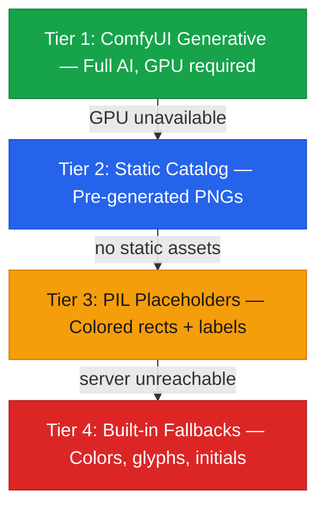

# Figure 6: Asset Generation Modes and Fallback Tiers

```mermaid
%%{init: {'flowchart': {'rankSpacing': 12, 'nodeSpacing': 8}}}%%
graph TD
    classDef t1 fill:#16a34a,color:#fff,stroke:#15803d
    classDef t2 fill:#2563eb,color:#fff,stroke:#1d4ed8
    classDef t3 fill:#f59e0b,color:#1c1917,stroke:#d97706
    classDef t4 fill:#dc2626,color:#fff,stroke:#b91c1c

    T1["Tier 1: ComfyUI Generative — Full AI, GPU required"]:::t1
    T2["Tier 2: Static Catalog — Pre-generated PNGs"]:::t2
    T3["Tier 3: PIL Placeholders — Colored rects + labels"]:::t3
    T4["Tier 4: Built-in Fallbacks — Colors, glyphs, initials"]:::t4

    T1 -->|"GPU unavailable"| T2
    T2 -->|"no static assets"| T3
    T3 -->|"server unreachable"| T4
```
