# Figure 6: Asset Generation Modes and Fallback Strategy

**Caption**: Four-level graceful degradation ensuring the game remains fully playable regardless of AI service availability. Each level activates automatically when the layer above fails, from high-quality generative assets down to minimal built-in hex glyphs.

```mermaid
graph TD
    %% ── Styling ──
    classDef generative fill:#16a34a,color:#fff,stroke:#15803d,stroke-width:2px
    classDef static fill:#2563eb,color:#fff,stroke:#1d4ed8,stroke-width:2px
    classDef placeholder fill:#d97706,color:#fff,stroke:#b45309,stroke-width:2px
    classDef builtin fill:#dc2626,color:#fff,stroke:#b91c1c,stroke-width:2px
    classDef trigger fill:#fef3c7,color:#92400e,stroke:#f59e0b,stroke-width:1px,stroke-dasharray: 3 3
    classDef code fill:#f1f5f9,color:#334155,stroke:#94a3b8,stroke-width:1px

    %% ── LEVEL 1: Generative ──
    subgraph L1["  LEVEL 1 — Generative Assets (Normal Operation)  "]
        direction TB
        gen1["🎨 ComfyUI + FLUX2 Klein 4B Distilled"]
        gen2["On-demand DiT inference · LoRA fine-tuned"]
        gen3["6 asset families · 35 REST endpoints"]
        gen4["High-quality, context-specific pixel art"]
        gen1 --> gen2 --> gen3 --> gen4
    end

    %% ── Trigger 1→2 ──
    trigger1["⚠️ ComfyUI unreachable · GPU unavailable · generation timeout"]

    %% ── LEVEL 2: Static ──
    subgraph L2["  LEVEL 2 — Static Catalog (Asset Server Degraded)  "]
        direction TB
        sta1["📁 static_tiles/ filesystem"]
        sta2["StaticCatalog.resolve_random(family, subtype)"]
        sta3["Pre-generated PNGs · random selection for variety"]
        sta4["Lower diversity, consistent quality"]
        sta1 --> sta2 --> sta3 --> sta4
    end

    %% ── Trigger 2→3 ──
    trigger2["⚠️ Asset server down · static_tiles/ empty · HTTP error"]

    %% ── LEVEL 3: Placeholder ──
    subgraph L3["  LEVEL 3 — Placeholder Engine (Server-Side Fallback)  "]
        direction TB
        pla1["🖼️ PIL ImageDraw procedural generation"]
        pla2["Colored rectangles + text labels"]
        pla3["Per-type color palette (warrior=red, archer=green…)"]
        pla4["Functional, aesthetically limited"]
        pla1 --> pla2 --> pla3 --> pla4
    end

    %% ── Trigger 3→4 ──
    trigger3["⚠️ All asset API calls fail · manifest resolution returns null"]

    %% ── LEVEL 4: Built-in ──
    subgraph L4["  LEVEL 4 — Built-in Fallbacks (Frontend-Only)  "]
        direction TB
        bui1["⬡ Color-coded hexagons + glyphs + initials"]
        bui2["No external dependencies"]
        bui3["Terrain colors · unit type icons · leader initials"]
        bui4["Minimal but fully playable"]
        bui1 --> bui2 --> bui3 --> bui4
    end

    %% ── Flow ──
    L1 --> trigger1
    trigger1 --> L2
    L2 --> trigger2
    trigger2 --> L3
    L3 --> trigger3
    trigger3 --> L4

    %% ── Apply styles ──
    class L1 generative
    class L2 static
    class L3 placeholder
    class L4 builtin
    class trigger1,trigger2,trigger3 trigger
```

## Implementation References

| Level | Server-Side Code | Frontend Code |
|-------|-----------------|---------------|
| **Generative** | `assetserver/src/*/engine.py` — `ComfyUI` mode | `frontend/lib/assetManifest.ts` — POST to asset API |
| **Static** | `assetserver/src/static_catalog.py` — filesystem scan | `frontend/lib/assetApi.ts` — `listLeaders()` catalog fallback |
| **Placeholder** | `assetserver/src/unit/engine.py` — `_PlaceholderUnitEngine` (PIL) | Catches HTTP errors, leaves manifest slot empty |
| **Built-in** | N/A (no server needed) | `frontend/components/HexMap.tsx` — terrain colors, unit glyphs, leader initials |

## Key Design Decisions

1. **No persistent cache**: Every `Begin Campaign` hits the asset service fresh, preventing stale URLs after backend restarts
2. **Per-asset try/catch**: Each asset generation is independently wrapped — one failure doesn't cascade
3. **Leader catalog fallback**: When splash POST fails, the system searches existing pre-generated leaders by archetype+culture match
4. **Bounded concurrency**: `mapLimit()` prevents overwhelming the GPU with parallel requests (4 terrain, 2 units/structures/leaders)
