# Figure 7: AI Civilization Behavior Patterns

**Caption**: Emergent strategic behavior exhibited by three AI civilizations with distinct persona prompts over a representative 20-turn playthrough. Each civilization's LLM controller receives the same fog-filtered game state but produces qualitatively different strategies driven by persona-based system prompts.

```mermaid
gantt
    title AI Civilization Strategic Behavior (20 Turns)
    dateFormat X
    axisFormat Turn %s

    section Genghis Khan 🗡️
    Found 2 cities (expand)           :done, g1, 0, 5
    Build warriors (build)            :done, g2, 0, 8
    Scout borders (scout)             :done, g3, 2, 6
    Declare war on Egypt (engage)     :crit, g4, 6, 7
    Attack Egyptian cities            :crit, g5, 7, 14
    Reinforce front line              :done, g6, 10, 16
    Threaten India (speak)            :done, g7, 12, 13
    Continue expansion                :done, g8, 15, 20

    section Cleopatra 🐍
    Found 1 city (expand)             :done, c1, 0, 4
    Build settlers + workers          :done, c2, 0, 8
    Scout for neighbors (scout)       :done, c3, 3, 7
    Greet Gandhi (speak)              :done, c4, 5, 6
    Propose alliance w/ India         :done, c5, 7, 8
    Improve tiles (improve)           :done, c6, 8, 14
    Research economy techs            :done, c7, 6, 16
    Defensive response to Mongol war  :crit, c8, 7, 12
    Offer peace to Mongolia           :done, c9, 14, 15

    section Gandhi 🕊️
    Found 1 city (expand)             :done, i1, 0, 4
    Build library + monument          :done, i2, 1, 8
    Research science techs            :done, i3, 3, 18
    Accept alliance w/ Egypt          :done, i4, 8, 9
    Improve tiles (improve)           :done, i5, 6, 14
    Build defensive units             :done, i6, 12, 18
    Peace offer to Mongolia (speak)   :done, i7, 10, 11
    Maintain defensive posture        :done, i8, 14, 20
```

## Persona-Driven Behavioral Differences

```mermaid
graph LR
    %% ── Styling ──
    classDef mongolia fill:#dc2626,color:#fff,stroke:#b91c1c,stroke-width:2px
    classDef egypt fill:#ca8a04,color:#fff,stroke:#a16207,stroke-width:2px
    classDef india fill:#16a34a,color:#fff,stroke:#15803d,stroke-width:2px
    classDef emergent fill:#7c3aed,color:#fff,stroke:#6d28d9,stroke-width:2px

    %% ── Genghis Khan ──
    subgraph GK["  GENGHIS KHAN — Aggressive Expansionist  "]
        direction TB
        gk_persona["Persona: 'Conquest is the only true<br/>measure of a civilization'"]
        gk_behavior["Observed Behavior:<br/>• Early military buildup (turns 1-5)<br/>• First to declare war (turn 6)<br/>• Sustained offensive campaigns<br/>• Frequent threats to neighbors"]
        gk_intents["Dominant Intents:<br/>engage (40%) · build (25%)<br/>expand (20%) · scout (15%)"]
        gk_persona --> gk_behavior --> gk_intents
    end

    %% ── Cleopatra ──
    subgraph CL["  CLEOPATRA — Diplomatic Manipulator  "]
        direction TB
        cl_persona["Persona: 'Survive and prosper through<br/>clever diplomacy'"]
        cl_behavior["Observed Behavior:<br/>• Economic focus over expansion<br/>• Early alliance proposals (turn 7)<br/>• Coalition building against aggressors<br/>• Retaliates when attacked"]
        cl_intents["Dominant Intents:<br/>improve (30%) · research (25%)<br/>speak (20%) · expand (15%)<br/>adjust_stance (10%)"]
        cl_persona --> cl_behavior --> cl_intents
    end

    %% ── Gandhi ──
    subgraph GH["  GANDHI — Peaceful Developer  "]
        direction TB
        gh_persona["Persona: 'Pursue victory through science,<br/>culture, and patient growth'"]
        gh_behavior["Observed Behavior:<br/>• Technology-first strategy<br/>• Never attacks unprovoked<br/>• Accepts defensive alliances<br/>• Builds military only when threatened"]
        gh_intents["Dominant Intents:<br/>research (35%) · improve (25%)<br/>build (20%) · expand (10%)<br/>speak (10%)"]
        gh_persona --> gh_behavior --> gh_intents
    end

    %% ── Emergent Interaction ──
    subgraph EM["  EMERGENT INTERACTION  "]
        direction TB
        em1["Genghis attacks Egypt (turn 6)"]
        em2["Cleopatra proposes alliance with Gandhi (turn 7)"]
        em3["Gandhi accepts — coalition forms (turn 8)"]
        em4["Combined defense halts Mongol advance"]
        em1 --> em2 --> em3 --> em4
    end

    class GK,gk_persona,gk_behavior,gk_intents mongolia
    class CL,cl_persona,cl_behavior,cl_intents egypt
    class GH,gh_persona,gh_behavior,gh_intents india
    class EM,em1,em2,em3,em4 emergent
```

## Key Insight

The three civilizations receive **identical game engine mechanics** — the same 9 intent tools, the same fog-of-war serialization, the same combat math. The behavioral diversity emerges entirely from:

1. **Persona prompts** — 6-8 lines of character description appended to the shared system prompt
2. **Rolling memory** — Last 8 turns of intents + last 32 diplomatic messages create path-dependent reasoning
3. **Intent abstraction** — The LLM reasons at the strategic level ("engage Egypt") while deterministic code handles tactical execution (pathfinding, combat resolution)

This demonstrates that **persona-based prompting through an intent abstraction layer** produces qualitatively diverse AI behavior without requiring separate models or fine-tuning per civilization.

## Implementation References

| Component | File | Purpose |
|-----------|------|---------|
| Persona prompts | `backend/app/api/game_factory.py` | Per-leader character descriptions |
| System prompt | `backend/app/engine/openai_goals.py` | `build_system_prompt(persona)` |
| Intent tools | `backend/app/engine/openai_goals.py` | 9 tool definitions (expand, scout, engage…) |
| Rolling memory | `backend/app/engine/openai_goals.py` | Last 8 turns + 32 messages |
| Intent resolution | `backend/app/engine/operations.py` | `resolve_intents()` → Goals + DiplomaticActions |
