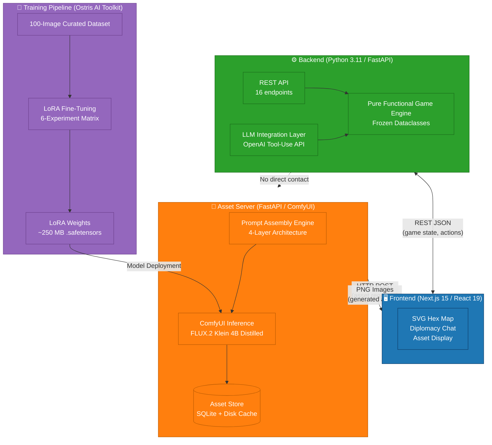
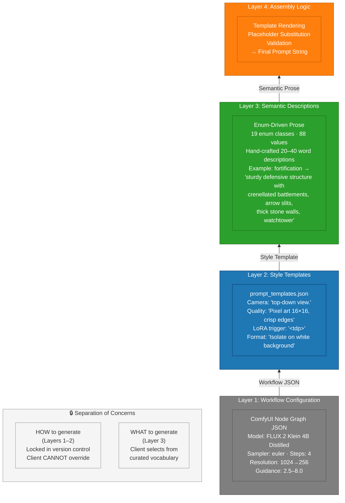
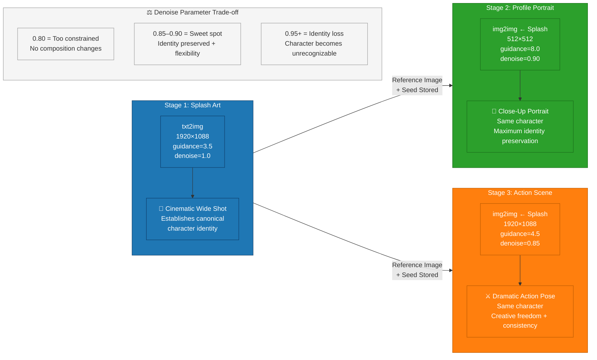

# StrategAI Report Figures — Mermaid Diagrams
#
# Render to PDF with: mmdc -i figures.md -o figures.pdf
# Or individually: mmdc -i fig1-architecture.mmd -o fig1-architecture.pdf
#
# Figures:
#   Fig 1: System Architecture Overview
#   Fig 2: Intent-Based LLM Abstraction Layer
#   Fig 3: Four-Layer Prompt Architecture
#   Fig 4: Three-Stage Leader Portrait Pipeline
#   Fig 5: LoRA Experiment Results → uses existing PNG (not mermaid)

---

## Fig. 1. System Architecture Overview



**Caption**: System architecture showing four primary components and their data flows. The frontend mediates all communication — the backend game engine and asset server never interact directly.

---

## Fig. 2. Intent-Based LLM Abstraction Layer

```mermaid
flowchart TD
    subgraph Strategic["🧠 Strategic Layer — LLM (OpenAI)"]
        Prompt["System Prompt<br/>+ Game State View<br/>+ Persona<br/>+ Rolling Memory"]
        IntentEmit["Emits Structured Intents<br/>(JSON via Tool-Use API)"]
        Prompt --> IntentEmit
    end

    subgraph Intents["📋 9 Intent Types"]
        I1["Expand: Found city"]
        I2["Scout: Explore territory"]
        I3["Engage: Attack enemy"]
        I4["Reinforce: Defend position"]
        I5["Speak: Diplomacy message"]
        I6["AdjustStance: Set war/peace"]
        I7["Build: Queue unit"]
        I8["Research: Pick technology"]
        I9["Improve: Build on tile"]
    end

    subgraph Resolution["⚡ Intent Resolution (Deterministic)"]
        Ops["resolve_intents()<br/>Intent → Goals + Directives"]
        Example["Example:<br/>Engage(civ_id=2)<br/>↓<br/>DeclareWar + MoveTo + Attack"]
        Ops --> Example
    end

    subgraph Tactical["🎯 Tactical Layer — Game Engine"]
        Path[A* Pathfinding]
        Combat[Combat Resolution]
        Validate[Rule Validation]
        State[Updated GameState<br/>(Immutable / Frozen)]
        Path --> Validate
        Combat --> Validate
        Validate --> State
    end

    Strategic -->|"Intent JSON"| Intents
    Intents -->|"Typed Dataclass"| Resolution
    Resolution -->|"Goals + Actions"| Tactical

    classDef strategic fill:#1f77b4,color:#fff,stroke:#0d3b66
    classDef intent fill:#ff7f0e,color:#fff,stroke:#b85900
    classDef resolution fill:#2ca02c,color:#fff,stroke:#1a6b1a
    classDef tactical fill:#d62728,color:#fff,stroke:#8b0000

    class Strategic,Prompt,IntentEmit strategic
    class Intents,I1,I2,I3,I4,I5,I6,I7,I8,I9 intent
    class Resolution,Ops,Example resolution
    class Tactical,Path,Combat,Validate,State tactical
```

**Caption**: Two-layer architecture separating strategic LLM reasoning from deterministic tactical execution. The LLM emits high-level intents (top); the engine resolves them into validated actions (bottom). The LLM never accesses `GameState` directly.

---

## Fig. 3. Four-Layer Prompt Architecture



**Caption**: Systematic prompt construction through four layers. Layers 1–2 (HOW) are locked in version-controlled files — no client request can override style directives. Layer 3 (WHAT) exposes a curated vocabulary of game-design concepts. This design trades API flexibility for guaranteed style consistency across all generated assets.

---

## Fig. 4. Three-Stage Leader Portrait Pipeline



**Caption**: Identity-preserving leader portrait generation through three stages. Stage 1 (txt2img) establishes canonical identity. Stages 2–3 (img2img) use the splash as a reference image with calibrated denoise parameters — high guidance (8.0) for profile preservation, lower (4.5) for creative action scenes. The denoise sweet spot (0.85–0.90) maintains recognizability while allowing composition changes.

---

## Fig. 5. LoRA Fine-Tuning Experiment Results

**This figure uses the existing rendered PNG image** at:
`dataset-gen-train/figures/report_figure.png`

**Caption**: Qualitative comparison of LoRA caption detail strategies. A 2×4 grid showing two prompt subjects (watchtower, boulder) across four conditions: base model without LoRA (unreliable perspective), ultra-minimal captions with low rank (strongest generalization, least detail), minimal captions with high rank (balanced), and detailed captions with high rank (optimal architectural fidelity — deployed variant).
