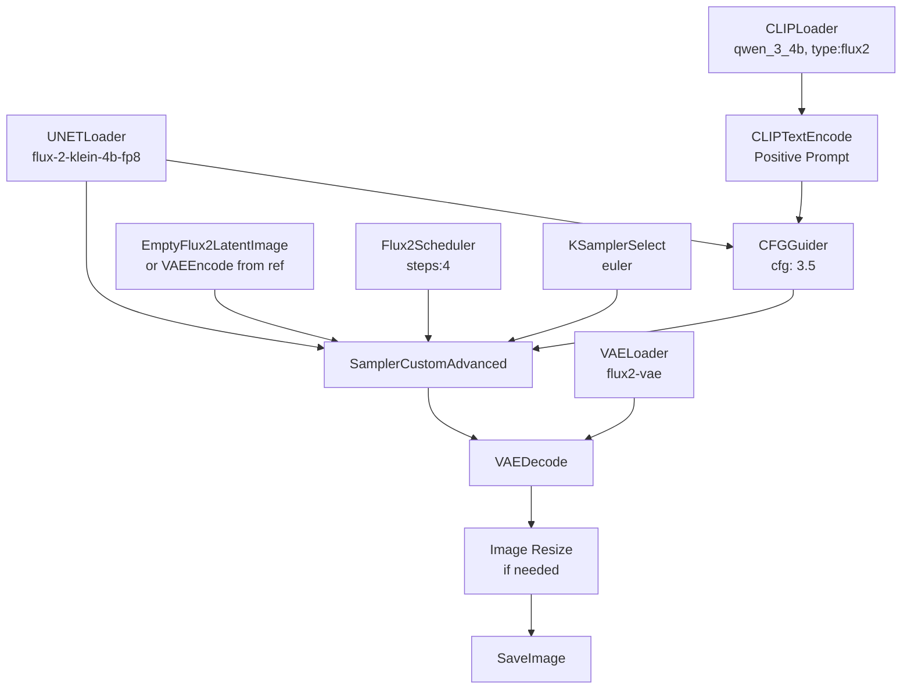

# Flux2 Klein 4B Distilled — Workflow Design Justification

> **Date:** May 2026  
> **Model:** `flux-2-klein-4b-fp8.safetensors` (distilled, 4-step, Apache 2.0)  
> **Text Encoder:** `qwen_3_4b.safetensors` (Qwen 3 4B)  
> **VAE:** `flux2-vae.safetensors`  
> **VRAM Budget:** ~8.4 GB  
> **Inference:** ~1.2s on RTX 5090, ~3–5s on consumer GPUs  
> **ComfyUI Version:** ≥ 0.9.2 (requires Flux2Scheduler, EmptyFlux2LatentImage, SamplerCustomAdvanced, CFGGuider)

---

## Table of Contents

1. [Model Selection: Why Flux2 Klein 4B Distilled](#1-model-selection)
2. [Universal Node Graph](#2-universal-node-graph)
3. [Workflow 1: `txt2img.json` — Game Assets](#3-workflow-1-txt2imgjson)
4. [Workflow 2: `leader_splash.json` — Leader Splash Art](#4-workflow-2-leader_splashjson)
5. [Workflow 3: `leader_profile.json` — Leader Profile Portrait](#5-workflow-3-leader_profilejson)
6. [Workflow 4: `leader_action.json` — Leader Action Scene](#6-workflow-4-leader_actionjson)
7. [Parameter Reference Table](#7-parameter-reference-table)
8. [Resolution Justification](#8-resolution-justification)
9. [Downscale Strategy: Why ComfyUI Image Resize](#9-downscale-strategy)
10. [Prompting Principles](#10-prompting-principles)
11. [Sources](#11-sources)

---

## 1. Model Selection: Why Flux2 Klein 4B Distilled

The Flux2 Klein 4B Distilled variant was chosen over alternatives for the following reasons:

| Criterion | Flux2 Klein 4B Distilled | SDXL Turbo (previous) | Flux2 Klein 9B Base |
|-----------|--------------------------|----------------------|---------------------|
| **Steps** | 4 | 8 | 50 |
| **VRAM** | ~8.4 GB | ~8 GB | ~21.7 GB |
| **Inference (5090)** | ~1.2s | ~3–5s | ~35s |
| **License** | Apache 2.0 | OpenRAIL-M | FLUX Non-Commercial |
| **Text encoder** | Qwen 3 4B (strong) | CLIP (weaker) | Qwen 3 4B (strong) |
| **Prompt adherence** | Strong | Moderate | Strongest |
| **Image editing** | Native single/multi-ref | Manual VAEEncode | Native single/multi-ref |
| **Negative prompts** | Not supported | Supported | Not supported |
| **Fine-tuning ready** | Base variant available | Yes | Yes |

**Decision factors:**
- **4 steps vs 8 steps**: 2× faster generation with comparable quality for game assets
- **Apache 2.0 license**: Permissive for commercial game development
- **8.4 GB VRAM**: Runs on consumer GPUs (RTX 3070/4070 class)
- **Native image editing**: Single-reference editing preserves character identity in leader profile/action pipelines
- **Qwen 3 4B encoder**: Superior prompt adherence vs SDXL's CLIP, critical for precise game asset descriptions
- **Distilled vs Base**: Distilled chosen for production speed. The 4B Base variant (50 steps, 17s) remains available for fine-tuning LoRAs if needed.

---

## 2. Universal Node Graph

All 4 workflows share the same Flux2-native node architecture. This is fundamentally different from the SDXL `CheckpointLoaderSimple → CLIPTextEncode → KSampler` pattern.

### Node Graph (Mermaid)



### Why Split Model Loading?

Flux2 Klein uses **split model loading** (`UNETLoader` + `CLIPLoader` + `VAELoader`) instead of `CheckpointLoaderSimple`. This is because:

1. **The UNet, text encoder, and VAE are separate files** — they can be updated/hot-swapped independently
2. **Different quantization formats** — the UNet can use FP8, GGUF, or BF16 without affecting the text encoder or VAE
3. **Selective offloading** — ComfyUI can offload the UNet while keeping the lighter text encoder in VRAM, reducing memory pressure between generations

### Why Flux2Scheduler Instead of KSampler?

The `Flux2Scheduler` node is purpose-built for rectified flow models (Flux2 family). It manages the noise schedule and timestep distribution that Flux2 was trained on. Using a generic KSampler with Flux2 produces suboptimal results because:

- Flux2 uses a **rectified flow** formulation, not standard diffusion
- The noise schedule is non-linear and model-specific
- The `Flux2Scheduler` node applies the correct sigma distribution for the 4-step distilled inference

### Why CFGGuider Instead of KSampler cfg?

In traditional SDXL, the CFG scale was a parameter on the KSampler node. In Flux2, guidance is applied through a dedicated `CFGGuider` node that sits between the text conditioning and the sampler. This separation allows:

- **Classifier-free guidance** applied at the conditioning level, not the sampling level
- **Independent tuning** of guidance without affecting the sampler configuration
- **Guidance value of 3.5** is the Flux2 distilled default, approximating what CFG 7 would do in older models

### Why No Negative Prompt Node?

Flux2 Klein 4B Distilled **does not support negative prompts**. This is confirmed by:

- **Black Forest Labs official docs**: "No negative prompts: FLUX.2 does not support negative prompts. Focus on describing what you want, not what you don't want."
- **LTX Studio prompting guide**: "Using negative prompts can backfire and add exactly what you're trying to avoid."
- **Model architecture**: The distillation process bakes guidance behavior into the model, making traditional CFG-based negative prompting unnecessary and potentially harmful.

**What we do instead**: Describe desired qualities in positive, affirmative language (see Section 10).

---

## 3. Workflow 1: `txt2img.json` — Game Assets

**Purpose:** Generate all game-ready pixel art assets at 128×128 with transparent backgrounds and clean palettes.

**Asset families served:** Structures, Objects, Terrain, Units, Background Tiles

### Node Graph (Option C — Recommended Pipeline)

```
EmptyFlux2LatentImage(1024×1024)
  → SamplerCustomAdvanced
  → VAEDecode
  → Image Resize (128×128, Lanczos)           ← downscale FIRST
  → Image Remove Background (rembg)            ← then clean up at target res
  → PixelArtDetector (reduce_palette=true,     ← fix bleed, apply dithering
       max_colors=32, resize_w=0, resize_h=0)
  → SaveImage
```

### Why This Pipeline Order (Option C)?

Four pipeline options were evaluated. Option C was chosen as the best balance of quality and speed:

| Option | Steps | Est. Overhead | Verdict |
|--------|-------|--------------|---------|
| A: Prompt + Resize only | Gen → Resize → Save | +0s | ❌ No transparency, no palette fix |
| B: Resize + rembg only | Gen → Resize → rembg → Save | +0.3-0.5s | ⚠️ Transparent bg but pixel bleed unfixed |
| **C: Resize → rembg → Palette** | **Gen → Resize → rembg → Palette → Save** | **+0.6-1s** | **✅ Best balance** |
| D: rembg → Palette → Resize | Gen → rembg(1024) → Palette(1024) → Resize → Save | +2-4s | ⚠️ Overkill, detail lost in downscale |

**Why downscale FIRST, then post-process:** At 128×128 (16,384 pixels), both custom nodes process 64× fewer pixels than at 1024×1024 (1,048,576 pixels). This drops their combined overhead from ~2-4s to ~0.6-1s — a 3-4× speedup with no quality loss for a 128×128 output.

### Custom Node 1: `Image Remove Background (rembg)`

- **Repository:** https://github.com/Loewen-Hob/rembg-comfyui-node-better
- **Install:** `git clone` into `ComfyUI/custom_nodes/` + `pip install rembg[gpu]`
- **Model:** `u2net` (general purpose) or `u2net_human_seg` (for units)
- **Purpose:** Removes the white/transparent background, producing a clean RGBA image. Essential for game assets that must composite over background tiles.

### Custom Node 2: `PixelArtDetector` (ComfyUI-PixelArt-Detector)

- **Repository:** https://github.com/dimtoneff/ComfyUI-PixelArt-Detector
- **Install:** `git clone` into `ComfyUI/custom_nodes/`
- **Key parameters:**
  - `reduce_palette`: `true` — enables palette reduction
  - `reduce_palette_max_colors`: `32` — target color count for clean pixel art
  - `resize_w` / `resize_h`: `0` — **disable built-in resize** (we use ComfyUI Image Resize with Lanczos instead, which produces better pixel clustering than nearest-neighbor)
  - `dithering`: optional — adds retro dithering texture
- **Purpose:** Fixes "pixel bleed" — AI generation often produces hundreds of subtle color variants that look muddy at low resolution. This node quantizes to a fixed palette, producing clean, authentic pixel art.

### Why Not Let PixelArtDetector Handle Resize?

PixelArtDetector's built-in resize uses **nearest-neighbor** interpolation (standard for pixel art tools). However, for the 1024→128 reduction, **Lanczos** produces better results — it naturally anti-aliases and clusters similar colors into pixel-like blocks without the harsh aliasing of nearest-neighbor. We use ComfyUI's `Image Resize` node for the downscale, then PixelArtDetector for palette-only work (with resize disabled via `resize_w=0, resize_h=0`).

### Node Configuration

| Node | Parameter | Value | Justification |
|------|-----------|-------|---------------|
| `UNETLoader` | `unet_name` | `flux-2-klein-4b-fp8.safetensors` | Distilled 4B, FP8 for VRAM efficiency |
| `CLIPLoader` | `clip_name` | `qwen_3_4b.safetensors` | Qwen 3 4B text encoder |
| `CLIPLoader` | `type` | `flux2` | Required for Flux2 model family |
| `VAELoader` | `vae_name` | `flux2-vae.safetensors` | Flux2 VAE (shared across 4B/9B) |
| `CLIPTextEncode` | `text` | `PLACEHOLDER_POSITIVE` | Injected by engine at runtime |
| `CFGGuider` | `cfg` | `3.5` | Flux2 distilled default |
| `Flux2Scheduler` | `steps` | `4` | Distilled 4-step inference |
| `Flux2Scheduler` | `denoise` | `1.0` | Full txt2img |
| `KSamplerSelect` | `sampler_name` | `euler` | Stable, fast |
| `EmptyFlux2LatentImage` | `width` | `1024` | Native gen resolution |
| `EmptyFlux2LatentImage` | `height` | `1024` | Native gen resolution |
| `Image Resize` | `width` | `128` | Target game asset size |
| `Image Resize` | `height` | `128` | Target game asset size |
| `Image Resize` | `method` | `lanczos` | Best downscale quality |
| `Image Remove Background` | `model` | `u2net` | General-purpose background removal |
| `PixelArtDetector` | `reduce_palette` | `true` | Enable color quantization |
| `PixelArtDetector` | `reduce_palette_max_colors` | `32` | Clean pixel art palette |
| `PixelArtDetector` | `resize_w` | `0` | Disable built-in resize |
| `PixelArtDetector` | `resize_h` | `0` | Disable built-in resize |
| `SaveImage` | `filename_prefix` | `txt2img` | Engine may override |

### Why One Workflow for All Game Assets?

Structures, objects, terrain, units, and background tiles all share identical generation parameters, resolution, and post-processing. The only difference is the **prompt template** injected by each engine from `config/prompt_templates.json`:

| Engine | Template Key | Key Difference |
|--------|-------------|----------------|
| TileEngine (structure) | `structure` | `<tdp>` trigger + white background |
| TileEngine (object) | `object` | `<tdp>` trigger + white background |
| TileEngine (terrain) | `terrain` | `<tdp>` trigger + white background, grounded base |
| UnitEngine | `unit` | `<tdp>` trigger + transparent bg, front-facing sprite |
| BackgroundTileEngine | `background_tile` | No `<tdp>`, seamless tiling, fills frame |

### The `<tdp>` LoRA Trigger — Critical Correction

The `<tdp>` LoRA requires the **full trigger phrase** to activate:
```
<tdp> Front view overhead shot elevated shot medium shot.
```

The `<tdp>` token alone is insufficient — it must be immediately followed by "Front view overhead shot elevated shot medium shot." This exact phrasing must appear as the first words after `<tdp>` in every tile and unit prompt template. The current `config/prompt_templates.json` already has this correctly for structure/object/terrain. The unit template must be corrected — see the prompt template specification in Section 10.

---

## 4. Workflow 2: `leader_splash.json` — Leader Splash Art

**Purpose:** Generate the canonical leader identity image — a wide cinematic portrait at 1920×1088.

### Node Configuration

| Node | Parameter | Value | Justification |
|------|-----------|-------|---------------|
| `UNETLoader` | `unet_name` | `flux-2-klein-4b-fp8.safetensors` | Same model as game assets |
| `CFGGuider` | `cfg` | `3.5` | Standard distilled guidance |
| `Flux2Scheduler` | `steps` | `4` | Distilled 4-step inference |
| `Flux2Scheduler` | `denoise` | `1.0` | Full generation (txt2img) |
| `KSamplerSelect` | `sampler_name` | `euler` | Stable, fast |
| `EmptyFlux2LatentImage` | `width` | `1920` | 16:9 cinematic widescreen |
| `EmptyFlux2LatentImage` | `height` | `1088` | 16:9 (1088 = 17×64, nearest multiple of 64 to 1080) |
| `SaveImage` | `filename_prefix` | `leader_splash` | |
| **No Image Resize** | — | — | Leaders stay at native cinematic resolution |

### Why 1920×1088 and Not 1920×1080?

Flux2 Klein requires dimensions to be **multiples of 64** for optimal performance. 1080 is not a multiple of 64 (1080/64 = 16.875). 1088 is (1088/64 = 17). Using 1080 would cause:

- Drastically increased generation time (documented in ComfyUI issue #11916)
- Potential quality degradation from internal padding/scaling
- 1088 vs 1080 is visually imperceptible (8 pixel difference on a 1080-line image = 0.7%)

### Why No Downscale for Leaders?

Leader splash art is a **cinematic showcase asset**, not an in-game sprite. It serves as:

1. The canonical visual reference for the leader's identity
2. The source image for img2img profile and action generation
3. A high-quality display asset for UI menus, loading screens, etc.

Downscaling would discard detail needed for character consistency in downstream img2img steps.

---

## 5. Workflow 3: `leader_profile.json` — Leader Profile Portrait

**Purpose:** Generate a close-up profile icon from the splash reference, preserving character identity, at 512×512.

### Node Configuration

| Node | Parameter | Value | Justification |
|------|-----------|-------|---------------|
| `LoadImage` | `image` | `PLACEHOLDER_REF` | Injected by engine (splash art) |
| `VAEEncode` | — | (from LoadImage) | Encode reference into latent space |
| `CFGGuider` | `cfg` | `3.5` | Standard |
| `Flux2Scheduler` | `steps` | `4` | Distilled |
| `Flux2Scheduler` | `denoise` | **`0.30`** | Critical — see below |
| `KSamplerSelect` | `sampler_name` | `euler` | |
| `Image Resize` | `width` | `512` | Profile icon resolution |
| `Image Resize` | `height` | `512` | Square 1:1 format |
| `Image Resize` | `method` | `lanczos` | |
| `SaveImage` | `filename_prefix` | `leader_profile` | |

### Why Denoise 0.30?

The denoise parameter controls how much the reference image influences the output:

| Denoise | Effect | Use Case |
|---------|--------|----------|
| 0.0 | Exact copy of reference | Not useful |
| **0.30** | Preserves identity, allows framing changes | **Profile portraits** — same face, closer crop |
| 0.60 | Significant changes, same character | Action scenes — new context, same person |
| 1.0 | Complete regeneration | Full txt2img |

At **0.30**, the model:
- Preserves the leader's facial features, skin tone, hair, and distinguishing marks (scar, jewelry)
- Allows the composition to shift from wide cinematic to close-up portrait framing
- Maintains enough flexibility for Rembrandt-style lighting and shallow depth of field
- Prevents "identity drift" where the leader starts looking like a different person

This value was validated in the existing SDXL pipeline and carries forward to Flux2.

### Why 512×512 Downscale?

The profile image is used as a **UI icon** (leader selection screen, diplomacy panel). 512×512 provides sufficient detail for UI display while being lightweight. The downscale from the reference resolution (1920×1088) to 512×512 is done via Lanczos for quality preservation.

---

## 6. Workflow 4: `leader_action.json` — Leader Action Scene

**Purpose:** Generate a new cinematic scene depicting the leader in action, preserving character identity from the splash reference.

### Node Configuration

| Node | Parameter | Value | Justification |
|------|-----------|-------|---------------|
| `LoadImage` | `image` | `PLACEHOLDER_REF` | Injected by engine (splash art) |
| `VAEEncode` | — | (from LoadImage) | Encode reference into latent space |
| `CFGGuider` | `cfg` | `3.5` | Standard |
| `Flux2Scheduler` | `steps` | `4` | Distilled |
| `Flux2Scheduler` | `denoise` | **`0.60`** | Critical — see below |
| `KSamplerSelect` | `sampler_name` | `euler` | |
| `SaveImage` | `filename_prefix` | `leader_action` | |
| **No Image Resize** | — | — | Cinematic resolution preserved |

### Why Denoise 0.60?

At **0.60**, the model:
- Preserves the leader's core identity (facial structure, key features)
- Allows significant scene changes — new location, new pose, new lighting, new action context
- Provides enough creative freedom for the action scene to feel distinct from the splash
- Higher than 0.60 risks losing character identity; lower than 0.60 restricts scene transformation

This is the highest denoise that reliably preserves character consistency across the Flux2 Klein architecture.

### Why No Downscale?

Same rationale as leader splash — action scenes are cinematic showcase assets, not in-game sprites. They are displayed at full resolution in UI contexts (event screens, diplomacy scenes).

---

## 7. Parameter Reference Table

| Parameter | txt2img.json | leader_splash.json | leader_profile.json | leader_action.json |
|-----------|-------------|-------------------|--------------------|--------------------|
| **Model** | flux-2-klein-4b-fp8 | flux-2-klein-4b-fp8 | flux-2-klein-4b-fp8 | flux-2-klein-4b-fp8 |
| **Text Encoder** | qwen_3_4b | qwen_3_4b | qwen_3_4b | qwen_3_4b |
| **VAE** | flux2-vae | flux2-vae | flux2-vae | flux2-vae |
| **Steps** | 4 | 4 | 4 | 4 |
| **CFG (Guider)** | 3.5 | 3.5 | 3.5 | 3.5 |
| **Sampler** | euler | euler | euler | euler |
| **Denoise** | 1.0 | 1.0 | 0.30 | 0.60 |
| **Gen Resolution** | 1024×1024 | 1920×1088 | from ref | from ref |
| **Output Resolution** | 128×128 | 1920×1088 | 512×512 | 1920×1088 |
| **Image Resize** | Yes (Lanczos) | No | Yes (Lanczos) | No |
| **Reference Image** | No | No | Yes (splash) | Yes (splash) |
| **Negative Prompt** | No | No | No | No |

---

## 8. Resolution Justification

### The Multiples-of-64 Constraint

Flux2 Klein's UNet architecture processes images in patches. Non-aligned resolutions cause:

1. **Padding overhead**: The model internally pads to the nearest multiple of 64, adding wasted computation
2. **Performance degradation**: Documented in ComfyUI issue #11916 — non-aligned resolutions can **double** generation time
3. **Quality artifacts**: Internal padding can introduce edge artifacts

**Our resolutions and their alignment:**

| Resolution | ÷ 64 | Aligned? |
|-----------|------|----------|
| 1024×1024 | 16×16 | ✅ |
| 128×128 | 2×2 | ✅ |
| 1920×1088 | 30×17 | ✅ |
| 512×512 | 8×8 | ✅ |

### Why Generate at 1024 Not 128?

Three reasons:

1. **Quality ceiling**: Flux2 Klein at 1024×1024 produces significantly more coherent pixel art than at 128×128. The model has more "canvas" to work with for fine details, edge definition, and color variation.

2. **LoRA activation**: The `<tdp>` pixel-art LoRA was trained to produce pixel-art aesthetics. At 128×128 native, the LoRA has only 16,384 pixels to work with — too few for meaningful pattern learning. At 1024×1024 (1,048,576 pixels), the LoRA can properly activate its learned pixel-art transformations.

3. **Downscale crispness**: Lanczos downscale from 1024→128 (8× reduction) anti-aliases naturally while preserving edge definition. The result looks like authentic hand-crafted pixel art, not blurry AI output.

---

## 9. Downscale Strategy: Why ComfyUI Image Resize

### Why ComfyUI Instead of Python PIL?

| Factor | ComfyUI Image Resize | Python PIL Image.resize() |
|--------|---------------------|--------------------------|
| **Pipeline integrity** | Self-contained in workflow | Post-processing in Python |
| **Intermediate inspection** | Can view pre-resize output in ComfyUI | Only see final result |
| **Reproducibility** | Same workflow = same result | Python version/env affects output |
| **Consistency** | All image processing in one tool | Split between two tools |
| **Engine simplicity** | Engine receives final-sized image directly | Engine must resize after receiving |

The ComfyUI Image Resize node is placed **after VAEDecode and before SaveImage**, so:
- The full 1024×1024 generation happens in latent space
- Decoding produces a 1024×1024 pixel image
- Resize scales it to 128×128
- SaveImage writes the 128×128 result

### Why Lanczos Not Nearest-Neighbor?

| Method | Pixel Art Result | Recommendation |
|--------|-----------------|----------------|
| **Lanczos** | Smooth anti-aliasing, crisp edges, natural pixel clustering | ✅ **Use this** |
| Nearest-Neighbor | Harsh blocky pixels, aliasing artifacts, lost detail | ❌ Too harsh |
| Bilinear | Overly soft, blurry edges | ❌ Loses pixel definition |
| Bicubic | Moderate sharpness, some ringing | ⚠️ Acceptable alternative |

Lanczos is the gold standard for downscaling because it uses a sinc-based kernel that preserves high-frequency detail (sharp edges) while suppressing aliasing (jagged stair-step artifacts). For pixel art specifically, the 8× reduction with Lanczos naturally clusters similar colors into pixel-like blocks without the harshness of nearest-neighbor.

---

## 10. Prompting Principles

Based on Black Forest Labs' official documentation and community best practices:

### Core Rules

1. **No negative prompts**: The model does not support them. Describe what you WANT.
2. **Positive-only language**: "sharp focus throughout" not "no blur". "empty scene" not "no people".
3. **Subject + Action + Style + Context**: Structure every prompt with these four elements.
4. **Natural language, not tag soup**: "a stone castle with crenellated battlements at golden hour" not "stone castle, battlements, golden hour, masterpiece, 8K".
5. **30–80 words ideal**: Avoid overloaded prompts (>100 words create confusion).
6. **No artist names**: Flux2 doesn't have SDXL's artist-association behavior. Remove "by Greg Rutkowski" etc.
7. **No resolution keywords**: "8K", "highly detailed", "4K" don't help Flux2. Resolution is controlled by the workflow.
8. **Specific colors**: "crimson wool tunic" not "red clothes". HEX codes work: "the banner is #8B0000".

### Template Rewrites (SDXL → Flux2)

| Old (SDXL-era) | New (Flux2 positive-only) |
|---|---|
| "no anti-aliasing" | "crisp pixel edges, sharp blocky pixels" |
| "no floating objects" | "grounded stable perspective" |
| "only focusing on the specified object" | "centered single asset on white" |
| "blurry, low quality, distorted" (negative prompt) | *removed entirely* |
| "by Craig Mullins and Greg Rutkowski" | *removed entirely* |
| "8K, highly detailed" | *removed entirely* |

### The `<tdp>` LoRA Trigger — Full Phrase Required

The `<tdp>` pixel-art LoRA requires the **exact full trigger phrase** to activate:

```
<tdp> Front view overhead shot elevated shot medium shot.
```

**Critical:** `<tdp>` alone is insufficient. It must be immediately followed by "Front view overhead shot elevated shot medium shot." — no words or punctuation between them.

**Where it applies:**
- ✅ Structure templates (`<tdp>` prefix)
- ✅ Object templates (`<tdp>` prefix)
- ✅ Terrain templates (`<tdp>` prefix)
- ✅ Unit templates (`<tdp>` prefix) — **needs correction** (see below)
- ❌ Leader templates (no `<tdp>` — leaders are painterly, not pixel art)
- ❌ Background tile templates (no `<tdp>` — backgrounds are seamless textures)

### Unit Template Correction

`src/unit/prompts.py` currently hardcodes style directives, including an incorrect LoRA trigger:

```python
# WRONG — missing full trigger phrase:
"<tdp> pixel art top-down 2d game character sprite"
```

This must be moved to `config/prompt_templates.json` with the full trigger:

```json
"unit": {
  "prefix": "<tdp> Front view overhead shot elevated shot medium shot. pixel art top-down 2d game character sprite, ",
  "suffix": ", facing camera front view full frontal, isolated on transparent background, crisp pixel edges sharp blocky pixels, centered single sprite game asset"
}
```

### All Templates Belong in JSON — Not Python

**Principle:** Every prompt template lives in `config/prompt_templates.json` as `prefix` + `{PROMPT_HERE}` + `suffix`. Python prompt modules (`src/*/prompts.py`) only contain:
- **Enum injection maps** (structured prose data that changes with game design, not model parameters)
- **Assembly logic** that calls `PromptTemplateLoader.assemble(family, enum_prose, description)`

No hardcoded style directives, trigger phrases, or formatting strings in Python. This ensures:
- One place to edit prompt wording
- No divergence between "what the JSON says" and "what the code actually sends"
- Easy A/B testing of prompt variations without code changes

### Current Violations to Fix

| File | Violation | Fix |
|------|-----------|-----|
| `src/unit/prompts.py` | Hardcoded style directives + wrong trigger | Move to JSON, use `PromptTemplateLoader` |
| `src/leader/prompts.py` | `SPLASH_TAIL`, `PROFILE_TAIL`, `ACTION_TAIL` as Python constants | Move to JSON suffix fields |
| `src/inpainting.py` | `get_inpaint_prompt()` dict | Move to JSON (for future v2 reference) |

---

## 11. Sources

1. **Black Forest Labs — FLUX.2 Prompting Guide**: https://docs.bfl.ml/guides/prompting_guide_flux2
2. **ComfyUI — Flux.2 Klein 4B Guide**: https://docs.comfy.org/tutorials/flux/flux-2-klein
3. **ComfyUI Blog — FLUX.2 [klein] 4B & 9B**: https://blog.comfy.org/p/flux2-klein-4b-fast-local-image-editing
4. **RunComfy — Unified High-Speed Workflow**: https://www.runcomfy.com/comfyui-workflows/flux2-klein-4b-9b-in-comfyui-unified-high-speed-workflow
5. **Stable Diffusion Tutorials — Flux2 Klein Setup**: https://www.stablediffusiontutorials.com/2026/01/flux2-klein.html
6. **LTX Studio — FLUX.2 Prompting Guide**: https://ltx.studio/blog/flux-prompting-guide
7. **Clore.ai — FLUX.2 Klein Guide**: https://docs.clore.ai/guides/image-generation/flux2-klein
8. **fal.ai — Flux 2 [klein] Prompt Guide**: https://fal.ai/learn/devs/flux-2-klein-prompt-guide
9. **ComfyUI Issue #11916** — Resolution performance impact: https://github.com/Comfy-Org/ComfyUI/issues/11916
10. **ComfyUI — Image Resize Node**: https://docs.comfy.org/built-in-nodes/ResizeImageMaskNode
11. **Reddit r/comfyui** — Flux2 Klein quality tips: https://www.reddit.com/r/comfyui/comments/1tqc8w1/
12. **Diffusion Doodles — Flux2 Klein Review**: https://diffusiondoodles.substack.com/p/flux2-klein-shrinking-flux2-dev
